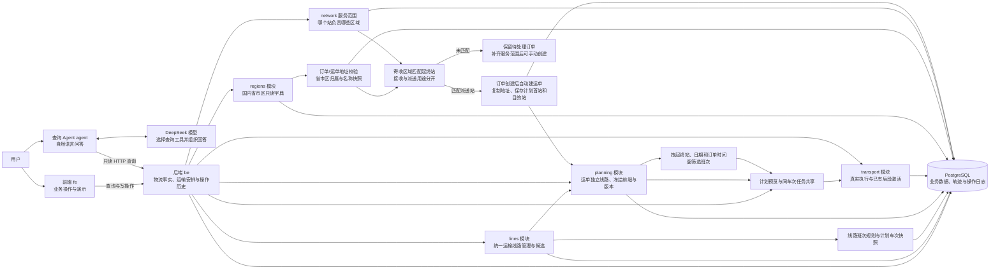

# JINGPO 项目协作索引

本文件是项目地图与协作规则。开始工作先读这里，再按任务打开对应文档；接口、字段、SQL 和验收细节放在 `docs/` 下，不在这里堆积。

## 必须遵循的文档规则

1. **PRD、技术方案要用大白话说明白。** 先说要解决什么问题、用户会看到什么变化，再讲必要的实现。少用术语；必须用时，紧跟一句解释。正文短而清楚，复杂细节拆到专项文档。
2. **图文一起表达。** 流程用流程图，模块关系用架构图，状态变化用状态图，界面行为用截图或示意图；优先使用 Mermaid。图旁配简短解释，让人一眼看懂。字段映射、方案差异用表格，不能只写大段文字。
3. **架构或重大模块更新后，同步更新本文件。** 模块新增、拆分、职责变化、主要调用链变化、关键业务模型或客户端契约变化，都要在同一次交付中更新架构图、模块入口和文档链接。
4. **本文件只做索引。** 详细说明优先放进现有 `docs/prd/<版本>/`、`docs/技术方案/<版本>/<模块>/`；需要模块自己的 `doc/` 或 `docs/` 时，在这里补链接。不要复制多份相同规则或整份规格。
5. **目标和结果要分清。** 草案不等于已实现，代码改动不等于验收通过。说明做了什么、验证了什么、还有什么待验证；不把未执行的检查写成通过。

PRD 建议顺序：问题与目标 → 用户流程图/界面示意 → 范围与关键规则 → 验收示例。
技术方案建议顺序：怎么解决（一小段话）→ 架构/数据流图 → 关键改动与取舍 → 验证与风险；详细契约和实施步骤另附链接。

## 项目一眼看懂

物流演示系统：前端操作业务，后端维护物流事实与运输安排，所有动作时间由服务器生成，查询 Agent 用自然语言读取后端数据。

模型不直接访问数据库。前端负责展示，业务状态、可执行操作和延误结果以 BE 为准。

## 各项目从哪里开始

| 项目 | 负责什么 | 入口 |
| --- | --- | --- |
| `fe/` | 业务页面与演示操作 | [前端 README](fe/README.md) |
| `be/` | 业务规则、数据与接口 | [后端 README](be/README.md) |
| `agent/` | 自然语言物流查询 | [查询 Agent README](agent/README.md) |

具体代码结构、业务规则、启动和验证方式看对应 README 及其链接的详细文档；相关规则变化时更新所属项目文档。

## 文档去哪找

| 要了解什么 | 文档 |
| 运输线路统一契约及旧字段弃用策略 | [统一运输线路](docs/技术方案/v7/be/unified-transport-lines.md) |
| 线路班次、车次生成和运单候选 | [班次与计划车次](docs/技术方案/v7/be/line-services.md) |
| --- | --- |
| 订单时间窗与兼容任务共享规则 | [字段、匹配条件与迁移](docs/技术方案/v7/be/order-delivery-windows.md) |
| 服务器时间与移除模拟时钟 | [时间规则、接口与迁移](docs/技术方案/server-time.md) |
| 寄件首站与创建后预览 | [字段、接口和交付状态](docs/技术方案/v7/be/planned-origin-and-preview.md) |
| 统一运输线路与全国城市演示初始化 | [管理接口、候选、迁移与交付](docs/技术方案/v7/be/unified-transport-lines.md) |
| 站点服务范围与自动匹配目的站 | [配置接口、自动创建与发布状态](docs/技术方案/v7/be/station-service-areas.md) |
| 订单与运单省市区＋详细地址 | [接口、字段与迁移](docs/技术方案/v7/be/structured-addresses.md) |
| 国内省市区地址库（三表与接口） | [地址库设计与交付状态](docs/技术方案/v7/be/address-library.md) |
| 订单、运单、揽收与入站的含义 | [领域术语](be/CONTEXT.md) |
| V1 产品范围与界面示例 | [V1 PRD](docs/prd/v1/JINGPO-logistics-system-v1.md) |
| V1 后端总体设计 | [技术方案](docs/技术方案/v1/be/be-v1技术方案.md)、[规格](docs/技术方案/v1/be/spec.md)、[实施与验证记录](docs/技术方案/v1/be/plan.md) |
| V1 查询 Agent 设计 | [技术方案](docs/技术方案/v1/agent/agent-v1技术方案.md)、[规格](docs/技术方案/v1/agent/spec.md)、[实施与验证记录](docs/技术方案/v1/agent/plan.md) |
| V2 通用物流阶段与轨迹事件 | [V2 PRD](docs/prd/v2/JINGPO-logistics-system-v2.md)、[后端规格](docs/技术方案/v2/be/spec.md)、[实施计划](docs/技术方案/v2/be/plan.md) |
| V3 站点与线路配置（BE 已实现） | [V3 PRD](docs/prd/v3/JINGPO-logistics-system-v3.md)、[规格](docs/技术方案/v3/be/spec.md)、[实施计划](docs/技术方案/v3/be/plan.md) |
| V4 发车前取消与业务操作归属（BE 已实现） | [V4 PRD](docs/prd/v4/JINGPO-logistics-system-v4.md)、[BE 规格](docs/技术方案/v4/be/spec.md)、[实施计划](docs/技术方案/v4/be/plan.md) |
| V5 运单目的站更正（BE 已实现，FE 已适配） | [V5 PRD](docs/prd/v5/JINGPO-logistics-system-v5.md)、[BE 规格](docs/技术方案/v5/be/spec.md)、[BE 验收记录](docs/技术方案/v5/be/plan.md)、[FE 适配记录](docs/技术方案/v5/fe/plan.md) |
| V6 完整运输路径与未来段调整（BE 已实现，FE 已接入） | [V6 PRD](docs/prd/v6/JINGPO-logistics-system-v6.md)、[BE 规格](docs/技术方案/v6/be/spec.md)、[BE 验收记录](docs/技术方案/v6/be/plan.md)、[FE 适配记录](docs/技术方案/v6/fe/plan.md) |
| V7 运输计划审核与全段任务生成（BE 已实现，FE 已接入待页面验收） | [V7 PRD](docs/prd/v7/JINGPO-logistics-system-v7.md)、[BE 规格](docs/技术方案/v7/be/spec.md)、[BE 实施与验证](docs/技术方案/v7/be/plan.md)、[FE 适配与验证](docs/技术方案/v7/fe/plan.md) |

当前快照（2026-09-30）：V2 通用阶段、事件、迁移及 BE/FE/Agent 客户端已在工作区实现。BE 6 项、Agent 20 项测试及前端构建通过，页面全流程走查、历史迁移演练和真实 Agent 查询工具核验完成；证据记录在 [V2 实施与验证记录](docs/技术方案/v2/be/plan.md)。开发库已由用户升级到 V2（`f714e269c2db`）；本地后端就绪，真实只读契约检查通过。

V3 后端站点/线路配置、运单目的站、停用保护、任务延误快照与迁移已实现；16 项后端测试通过，迁移模型无差异。本轮用户明确只负责 BE，客户端由其负责方推进。开发库已备份并升级为 V3（`a83c9e14d602`），后端已恢复且只读检查通过；迁移版本和验证证据见 [V3 BE 验收记录](docs/技术方案/v3/be/plan.md)。

V4 BE 已实现发车前取消任务、批量占用释放、取消信息与关联历史、操作资格和运单任务历史查询；开发库已备份并升级为 V4（`d92f4b76e301`），后端已重启且只读检查通过。业务操作回归运单和任务页面的 FE 工作，以及 Agent 适配，由其负责方验收。迁移与测试证据见 [V4 BE 验收记录](docs/技术方案/v4/be/plan.md)。

V5 BE 已实现目的站更正、原站前提校验、幂等和更正历史查询；35 项联合后端测试及迁移结构检查通过。复用 V4 数据结构，不需要迁移，不自动更正开发库运单。FE 已接入运单详情更正操作与独立更正历史，lint 和构建通过；Agent 适配由其负责方推进。

V6 BE 已实现可复用路径方案、运单独立路径与版本、下一段批量任务及未来调整；48 项联合后端测试和迁移检查通过。新增 planning 模块与 e61a7c93b204 迁移。开发库已于 2026-10-01 备份并升级到该版本，本地后端已启动，存活与数据库就绪检查通过；备份位于 `be/backups/jingpo_logistics_before_v6_20261001_134940.dump`。旧任务可继续，后续新任务按完整剩余路径校验。FE 已接入方案管理、运单路径规划/调整/历史和带路径版本的下一段批量创建；lint、构建及只读接口契约检查通过，页面操作走查仍待验收。Agent 适配由其负责方推进。

V7 BE 已按会话 `01a0f630-e7e5-70c2-a0b4-60b08ff2f56b` 的流程实现：运单选择完整路线，逐站时间预览并人工确认后生成全部分段任务。新增 scheduling 模块负责审核、时间版本、任务链及预测；transport 负责真实执行。未来 PLANNED 关联与当前 ACTIVE 占用分开，实际到站只激活已有后段。67 项后端联合检查全部通过，迁移模型无差异。开发库已备份并升级到 `f72d8a94c105`，原 13 张表旧字段/记录对账一致，后端就绪。FE 已接入参考耗时配置、逐站时间审核、全段任务展示和取消影响审核；lint 与构建通过。开发库没有 REVIEWED 演示样本，V7 页面写流程仍待隔离样本验收，详见 [V7 FE 适配记录](docs/技术方案/v7/fe/plan.md)。客户端契约见 [V7 接入说明](docs/技术方案/v7/be/client-contract.md)，BE 验收证据见 [V7 plan](docs/技术方案/v7/be/plan.md)。

国内地址库已有 provinces/cities/districts 三表和只读联动接口，已初始化 34 个省级、355 个市级、3,241 个区县（含港澳台，已补齐乌苏市、沙湾市）。订单/运单保留寄收区域 ID、名称快照和归属校验。新增 network 服务范围与目的站匹配：按区县、城市、省级优先级，在创建事务内自动确定目的站。开发库已备份并升级统一线路分支 `c52d09a13f84`，44 条城市站派送范围和 44 条接收范围已初始化。运单可保存计划首站，已有运单只读推断首站；实际起点优先，未入站也可查询路线候选与初始时间预览。查询接口与现有订单/运单预览正常。无匹配需补配置，已有运单不自动改站。代码编译、结构迁移及只读检查已执行，未新增或运行功能测试，写流程和前端页面仍待验收；详见上方地址库与服务范围文档。

统一线路：新增 lines 模块，对外用 transport-lines 管理两站直达与多站中转，内部复用旧完整路径和运输分段，旧管理接口保留兼容并标记弃用。国内现有 44 个城市站的 1,892 个有向组合已全部配置，目录 2,347 条、启用 2,346 条；参数为演示参考值。公共配置、运单版本与真实执行分开；前端与查询 Agent 由负责方接入。接口只读检查和编译完成，业务写流程仍未验收，详见统一线路文档。

统一运输线路契约：排程预览/确认、已确认计划、运单线路安排与历史记录均新增正式 `line_id/line_version` 字段；旧 `plan_id/source_plan_id`、`route_ids`、`/path-plans` 和 `/path-options` 标记弃用并保留兼容。底层表和历史外键暂时保留，避免改名影响已审核运单及追溯；新客户端统一调用 `/transport-lines` 与 `/line-options`。详见 [统一线路契约](docs/技术方案/v7/be/unified-transport-lines.md)。

线路班次 BE：新增线路班次规则、逐站跨日时刻、日期车次快照、运单车次候选查询及按所选车次生成/共享分段任务；错过车次时拒绝迟发并提示改排。开发库已备份升级到 `8f2c6d41a930`，初始化 2,383 条每日 08:00 班次模板；8 条缺少运输耗时的线路未生成班次。开发机已配置每日 00:00 的滚动生成 LaunchAgent，生成未来 7 天车次，并清理超过 30 天且未被业务历史引用的旧车次。首次生成 16,674 趟车次；运力仅保留快照、不做容量占用。细节和备份见 [班次与计划车次](docs/技术方案/v7/be/line-services.md)。测试尚未运行。

订单时间窗与任务共享：订单可选记录货物最早可在计划始发站交运时间及最晚送达目的站时间；创建运单时复制为履约快照。按完整线路逐段查找时间兼容的待执行任务，任务出发不早于货物在段起点就绪时间、路线最终预计到达不晚于截止时间即可共享，不要求时间完全一致。旧订单未设时间窗时沿用原精确时间匹配。字段、规则和迁移见 [时间窗专项说明](docs/技术方案/v7/be/order-delivery-windows.md)。本轮尚未运行测试或执行迁移。

服务器时间切换：已移除模拟时钟接口，业务动作、延误和预测统一使用服务器 UTC 时间。新增 `c84e2b19a607` 迁移删除模拟时钟表；历史动作时间不回写，开发库尚未执行本次迁移。验证结果见时间规则文档。

## 每次交付怎么收尾

先查相关 PRD、规格和当前代码，遇到不一致明确说明。变更接口或模型时检查 BE、FE、Agent 与迁移的影响；执行与改动相关的验证，并记录结果。架构或重大模块变化时更新本索引及详细文档，确认链接、图示和实现一致；小修不需要往索引追加流水账。
