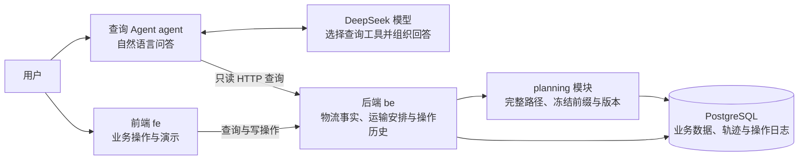

# JINGPO 项目协作索引

本文件是项目地图与协作规则。开始工作先读这里，再按任务打开对应文档；接口、字段、SQL 和验收细节放在 `docs/` 下，不在这里堆积。

## 必须遵循的文档规则

1. **PRD、技术方案要用大白话说明白。** 先说要解决什么问题、用户会看到什么变化，再讲必要的实现。少用术语；必须用时，紧跟一句解释。正文短而清楚，复杂细节拆到专项文档。
2. **图文一起表达。** 流程用流程图，模块关系用架构图，状态变化用状态图，界面行为用截图或示意图；优先使用 Mermaid。图旁配简短解释，让人一眼看懂。字段映射、方案差异用表格，不能只写大段文字。
3. **架构或重大模块更新后，同步更新本文件。** 模块新增、拆分、职责变化、主要调用链变化、关键业务模型或客户端契约变化，都要在同一次交付中更新架构图、模块入口和文档链接。
4. **本文件只做索引。** 详细说明优先放进现有 `docs/prd/<版本>/`、`docs/技术方案/<版本>/<模块>/`；需要模块自己的 `doc/` 或 `docs/` 时，在这里补链接。不要复制多份相同规则或整份规格。
5. **目标和结果要分清。** 草案不等于已实现，代码改动不等于验收通过。说明做了什么、验证了什么、还有什么待验证；不把未执行的检查写成通过。

PRD 建议顺序：问题与目标 → 用户流程图/界面示意 → 范围与关键规则 → 验收示例。
技术方案建议顺序：怎么解决（一小段话）→ 架构/数据流图 → 关键改动与取舍 → 验证与风险；详细契约和实施步骤另附链接。

## 项目一眼看懂

物流演示系统：前端操作业务，后端维护物流事实与运输安排，查询 Agent 用自然语言读取后端数据。

模型不直接访问数据库。前端负责展示，业务状态、可执行操作和延误结果以 BE 为准。

## 各项目从哪里开始

| 项目 | 负责什么 | 入口 |
| --- | --- | --- |
| `fe/` | 业务页面与演示操作 | [前端 README](fe/README.md) |
| `be/` | 业务规则、数据与接口 | [后端 README](be/README.md) |
| `agent/` | 自然语言物流查询 | [查询 Agent README](agent/README.md) |

具体代码结构、业务规则、启动和验证方式看对应 README 及其链接的详细文档；相关规则变化时更新所属项目文档。

## 文档去哪找

| 要了解什么 | 文档 |
| --- | --- |
| 订单、运单、揽收与入站的含义 | [领域术语](be/CONTEXT.md) |
| V1 产品范围与界面示例 | [V1 PRD](docs/prd/v1/JINGPO-logistics-system-v1.md) |
| V1 后端总体设计 | [技术方案](docs/技术方案/v1/be/be-v1技术方案.md)、[规格](docs/技术方案/v1/be/spec.md)、[实施与验证记录](docs/技术方案/v1/be/plan.md) |
| V1 查询 Agent 设计 | [技术方案](docs/技术方案/v1/agent/agent-v1技术方案.md)、[规格](docs/技术方案/v1/agent/spec.md)、[实施与验证记录](docs/技术方案/v1/agent/plan.md) |
| V2 通用物流阶段与轨迹事件 | [V2 PRD](docs/prd/v2/JINGPO-logistics-system-v2.md)、[后端规格](docs/技术方案/v2/be/spec.md)、[实施计划](docs/技术方案/v2/be/plan.md) |
| V3 站点与线路配置（BE 已实现） | [V3 PRD](docs/prd/v3/JINGPO-logistics-system-v3.md)、[规格](docs/技术方案/v3/be/spec.md)、[实施计划](docs/技术方案/v3/be/plan.md) |
| V4 发车前取消与业务操作归属（BE 已实现） | [V4 PRD](docs/prd/v4/JINGPO-logistics-system-v4.md)、[BE 规格](docs/技术方案/v4/be/spec.md)、[实施计划](docs/技术方案/v4/be/plan.md) |
| V5 运单目的站更正（BE 已实现，FE 已适配） | [V5 PRD](docs/prd/v5/JINGPO-logistics-system-v5.md)、[BE 规格](docs/技术方案/v5/be/spec.md)、[BE 验收记录](docs/技术方案/v5/be/plan.md)、[FE 适配记录](docs/技术方案/v5/fe/plan.md) |
| V6 完整运输路径与未来段调整（BE 已实现，FE 已接入） | [V6 PRD](docs/prd/v6/JINGPO-logistics-system-v6.md)、[BE 规格](docs/技术方案/v6/be/spec.md)、[BE 验收记录](docs/技术方案/v6/be/plan.md)、[FE 适配记录](docs/技术方案/v6/fe/plan.md) |
| V7 运输计划审核与全段任务生成（方案草案） | [V7 PRD](docs/prd/v7/JINGPO-logistics-system-v7.md)、[BE 规格](docs/技术方案/v7/be/spec.md)、[实施计划](docs/技术方案/v7/be/plan.md) |

当前快照（2026-09-30）：V2 通用阶段、事件、迁移及 BE/FE/Agent 客户端已在工作区实现。BE 6 项、Agent 20 项测试及前端构建通过，页面全流程走查、历史迁移演练和真实 Agent 查询工具核验完成；证据记录在 [V2 实施与验证记录](docs/技术方案/v2/be/plan.md)。开发库已由用户升级到 V2（`f714e269c2db`）；本地后端就绪，真实只读契约检查通过。

V3 后端站点/线路配置、运单目的站、停用保护、任务延误快照与迁移已实现；16 项后端测试通过，迁移模型无差异。本轮用户明确只负责 BE，客户端由其负责方推进。开发库已备份并升级为 V3（`a83c9e14d602`），后端已恢复且只读检查通过；迁移版本和验证证据见 [V3 BE 验收记录](docs/技术方案/v3/be/plan.md)。

V4 BE 已实现发车前取消任务、批量占用释放、取消信息与关联历史、操作资格和运单任务历史查询；开发库已备份并升级为 V4（`d92f4b76e301`），后端已重启且只读检查通过。业务操作回归运单和任务页面的 FE 工作，以及 Agent 适配，由其负责方验收。迁移与测试证据见 [V4 BE 验收记录](docs/技术方案/v4/be/plan.md)。

V5 BE 已实现目的站更正、原站前提校验、幂等和更正历史查询；35 项联合后端测试及迁移结构检查通过。复用 V4 数据结构，不需要迁移，不自动更正开发库运单。FE 已接入运单详情更正操作与独立更正历史，lint 和构建通过；Agent 适配由其负责方推进。

V6 BE 已实现可复用路径方案、运单独立路径与版本、下一段批量任务及未来调整；48 项联合后端测试和迁移检查通过。新增 planning 模块与 e61a7c93b204 迁移。开发库已于 2026-10-01 备份并升级到该版本，本地后端已启动，存活与数据库就绪检查通过；备份位于 `be/backups/jingpo_logistics_before_v6_20261001_134940.dump`。旧任务可继续，后续新任务按完整剩余路径校验。FE 已接入方案管理、运单路径规划/调整/历史和带路径版本的下一段批量创建；lint、构建及只读接口契约检查通过，页面操作走查仍待验收。Agent 适配由其负责方推进。

V7 方案已按会话 `01a0f630-e7e5-70c2-a0b4-60b08ff2f56b` 的讨论与用户截图修订：选择路线生成各站时间预览，人工修改并确认后一次生成全部分段任务。拟新增 `scheduling` 模块负责审核、时间版本及任务链，transport 负责真实执行；未来关联与当前执行占用分开，实际到站激活已有后段。详细架构见 V7 BE 规格；当前架构图表示 V6 已实现结构，V7 代码、迁移和验收尚未开展。

## 每次交付怎么收尾

先查相关 PRD、规格和当前代码，遇到不一致明确说明。变更接口或模型时检查 BE、FE、Agent 与迁移的影响；执行与改动相关的验证，并记录结果。架构或重大模块变化时更新本索引及详细文档，确认链接、图示和实现一致；小修不需要往索引追加流水账。
