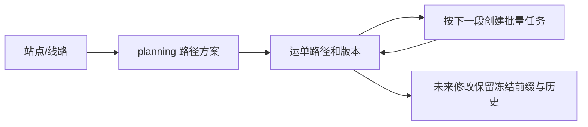

# BE

## 统一运输线路

`lines` 模块提供 `/api/v1/transport-lines` 统一管理：站点顺序、各段参考耗时和中转覆盖值。`GET /api/v1/shipments/{id}/line-options` 按起终站返回候选及推荐；预览支持 line_id/expected_line_version。旧 routes 是内部运输分段，path-plans 是旧完整线路接口，两类管理接口已标记弃用并保留兼容。

开发库已备份升级 c52d09a13f84，目录 2,347 条（启用 2,346），现有 44 个城市站的 1,892 个有向组合全部有线路。耗时为明确标注的演示值。初始化其他环境用 `python -m lines.seed` 和 `python -m lines.seed_national`，先迁移并备份。契约、部署与实际检查见 [统一线路说明](../docs/技术方案/v7/be/unified-transport-lines.md)。

## 服务器时间（取代模拟时钟）

揽收、收货入站、发车、到达、派送、签收及其他操作，均由后端在执行时记录服务器 UTC 时间。延误和预测使用服务器当前时间；计划时间仍由用户审核。前端已移除演示时钟与推进时间入口。

新增迁移 `c84e2b19a607`（接 `30ec3dbeb8ac`）删除模拟时钟表，保留历史业务时间。部署需停止旧服务、备份、迁移并重启；开发库尚未执行本次迁移。`GET /api/v1/server-time` 及任务/计划响应的观察时间字段统一为 `server_time`。详细契约见 [服务器时间说明](../docs/技术方案/server-time.md)。

## 寄件首站与创建后计划预览

服务范围新增 purpose：PICKUP 接收、DELIVERY 派送。创建运单时唯一匹配寄件区域会保存 planned_origin_station_id；已有运单可只读推断。path-options 现在提供计划起点和多段路线候选，`GET /api/v1/shipments/{id}/schedule/initial-preview` 可在实际入站前生成默认时间预览。参考耗时缺失时返回缺项，保留人工编辑时间；确认后才建任务。ARRIVE 可省略 station_id，确认实际入站时默认计划首站。

开发库已备份并升级 a39f04d72816，新增 44 条接收范围；旧 44 条派送范围保留。源码合并 head 为 b41c60e79a23，开发库未执行模拟时钟表删除分支。详细契约与实际检查见 [计划首站说明](../docs/技术方案/v7/be/planned-origin-and-preview.md)。

## 站点服务范围与自动目的站

新增 `station_service_areas`，配置站点负责的省、市或区县。创建运单时 `destination_station_id` 可省略，按订单收件区域自动匹配；`GET /api/v1/orders/{id}/destination-match` 可先预览。区县优先于城市和省级，没有匹配或配置冲突时明确报错，已有运单不随配置变化改站。

开发库已备份并独立升级到 `d18a64b3902f`，44 条城市站演示范围已初始化；未执行待处理的模拟时钟删除迁移。前端配置与自动创建入口由其负责方接入。详细接口、部署命令与检查记录见 [站点服务范围说明](../docs/技术方案/v7/be/station-service-areas.md)。

## 国内地址库

新增 `provinces`、`cities`、`districts` 三表与省市区只读查询，区县可直接归属省级。地址库迁移为 `77292ad0db58`（接 V7），随后订单/运单已接入寄收区域字段和名称快照，地址字段迁移为 `30ec3dbeb8ac`，已备份升级并恢复服务。全国区域数据已于 2026-10-02 初始化：34 个省级、355 个市级、3,241 个区县（含港澳台，首次导入后补齐乌苏市、沙湾市）。可用 `python -m regions.seed --dry-run` 检查，`python -m regions.seed` 初始化其他环境；先配置 DATABASE_URL 并备份。站点服务范围与自动匹配已接入，见下节。结构、接口、特殊层级及发布状态见 [地址库说明](../docs/技术方案/v7/be/address-library.md)。

订单与运单新地址字段和提交示例见 [结构化地址契约](../docs/技术方案/v7/be/structured-addresses.md)。本轮没有新增或运行功能测试。

## V7 运输计划审核与全段任务生成（后端已实现）

V7 流程为“选择/切换完整路线 → 自动预览各站时间 → 人工修改并确认 → 一次生成所有分段任务”。线路运输和站点中转时长提供参考，具体时间在运单计划中审核。一个任务对应一段线路；未来任务已有编号和关联，等待前段实际到达后才能发车。运单页面直接展示全段任务、计划时间和执行状态。

后端已实现预览、审核确认、全段任务链、等待/激活、共享及下游取消；迁移版本为 `f72d8a94c105`。入口：[V7 PRD](../docs/prd/v7/JINGPO-logistics-system-v7.md)、[BE 规格](../docs/技术方案/v7/be/spec.md)、[实施计划](../docs/技术方案/v7/be/plan.md)。新增 `scheduling` 模块负责预览、确认和任务链安排；`transport` 负责真实执行及激活已有后段任务。FE 和查询 Agent 独立适配，本轮未修改客户端。接口示例与操作顺序见 [客户端接入说明](../docs/技术方案/v7/be/client-contract.md)。发布状态及验证证据见 V7 实施计划。67 项后端联合检查全部通过，开发库已备份升级 V7，后端健康与只读契约检查通过。

V7 迁移：停止后端并 `pg_dump -Fc` 备份后，执行 `python -m alembic upgrade f72d8a94c105`，检查版本并重启。开发库备份：`backups/jingpo_logistics_before_v7_20261001_171109.dump`。升级保留旧事实和缓存，不自动建任务；回退恢复备份。

## V6 完整运输路径（后端已实现，V7 继续复用）

以下为 V6/LEGACY 流程说明；V7 新运单使用上方的审核确认流程。当前开发库为 V7。

配置一次完整路径方案，多张运单可复用。首次入站后按首站/目的站唯一匹配时自动绑定，多个方案只选择一次，无方案提示配置；中转后直接采用下一段。已绑定路径保存独立版本，不随方案编辑而变化。



### 主要契约

- `GET/POST /api/v1/path-plans`，`PATCH /api/v1/path-plans/{id}`：完整方案创建、查询、版本校验和启停；有序 `route_ids` 必须连续且最终站允许派送。
- `GET/PUT /api/v1/shipments/{id}/path`：当前完整路径与未来修改。PUT 要求 expected_version、expected_anchor_station_id、reason，以及 route_ids 或 plan_id/expected_plan_version。
- `GET /api/v1/shipments/{id}/path-options`：从接续站到运单目的站的可用方案。
- `GET /api/v1/shipments/{id}/path-history?page=1&page_size=20`：路径布局版本，区别于实际物流轨迹。
- 运单详情新增 path_version、transport_path 和 UPDATE_PATH 资格；运输中从本段终点修改未来路径，已完成/运输段保留，待发车任务先取消。
- `POST /api/v1/transport-tasks/create` 可省略 route_code，提供每张运单的 expected_path_versions，自动取共同下一段；不同下一段需先分组。原显式线路请求仍校验下一段，无法任意改线路。

自动任务请求示例（ID 和版本按实际数据填写）：

```json
{"shipment_ids":[10,11],"expected_arrival_at":"2026-10-02T12:00:00+08:00","expected_path_versions":{"10":1,"11":2}}
```

停用方案不修改绑定路径，停用未来线路会阻止新任务并提示重规划，已有任务仍可完成。更正目的站废弃旧未来段，保留已到达前缀并重新匹配。所有写入要求 Idempotency-Key，版本与接续站冲突后刷新再确认。

代码入口为 `planning/schemas.py`、`planning/service.py`、`planning/router.py`；通过 shipments/transport/network 集成自动绑定、下一段校验和停用保护。详细规则见 [V6 PRD](../docs/prd/v6/JINGPO-logistics-system-v6.md)、[spec](../docs/技术方案/v6/be/spec.md)、[验收记录](../docs/技术方案/v6/be/plan.md)。

### 从 V5 升级

**V6 需要数据库迁移**。开发库已于 2026-10-01 备份并升级到 e61a7c93b204，本地后端已启动，`/health` 与 `/health/ready` 检查通过。备份文件为 `backups/jingpo_logistics_before_v6_20261001_134940.dump`。其他环境升级前需停止后端并备份；新接口与运单查询依赖新表/字段：

```bash
mkdir -p backups
pg_dump -Fc jingpo_logistics -f "backups/jingpo_logistics_before_v6_$(date +%Y%m%d_%H%M%S).dump"
export DATABASE_URL="postgresql+psycopg:///jingpo_logistics"
./.venv/bin/python -m alembic upgrade head
./.venv/bin/python -m alembic current
./.venv/bin/python -m uvicorn main:app --reload
```

该 V6 迁移的目标版本为 e61a7c93b204；当前 head 已为 V7，单独复现 V6 时请指定该版本。迁移不自动创建方案或推测历史路径，旧任务可继续；旧运单后续新任务需要完整剩余路径。旧缓存/key/hash 保留，写后重新 GET。回退恢复升级前备份，不能直接 downgrade。

### 验证

```bash
DATABASE_URL="postgresql+psycopg:///jingpo_logistics_v6_test" RUN_V2_MIGRATION_TESTS=1 \
  ./.venv/bin/python -m unittest discover -s tests -v
DATABASE_URL="postgresql+psycopg:///jingpo_logistics_v6_test" \
  ./.venv/bin/python -m alembic check
```

48 项联合测试通过，结构检查无差异。测试库需先升级 head，原 V2 回归需要后文 A/B/C 网络；测试样本自行配置完整方案。迁移演练需 CREATE DATABASE 权限，自动清理自己创建的临时库；不启用 RUN_V2_MIGRATION_TESTS 时 8 项迁移测试跳过。客户端适配和页面/Agent 验收由其负责方完成。

## V5 运单目的站更正（后端已实现）

目的站更正只修改运输安排，订单、运单地址、当前位置与物流轨迹保持原样。允许待揽收、已揽收、无任务占用的在站运单更正；运输中、派送中、已签收拒绝。待发车任务需先取消。新站必须启用且允许派送。

- `PATCH /api/v1/shipments/{id}/destination`，要求 `Idempotency-Key`，返回最新运单详情。请求示例：

```json
{"expected_destination_station_id": 6, "destination_station_id": 5, "reason": "原目的站选择错误"}
```

两个 ID 必须为正整数，原因去首尾空白后为 1～500 字符。原目的站与当前不一致，或新站未变化，返回 409。相同 key 同内容重试返回首次缓存；不同内容返回 409。更正为当前所在站后允许开始派送，不自动派送。

- 运单详情 `allowed_actions` 新增 `UPDATE_DESTINATION`，不可用时区分阶段限制与任务占用。
- `GET /api/v1/shipments/{id}/destination-changes?page=1&page_size=20` 返回原站、新站、原因、服务器时间；不是物流轨迹。

**本版没有数据库迁移**，结构版本仍为 `d92f4b76e301`。历史幂等缓存不回写，客户端操作成功后重新 GET 详情取得当前资格。现有本地后端使用 reload，可自动加载代码；其他环境需重启进程。没有自动更正开发库中的运单。

35 项联合后端测试通过，迁移结构无差异；验证命令沿用下方测试命令，将库名换为 `jingpo_logistics_v5_test`。客户端页面与 Agent 独立交接；详见 [V5 PRD](../docs/prd/v5/JINGPO-logistics-system-v5.md)、[spec](../docs/技术方案/v5/be/spec.md)、[验收记录](../docs/技术方案/v5/be/plan.md)。完整运输路径安排另见 [V6 规划草案](../docs/prd/v6/JINGPO-logistics-system-v6.md)。

## V4 待发车任务取消（后端已实现）

后端迁移版本为 `d92f4b76e301`。待发车任务可取消并解除全部运单占用；任务及关联历史保留，运单位置、地址、订单和物流轨迹保持原样。取消原因不能被后续重试覆盖。

### 新增契约

- `POST /api/v1/transport-tasks/{id}/cancel`，请求 `{"reason":"线路选择错误"}`，要求 `Idempotency-Key`，返回任务详情。原因去首尾空白后为 1～500 字符，仅 `PENDING_DEPARTURE` 可首次取消。
- 任务详情/列表/写响应增加 `cancelled_at`、`cancel_reason`；状态筛选支持 `CANCELLED`。取消任务延误为 `NOT_APPLICABLE`。
- 任务详情 `allowed_actions` 增加 `CANCEL`；运单详情增加 `CREATE_TRANSPORT_TASK`。资格用于页面提示，提交仍由服务端重新校验。
- `GET /api/v1/shipments/{id}/transport-tasks?page=1&page_size=20` 查询原关联历史，包含未发车的取消任务及各次关联的 `released_at`。

同 key 重试返回首次快照；成功后客户端重新 GET 详情。新 key 同原因重复取消成功且不再次释放，原因不同返回 409。业务入口迁入页面由 FE 负责，本次后端交付不代表页面验收。详见 [V4 spec](../docs/技术方案/v4/be/spec.md) 和 [验收记录](../docs/技术方案/v4/be/plan.md)。

### 从 V3 升级

开发库已于 2026-09-30 备份并升级到 V4，后端已重启且只读检查通过，记录见 V4 plan。以下步骤用于其他 V3 环境：停止后端后，在 be 目录备份，再执行：

```bash
mkdir -p backups
pg_dump -Fc jingpo_logistics -f "backups/jingpo_logistics_before_v4_$(date +%Y%m%d_%H%M%S).dump"
export DATABASE_URL="postgresql+psycopg:///jingpo_logistics"
./.venv/bin/python -m alembic upgrade head
./.venv/bin/python -m alembic current
./.venv/bin/python -m uvicorn main:app --reload
```

迁移保留历史数据、幂等 key/hash，并补齐旧缓存响应字段。历史运单缓存新增创建资格保守禁用并提示刷新；不会根据当前网络猜测历史资格。V4 拒绝 downgrade，回退使用升级前备份。

### 后端验证

```bash
DATABASE_URL="postgresql+psycopg:///jingpo_logistics_v4_test" RUN_V2_MIGRATION_TESTS=1 \
  ./.venv/bin/python -m unittest discover -s tests -v
DATABASE_URL="postgresql+psycopg:///jingpo_logistics_v4_test" \
  ./.venv/bin/python -m alembic check
```

测试库需升级到 head 并初始化演示网络（见后文）。迁移演练自动创建和清理临时库，需要 CREATE DATABASE 权限；HTTP 测试自动管理测试服务。未启用迁移演练时 6 项迁移测试跳过。禁止用开发库执行测试。

## V3 可配置网络

V3 后端支持站点和单向线路创建、编辑、启停。站点配置首次入站/派送能力；线路配置延误监测。运单创建必须人工指定目的站，到达自身目的站后才能派送。旧订单地址保持不变。

V3 对应版本为 `a83c9e14d602`，详细接口与规则见 [V3 spec](../docs/技术方案/v3/be/spec.md)，测试和发布记录见 [V3 plan](../docs/技术方案/v3/be/plan.md)。前端与 Agent 是独立交付，本轮后续只负责 BE。

### 从 V2 升级

在 be 目录执行；先停止旧后端并备份，数据库地址按实际环境调整：

```bash
mkdir -p backups
pg_dump -Fc jingpo_logistics -f "backups/jingpo_logistics_before_v3_$(date +%Y%m%d_%H%M%S).dump"
export DATABASE_URL="postgresql+psycopg:///jingpo_logistics"
./.venv/bin/python -m alembic upgrade head
./.venv/bin/python -m uvicorn main:app --reload
```

已有网络保留，A 允许首站入站、C 允许派送、旧运单目的站=C。既有 AB 任务保持监测延误、BC 保持不适用。V3 不支持无损 downgrade，回退需恢复升级前备份。开发库的迁移由用户执行；测试使用独立库。

### 主要接口

- `GET /api/v1/stations`、`GET /api/v1/routes` 默认包括停用配置，`?enabled=true` 只查询启用记录。
- `POST /api/v1/stations`、`PATCH /api/v1/stations/{id}` 维护站点。
- `POST /api/v1/routes`、`PATCH /api/v1/routes/{id}` 维护线路。
- `POST /api/v1/orders/{id}/shipment` 请求体为 `{"destination_station_id": 3}`，站点 ID 必须是实际启用的派送站。
- 首次入站沿用 `POST /api/v1/shipments/{id}/events`，请求体 `{"event_type":"ARRIVE","station_id":"1"}`，由站点能力校验，不再固定 A。
- 任务候选、创建和查询支持任意符合编码规则的线路；延误结果由任务监测快照决定。

写操作要求 `Idempotency-Key`。编码与线路起终点不可修改，不提供删除；停用线路不阻断已有任务，停用站点会校验在站货物、未完成任务、目的运单和启用线路。

### 验证

隔离的 `*_test` PostgreSQL 库须先升级到 head 。原有 V2 回归测试还需要 A/B/C、AB/BC（初始化 SQL 见后文）：

```bash
DATABASE_URL="postgresql+psycopg:///jingpo_logistics_v3_test" RUN_V2_MIGRATION_TESTS=1 \
  ./.venv/bin/python -m unittest discover -s tests -v
DATABASE_URL="postgresql+psycopg:///jingpo_logistics_v3_test" \
  ./.venv/bin/python -m alembic check
```

16 项测试包含业务回归、V3 配置与并发、真实 HTTP 和迁移演练。迁移演练需要 CREATE DATABASE 权限，并自动清理自己创建的临时库；HTTP 测试自动启动并停止只连测试库的后端，无需手工启动服务。没有 opt-in 时 4 项迁移演练会跳过。业务测试保留样本，禁止使用开发库。

## V2 状态与事件迁移

V2 使用通用运单阶段 `AT_STATION`、`IN_TRANSIT` 和通用轨迹事件 `ARRIVE`、`DEPART`。A/B/C 仍是固定演示网络；揽收与首次入站分开。运单地址修改只影响运单，订单保留下单地址。

阶段表示货物所处环节，具体站点和线路从关联数据取得；运输中的最后扫描站点不是实时位置。任务发车、到达时，任务与全部关联运单的状态、轨迹、占用和操作日志必须在同一事务中更新，并保留幂等与业务防重规则。

业务含义见 [领域术语](CONTEXT.md)，完整规则与验收见 [V2 后端规格](../docs/技术方案/v2/be/spec.md)；未被 V2 改变的规则沿用 [V1 后端规格](../docs/技术方案/v1/be/spec.md)。

在升级已有 V1 数据库前先备份，并在副本上演练迁移。迁移会核对旧阶段、站点、任务关联，冲突数据会使升级失败且事务回滚。V2 阶段无法单凭字符串无损还原为 V1 的 `AT_A`、`AT_B` 等值；回退请恢复升级前备份。

```bash
export DATABASE_URL="postgresql+psycopg:///jingpo_logistics"
./.venv/bin/python -m alembic upgrade head
```

V2 当时的验收结果见其 plan；当前代码测试与数据库初始化请使用本文 V3 节。

V2 需求、验收和实施记录分别见 [PRD](../docs/prd/v2/JINGPO-logistics-system-v2.md)、[spec](../docs/技术方案/v2/be/spec.md)、[plan](../docs/技术方案/v2/be/plan.md)。

How to start?

```bash
python3 -m venv .venv
source .venv/bin/activate
python3 -m pip install -r requirements.txt

# 迁移文件步骤
export DATABASE_URL="postgresql+psycopg:///jingpo_logistics"
python -m alembic revision \
  --autogenerate \
  -m "create task shipments"

# main 当前目录的 main.py 
# :app 文件里的 app = FastAPI() 对象
#  --reload 修改代码后自动重启
python -m uvicorn main:app --reload

# 加上 DATABASE_URL 环境变量
export DATABASE_URL="postgresql+psycopg://franki@localhost:5432/jingpo_logistics"
export DATABASE_URL="postgresql+psycopg:///jingpo_logistics"
python -m uvicorn main:app --reload

# 迁移目录
python -m alembic init migrations

# 初始化 Alembic
python -m alembic init migrations

# 查看当前数据库版本
python -m alembic current

# 根据模型（models.py）生成迁移文件
python -m alembic revision --autogenerate -m "describe model change"

# 预览迁移 SQL
python -m alembic upgrade head --sql

# 执行迁移
python -m alembic upgrade head

# 进入 PostgreSQL
psql -d jingpo_logistics

# 查看表结构
psql -d jingpo_logistics -c '\d shipments'

# 设置 cors origin
export CORS_ORIGINS="http://localhost:5173,http://127.0.0.1:5173"

# 迁移顺序：（修改模型 → 生成迁移 → review 迁移 → 预览 SQL → 执行迁移 → 检查数据库）
```

## 1. 创建环境

```bash
cd be
python3 -m venv .venv
source .venv/bin/activate
python -m pip install -r requirements.txt
```

## 2. 启动 PostgreSQL

```bash
brew services start postgresql@17
brew services list
```

首次运行时创建数据库：

```bash
createdb jingpo_logistics
```

确认数据库可连接：

```bash
psql -d jingpo_logistics -c "SELECT 1;"
```

## 3. 配置环境变量

```bash
export DATABASE_URL="postgresql+psycopg:///jingpo_logistics"
export CORS_ORIGINS="http://localhost:5173,http://127.0.0.1:5173"
export LOG_LEVEL="INFO"
```

## 4. 执行数据库迁移

```bash
python -m alembic upgrade head
python -m alembic current
```

### 初始化固定演示网络

新库迁移只创建结构。首次运行时在当前 `DATABASE_URL` 所指数据库执行以下 SQL；已有网络不用重复初始化：

```sql
INSERT INTO stations (code, name, allows_first_arrival, allows_delivery) VALUES
  ('A', 'A 分拣站', true, false), ('B', 'B 中转站', false, false), ('C', 'C 配送站', false, true)
ON CONFLICT (code) DO NOTHING;
INSERT INTO transport_routes (code, origin_station_id, destination_station_id, delay_monitoring_enabled)
SELECT route.code, origin.id, destination.id, route.code = 'AB'
FROM (VALUES ('AB', 'A', 'B'), ('BC', 'B', 'C')) AS route(code, source, target)
JOIN stations origin ON origin.code = route.source
JOIN stations destination ON destination.code = route.target
ON CONFLICT (code) DO NOTHING;
```

测试库也需要此初始化；迁移测试自身会准备独立样本。

## 5. 启动服务

```bash
python -m uvicorn main:app --reload
```

访问：

- API 文档：http://127.0.0.1:8000/docs
- 存活检查：http://127.0.0.1:8000/health
- 数据库检查：http://127.0.0.1:8000/health/ready
