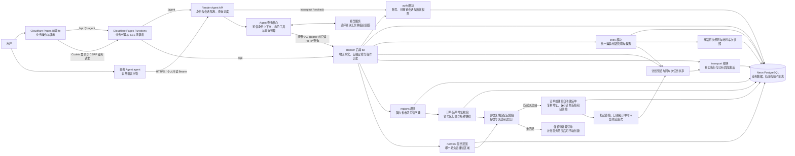

# 系统架构

本图由原根目录 AGENTS.md 迁入；部署操作以各项目 deploy-prod.md 为准，模块变更同步维护本图。

## 项目一眼看懂

物流演示系统：前端操作业务，后端维护物流事实与运输安排，所有动作时间由服务器生成，查询 Agent 用自然语言读取后端数据。

```mermaid
flowchart LR
    U[用户] --> FE[Cloudflare Pages 前端 fe\n业务操作与演示]
    U --> CLI[查询 Agent agent\n自然语言问答]
    CLI -->|HTTPS / 个人只读 Bearer| API[Render Agent API\n身份与会话隔离、查询进度]
    FE -->|/api 与 /agent| PROXY[Cloudflare Pages Functions\n业务代理与 SSE 流转发]
    PROXY -->|/agent| API
    PROXY -->|/api| BE[Render 后端 be\n物流事实、运输安排与操作历史]
    API -->|introspect / recheck| AUTH
    API --> CORE[Agent 查询核心\n可信身份上下文、角色工具与查询预算]
    CORE <--> LLM[模型服务\n选择查询工具并组织回答]
    FE -->|Cookie 登录与 CSRF 业务请求| PROXY
    BE --> AUTH[auth 模块\n账号、可撤销会话与数据权限]
    AUTH --> DB
    CORE -->|携带个人 Bearer 的只读 HTTP 查询| BE
    BE --> DB[(Neon PostgreSQL\n业务数据、轨迹与操作日志)]
    BE --> L[lines 模块\n统一运输线路管理与候选]
    L --> DB
    L --> LS[线路班次规则与计划车次快照]
    LS --> DB
    BE --> S[scheduling 模块\n审核时间、任务链与预测]
    L --> S
    S --> T[transport 模块\n真实执行与已有后段激活]
    BE --> T
    T --> DB
    BE --> R[regions 模块\n国内省市区只读字典]
    R --> DB
    R --> A[订单/运单地址校验\n省市区归属与名称快照]
    A --> DB
    BE --> N[network 服务范围\n哪个站负责哪些区域]
    N --> DB
    A --> M[寄收区域匹配起终站\n接收与派送用途分开]
    N --> M
    M -->|匹配派送站| C[订单创建后自动建运单\n复制地址、保存计划首站和目的站]
    M -->|未匹配| O[保留待处理订单\n补齐服务范围后可手动创建]
    C --> DB
    C --> V[按起终站、日期和订单时间窗筛选班次]
    V --> S[计划预览与同车次任务共享]
```

模型不直接访问数据库。前端负责展示，业务状态、可执行操作和延误结果以 BE 为准。
