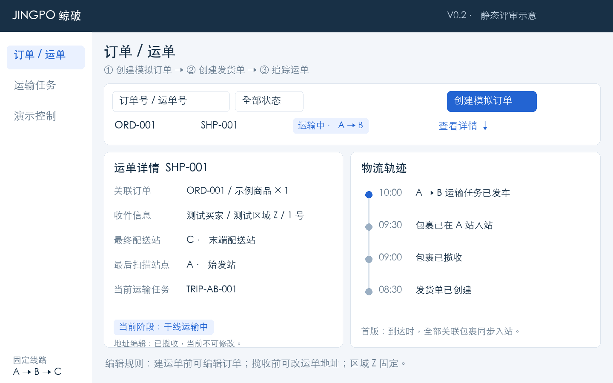
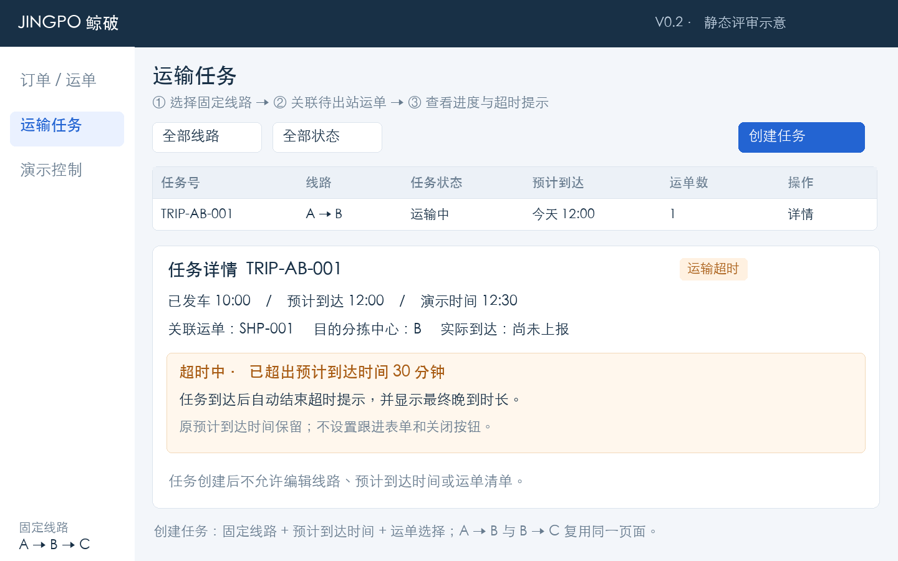
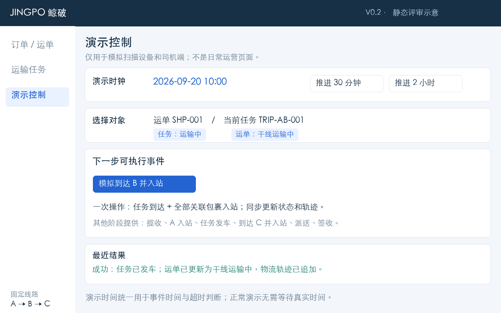
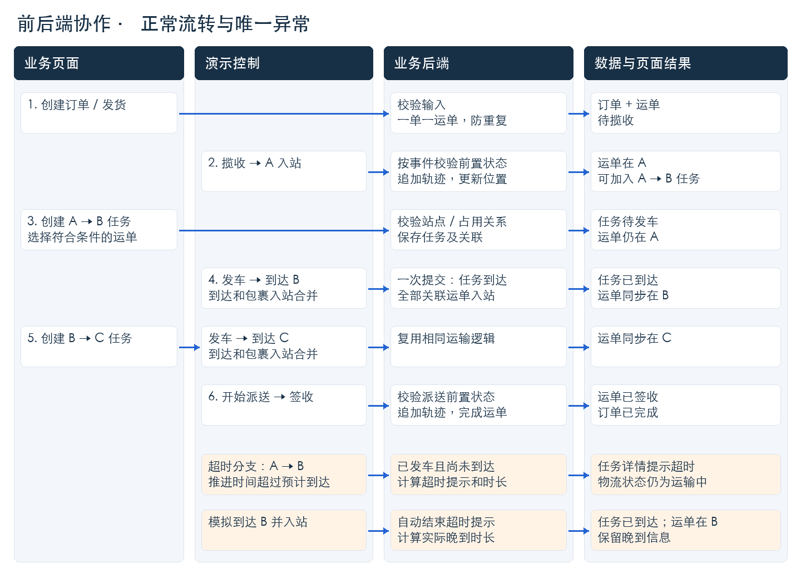

# JINGPO 鲸破 · PRD V1

JINGPO Supply Chain & Logistics System · 鲸破供应链物流系统

> V1 · 已定稿 · 2026-09-20。本文确定首版需求与业务规则，不包含功能实现。

## JINGPO 鲸破 · PRD

JINGPO Supply Chain & Logistics System

鲸破供应链物流系统 · V1 · 定稿 · 2026-09-20

目标：用一个轻量后台，演示一张运单从卖家经 A → B → C 到买家签收的完整过程，并显示干线运输超时及到达后的晚到信息。首版不实现 Agent。

### 01  首版范围

| 纳入首版 | 本轮不做 |
| --- | --- |
| 一单一包裹一运单；创建、发货、轨迹查询 | 支付、库存、拆合单、退货 |
| 固定 A / B / C 三站与 A → B、B → C 两条线路 | 站点管理页面、动态路由、路径优化、多市场 |
| 运输任务创建与运单关联；事件推进状态 | 车辆 / 司机管理、装笼、真实设备对接 |
| A → B 超时提示；到达后自动结束提示 | 异常工单、人工跟进 / 关闭、其他异常、Agent |

### 02  固定演示数据与角色

固定线路：卖家 → 揽收 → A 始发站 / 分拣中心 → 干线 → B 目的分拣中心 → 支线 → C 末端配送站 → 派送 → 买家。目的区域固定为测试区域 Z，由 C 配送。

使用订单 ORD-001、运单 SHP-001、任务 TRIP-AB-001 / TRIP-BC-001 串联示例；这些均为虚构数据。默认单个演示操作人，不实现登录和权限系统。

演示时钟起始为 2026-09-20 08:00（Asia/Shanghai）。页面与后端使用同一个时钟；真实时间不影响演示。任务示例：A → B 于 10:00 发车，预计 12:00 到达。

### 03  已确认的产品决策

已确认：三个页面够用；任务到达与全部包裹入站合并操作；超时按最简方式提示并自动结束；订单 / 运单按阶段允许编辑；运输任务保持创建后不可编辑。

简化假设：每次到达默认全部关联包裹完整入站，不模拟少件、漏扫或部分卸货。页面图为不同时间点的静态示意。本文为首版定稿；业务功能尚未实现。

## 页面 1 / 订单与运单

从创建订单到查看完整物流轨迹

### 功能与操作

列表按订单号 / 运单号和运输阶段查询。创建模拟订单时填写商品名称、数量、卖家信息、测试买家姓名与收货详细地址；区域 Z 固定。无运单的订单显示“创建发货单”，成功后进入运单详情。

运单详情展示关联订单、地址、运输阶段、最后扫描站点、当前任务及倒序轨迹。运输中显示“最后扫描 A”，不把 A 误称为包裹当前物理位置。

创建运单前可编辑订单的商品、数量和收发信息；创建后订单锁定。运单在揽收前允许修改收发地址文本，区域 Z 固定，不支持跨区改址；揽收后锁定地址。编辑入口仅在允许阶段显示，后端保存时再次校验。

### 业务规则与后端职责

必填项缺失、数量非正整数时禁止提交，并指出具体字段。后端生成订单号和运单号；同一订单重复发货返回原运单，不新增第二张。列表无结果显示空状态；请求失败保留输入并允许重试。

订单状态为“待创建运单 / 运单已创建 / 已完成”；签收后自动完成。运单地址是执行配送用的独立快照，修改不回写已锁定订单；地址修改记录前后值。运输状态、站点和轨迹不可手工编辑。

## 页面 2 / 运输任务

A → B 与 B → C 共用一套页面和逻辑

### 任务创建与详情

创建任务：选择固定线路、填写晚于演示当前时间的预计到达时间、勾选至少一张待出站运单。A → B 只列出已在 A 入站的运单；B → C 只列出已在 B 入站的运单。已关联待发车或运输中任务的运单不可重复选择。

详情展示线路、预计 / 实际发到时间、任务状态与关联运单。首版任务创建后不改线路、预计到达时间或运单清单；不做取消和删除。任务创建不会推进运单物流状态。

### 唯一异常表现：A → B 运输超时

任务运输中且演示时间晚于预计到达时间时，显示“超时中”和超出时长。后端以演示时钟及任务时间计算；前端在推进时钟、操作后或刷新时读取结果。不推断延误原因。

到达后自动结束“超时中”提示：若实际到达晚于预计时间，显示“已到达 · 晚到 X 分钟”；否则只显示已到达。只用任务时间计算，不建异常工单、跟进表单或关闭按钮。B → C 首版不显示超时提示。

## 页面 3 / 演示控制

用模拟事件替代扫描设备和司机端

### 提供哪些控制

选择运单或运输任务后，只开放当前可执行的事件：揽收、A 入站、任务发车、到达 B / C 并入站、开始派送、签收。不可执行操作禁用并显示原因，后端仍须再次校验。

提供“推进 30 分钟 / 2 小时”，累计推进演示时钟，不允许倒退。新物流事件以该时钟为发生时间；可以在同一时刻连续执行事件，并以写入序号排序。推进时钟只检查超时，不自动发车或到达。

### 关键事件约束

发车要求任务待发车且全部关联运单位于起点。合并到达操作要求任务已发车；后端取任务终点，统一记录实际到达时间，将全部关联运单更新至终点站内并追加入站轨迹。一并成功或一并回滚。

C 入站后才能开始派送；派送中才能签收。操作成功返回新的状态和轨迹，相关页面重新查询；失败不改状态并保留选择。相同事件重试不重复写入；跨过必要步骤的操作被拒绝。

## 协作流程与最小数据模型

先约定业务输入、状态和结果；本文不规定框架或 SQL

### 后端模块与核心数据

| 模块 / 表 | 用途 |
| --- | --- |
| 订单：orders、shipments | 一对一；保存订单、地址、运单阶段和最后扫描站点 |
| 预置网络：stations、transport_routes | 三站两线路，只读种子数据；下一段线路固定映射 |
| 运输：transport_tasks、task_shipments | 一任务多运单；一运单可先后参与两段任务 |
| 事件：tracking_events | 追加式保存运单事件、时间、站点及可选任务关联 |
| 操作记录：operation_logs | 记录业务操作、地址修改前后值及结果 |

共 8 张业务表，不建异常表；超时与晚到时长由任务时间计算。演示时钟使用单条持久化配置。前端调用查询 / 业务操作 / 演示事件接口；后端校验并保存，成功后页面读取新状态。

## 状态、验收与实现边界

先验证正常链路，再验证唯一异常

### 状态约定

运单：待揽收 → 已揽收 → A 站内 → A→B 运输中 → B 站内 → B→C 运输中 → C 站内 → 派送中 → 已签收。首版合并到达与入站操作，没有“车辆到达但包裹待入站”的中间状态。

任务：待发车 → 运输中 → 已到达。超时仅为 A → B 的附加提示，不改变任务或运单状态；到达后显示实际晚到时长。等于预计到达时间不算超时。时长以整分钟展示。

### 验收清单

| 编号 | 操作 / 前置条件 | 必须得到的结果 |
| --- | --- | --- |
| 01 | 创建订单并连续两次提交发货 | 只有一张运单，初始为待揽收 |
| 02 | 揽收、A 入站，创建 A → B 任务 | 候选运单正确；创建任务后仍在 A |
| 03 | 尝试重复关联、跳站或提前签收 | 后端拒绝，说明原因，数据不变 |
| 04 | 发车后，点击到达 B 并入站 | 任务与全部关联运单同步更新，追加轨迹 |
| 05 | 完成 B → C、开始派送、签收 | 运单签收，订单完成，轨迹完整 |
| 06 | A → B 预计 12:00 到达，推进至 12:30 | 显示超时 30 分钟；物流状态不变 |
| 07 | 12:30 点击到达 B 并入站 | 结束超时提示；显示已到达、晚到 30 分钟 |
| 08 | 建运单前改订单；揽收前改运单地址 | 允许；创建运单后锁订单、揽收后锁地址 |
| 09 | 尝试编辑已创建运输任务 | 拒绝编辑线路、时间及运单清单 |
| 10 | 重复提交事件 / 刷新 / 模拟失败 | 不重复轨迹；刷新可恢复；失败无部分更新 |

### 后端一致性要求

订单发货、事件处理、任务运单关联必须防重复。合并到达时，任务、全部运单、轨迹与日志一起提交，失败一起回滚。保存编辑时重查状态，避免揽收和地址修改冲突。非法状态、占用冲突和服务失败应说明原因。

### 定稿交付与后续

首版需求已定稿，交付包含本文、三张静态页面图和协作流程图。到达与入站合并，超时采用最简提示，订单 / 地址按阶段允许编辑，运输任务创建后不可编辑。后续依据本文确定技术方案并开展开发；Agent 后续独立设计。
