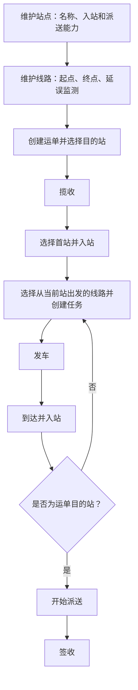

# JINGPO 鲸破 · PRD V3

> 2026-09-30 · V3 产品规格。后端实现与验收已完成；本轮用户明确分工仅负责 BE，客户端及页面验收由其负责方推进。承接已完成的 [V2](../v2/JINGPO-logistics-system-v2.md)。

## 1. 问题与目标

V2 的阶段和事件已经通用，但数据库、接口和页面仍限定 A/B/C、AB/BC。首站只能 A、派送只能 C、延误只计算 AB，换一张运输网络仍需要修改代码。

V3 让运营人员在页面维护站点和有方向的线路，并用新网络完成一次物流履约。每张运单明确目的站，操作人员选择首次入站和下一段运输线路。物流仍使用 V2 的六个阶段和六种事件。

## 2. 用户流程

例：新增广州首站 GZ、武汉中转站 WH、杭州配送站 HZ，以及 GZ_WH、WH_HZ 两条线路。创建目的站 HZ 的运单，人工选择 GZ 首次入站，再分别执行两趟任务，最终在 HZ 派送、签收。

## 3. 版本范围

| V3 纳入 | 后续版本再做 |
| --- | --- |
| 站点与线路新增、编辑、启停及管理页面 | 权限、多租户、批量导入、地图 |
| 首站与运输线路动态选择 | 根据地址自动分配首站、目的站 |
| 运单人工指定目的站，目的站决定派送资格 | 最优路径、自动调度、改道与目的站变更 |
| 每条线路配置是否监测延误 | 班次、车辆、容量、自动预计到达时间 |
| 历史数据迁移和 BE/FE/Agent 同步适配 | 取消任务、拆包卸货、异常工单 |

本版区域 Z 和订单地址规则沿用 V2。运输任务依然由人工输入预计到达时间，任务到达仍一次性完成全部关联运单入站。

## 4. 关键规则

### 站点和线路

- 站点有唯一编码、名称、启用状态，以及“允许首次入站”“允许派送”两个能力。同一站可以同时具有两种能力，中转站可以都不具备。
- 线路有唯一编码、固定起点和终点、启用状态、是否监测延误。线路是单向的，返回方向需要另建一条线路；V3 同一对起终点只维护一条线路。
- 编码和线路起终点创建后不可修改。名称可改；历史页面显示当前名称，历史站点 ID、编码和线路起终点保持稳定。
- 不提供物理删除。历史查询包含停用数据，新增业务的下拉框只提供可使用数据。
- 线路停用后不能创建新任务；已创建的任务可以继续发车、到达。修改延误监测只影响新任务。
- 站点停用前，必须没有在站未完成运单、未完成任务引用及未签收目的运单，并先停用关联线路。关闭站点能力时也须检查已有未完成业务，避免货物被卡住。

### 运单和操作

- 创建运单必须选择启用且允许派送的目的站；目的站是履约信息，不写回订单，V3 暂不允许变更。
- 揽收后，人工选择启用且允许首次入站的站点；仍需单独记录 ARRIVE。
- 创建任务必须使用启用线路，且起终点启用；候选运单必须在该线路起点、没有当前任务占用，且尚未到达自身目的站。
- 到达运单目的站后才能开始派送；仅“站点允许派送”不足以让所有在该站的运单派送。支持首站就是目的站，此时无需创建运输任务。
- 人工选择下一段线路；本版不保证网络可达、不替用户计算路径。选错路可以继续通过现有线路运输回目的站，尚不提供直接改写站点的纠正操作。
- 发车、到达、派送与签收保留 V2 的事务、幂等和并发占用规则。

### 延误

线路“监测延误”开关决定新任务是否计算超时、晚到。任务创建时保存该开关，后续线路编辑不会改变旧任务的解释。未开启时返回 NOT_APPLICABLE，不能显示成“未延误”。

## 5. 验收示例

| 编号 | 用户可复现的结果 |
| --- | --- |
| V3-01 | 页面新增 GZ、WH、HZ 和两条线路，无需改代码就能走完揽收到签收 |
| V3-02 | 可编辑名称、配置能力和启停；重复编码、自环线路、重复起终点明确报错 |
| V3-03 | 目的站 HZ 的运单到达另一个可派送站 WH，仍不能派送；在 HZ 可以派送 |
| V3-04 | 非首站能力的站点不能首次入站；错误起点、已占用运单不能加入任务 |
| V3-05 | 停用线路不能创建新任务，既有任务仍可完成；有未完成业务的站点不能停用 |
| V3-06 | 新线路启用延误监测后可超时、晚到；修改开关不改变旧任务 |
| V3-07 | V2 历史运单默认目的站 C，旧任务延误结果保持；历史事件身份与时间不丢失 |
| V3-08 | 前端和 Agent 支持新站点、新线路及筛选；V2 全链路、地址隔离、幂等、并发、回滚继续通过 |

规格见 [spec](../../技术方案/v3/be/spec.md)，步骤与状态见 [plan](../../技术方案/v3/be/plan.md)。
