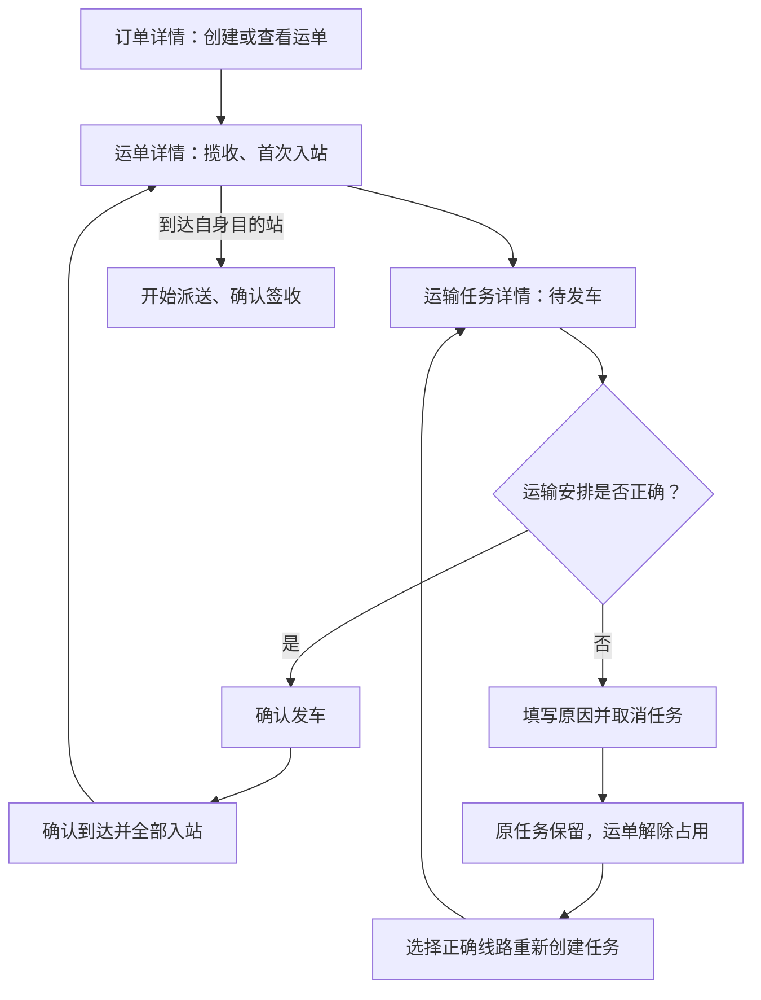

# JINGPO 鲸破 · PRD V4

> 2026-09-30 · BE 已实现并在隔离库验证；开发库已备份升级并重启；FE 页面与 Agent 适配独立验收。承接 [V3](../v3/JINGPO-logistics-system-v3.md)。

## 1. 问题与目标

V3 支持自定义网络并完成履约，但选错线路或运单后，待发车任务持续占用运单，操作员没有纠正入口。业务操作又集中在演示控制页，用户必须离开订单、运单或任务详情才能执行下一步。

V4 提供发车前取消任务并重新安排运输的能力；业务操作回到所属对象的页面。演示工具只负责查看和推进时钟。

本轮代理延续仅负责 BE 的分工：产品与后端契约已实现，前端交互由其负责方实现。本文页面要求用于交接，不代表页面已修改。

## 2. 用户流程



取消后货物仍在原站点。操作员更正的是运输安排，不能通过取消把已发车货物恢复成在站。

## 3. 范围与页面归属

| 页面 | 本版操作 |
| --- | --- |
| 订单列表/详情 | 创建、编辑订单；创建运单；查看并跳转关联运单 |
| 独立运单列表/详情 | 查看阶段、当前站/运输区间、目的站与轨迹；编辑履约地址、揽收、首次入站、派送、签收；创建/查看任务 |
| 运输任务列表/详情 | 批量创建任务；确认发车；确认到达并入站；发车前取消；查看关联运单、取消原因和历史 |
| 演示工具 | 查看、推进演示时钟；不再提供运单与任务业务写操作 |

V4 不增加订单/运单取消、发车后撤销、修改既有任务线路、改单、拆卸部分运单、运输异常工单、扫码、角色权限或自动调度。当前业务接口能复用的直接复用。

## 4. 取消规则

- 仅待发车任务允许取消。运输中、已到达任务拒绝；已取消任务不允许重新发车、到达或恢复。
- 取消原因必填，去除首尾空白后 1～500 字符；记录取消时间，使用演示时钟。
- 取消一次性释放全部关联运单占用，运单仍为在站，扫描站点、目的站、地址和订单状态不变。
- 任务及原关联保留，可从任务详情和运单任务历史追溯。记录操作日志，不新增发车、到达或取消类物流轨迹。
- 同一请求重试不能重复释放。不同 key、相同原因重复取消返回成功；不同原因不能覆盖首次取消记录。新任务占用不受旧任务重复取消影响。
- 发车与取消并发只能一个成功；故障时任务状态、取消信息、全部占用与日志整体回滚。
- 已停用线路的待发车任务仍允许取消；释放后是否能创建新任务，由当前线路与候选规则决定。

## 5. 交互交接要求

### 运单详情

```text
运单号 / 当前阶段
当前所在站或运输区间 · 运单目的站
主要操作                         查看当前任务
履约信息 | 物流轨迹 | 运输任务历史
```

| 阶段 | 主要操作与说明 |
| --- | --- |
| 待揽收 | 确认揽收；编辑地址为次要操作 |
| 已揽收 | 首次入站，弹窗选择允许首次入站的启用站点 |
| 在站，无占用、未到目的站 | 创建运输任务，预选当前运单，人工选择从该站出发的可用线路 |
| 在站，待发车任务占用 | 显示任务与占用说明，跳转任务详情 |
| 到达自身目的站 | 开始派送 |
| 运输中 | 展示当前任务、起终点及最后扫描站，跳转任务详情 |
| 派送中 | 确认签收 |
| 已签收 | 查看结果和完整历史 |

线路选择支持中转，不能只提供直达运单目的站的线路。没有可用线路时说明需要配置线路；服务端操作规则与提交校验仍是准则。

### 运输任务详情

待发车突出“确认发车”，同时提供“取消任务”；运输中突出“确认到达并入站”。取消任务用弹窗填写原因，并明确展示关联运单数量及“货物仍在原站点，将解除占用”。已取消时显示原因、取消时间和原关联运单。

发车与到达确认框显示任务编号、起终点和影响的运单数量。用户确认的是实际发生的运输动作；系统不会仅因为时间到期自动发车、到达。

成功后刷新任务、运单占用与轨迹；失败保留表单输入，显示错误并允许重试。取消和发车竞争失败时刷新详情，说明任务状态已变化。默认只突出当前可执行动作，必要限制在附近解释。

## 6. 验收项

| 编号 | 结果 |
| --- | --- |
| V4-01 | 多运单待发车任务取消后全部解除占用，货物仍在原站；可创建正确任务并完成运输 |
| V4-02 | 原任务、取消原因/时间和关联历史保留，运单任务历史包含无发车轨迹的已取消任务 |
| V4-03 | 同 key 重试、不同 key 重复、旧任务重试均不误释放新任务；原因不可覆盖 |
| V4-04 | 运输中/已到达拒绝取消；已取消拒绝发到；发车与取消竞争仅一个成功；批量失败整体回滚 |
| V4-05 | 订单→运单→任务可跳转，运单和任务详情能完成全流程，演示工具仅保留时钟 |
| V4-06 | V3 数据升级后任务、轨迹、占用和幂等记录可用；正常业务、网络停用、地址隔离、延误与并发回归通过 |

BE 完成与页面验收分别记录，不将接口通过当作页面通过。实现契约见 [spec](../../技术方案/v4/be/spec.md)，实施步骤见 [plan](../../技术方案/v4/be/plan.md)。
