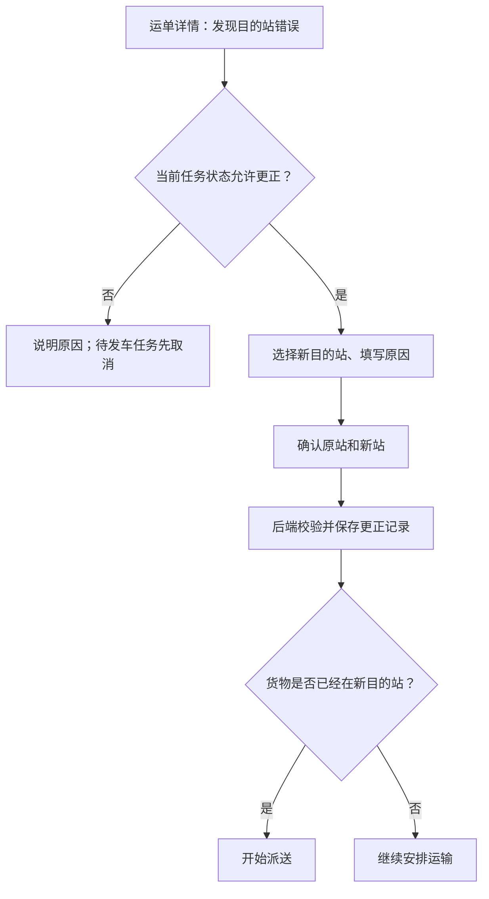

# JINGPO 鲸破 · PRD V5

> 2026-09-30 · BE 已实现并通过隔离库验收；客户端独立交接。承接 [V4](../v4/JINGPO-logistics-system-v4.md)。

## 1. 问题与目标

运单选错目的站后，可在运输开始前或运输途中更正；系统保留原因、原目的站、新目的站和操作时间。在途更正不改变正在执行的运输段，只调整抵达当前段终点后的安排。

更正物流安排不代表货物移动，订单及运单地址保持原值。地址不正确时通过现有地址维护流程处理。

## 2. 范围与规则

| 场景 | 结果 |
| --- | --- |
| 待揽收、已揽收、在站且无未释放任务关联 | 可更正 |
| 在站但被待发车任务占用 | 先取消原任务，再更正；不自动取消整批任务 |
| 运输中且存在当前执行任务 | 可更正；当前段照常抵达原定终点，本运单未发车的后续安排释放，之后按新目的站重排 |
| 运输中但无法确认当前执行任务、派送中、已签收 | 拒绝 |
| 新目的站 | 必须存在、启用、允许派送；与当前目的站不同 |
| 原因 | 必填，去首尾空白后 1～500 字符 |
| 页面看到的原目的站已变化 | 拒绝覆盖，刷新后重新确认 |
| 更正为当前所在站 | 运单仍为在站，可开始派送；不自动派送 |
| 同请求重试 | 返回首次成功快照，不再写更正记录 |
| 新请求但目的站未变化 | 拒绝，不制造重复记录 |

记录更正前后目的站、原因和演示时间；物流轨迹不新增事件。订单、运单地址、当前扫描站、运单阶段、任务历史和已有物流事件保持不变。

目的站更正不等于车辆临时改道：在途中的货物仍先到当前运输任务原定终点；到站后再从实际站点规划后续路线。收件地址和订单不随目的站安排变化。

## 3. 客户端交接

运单详情提供“更正目的站”，按后端 UPDATE_DESTINATION 资格启用。弹窗显示当前目的站，选择可派送新站、填写原因，再确认前后站点。提示“收件地址不会改变，请确认新站能够负责该地址的配送”；当前尚无站点服务区域模型，不能自动校验地址归属。

待发车任务占用时解释需先取消；运输中显示当前段保持不变、到站后重排的提示。派送中/签收后说明阶段限制。成功后重新 GET 运单和更正记录。状态或原目的站冲突时刷新详情，保留输入供重新确认。

在运单详情展示“目的站更正记录”，与物流轨迹分开，按最新操作在前分页显示。FE 页面及 Agent 只读适配由其负责方完成。

## 4. 验收项

| 编号 | 必须证明 |
| --- | --- |
| V5-01 | 三个允许阶段更正；货物在新目的站时派送资格恢复，可完成签收 |
| V5-02 | 任务占用/运输中/派送中/签收后拒绝，取消待发车任务后可更正 |
| V5-03 | 原因与站点校验、原目的站前提、幂等重试、并发不静默覆盖 |
| V5-04 | 更正与日志整体回滚；订单/地址/阶段/扫描站/轨迹/任务不被更正改写 |
| V5-05 | 原站、新站、原因、时间可查，分页/空记录/不存在运单契约完整 |
| V5-06 | V2/V3/V4 回归、旧幂等缓存可用、无需数据库迁移；页面另行验收 |

契约与验证见 [spec](../../技术方案/v5/be/spec.md)、[plan](../../技术方案/v5/be/plan.md)。完整路径安排已列为 [V6 规划](../v6/JINGPO-logistics-system-v6.md)，本版不提前实现。
