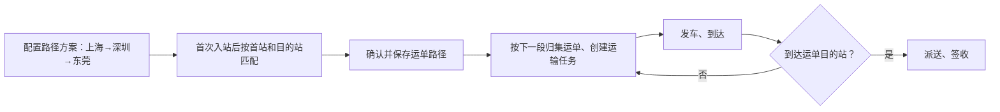

# JINGPO 鲸破 · V6 运单运输路径规划

> 2026-09-30 · 后续版本建议草案，尚未实施；具体契约待 V6 开始时确定。

## 1. 要解决什么

当前每到一站都需要重新挑线路，操作重复，也容易选错。配置一次完整路径方案，让多张运单按首站和目的站复用；运单拥有自己的路径，操作员到下一站直接采用下一段。

运单路径是全程安排；运输任务是一段线路上一批运单的一趟运输。自动选出下一段不会自动代表车辆已经发车或货物已经到达。

## 2. 建议边界

| 增强 | 建议规则 |
| --- | --- |
| 可复用路径方案 | 明确首站、最终站及有序线路；线路连续、无重复绕行，起终点一致 |
| 路径确定时机 | 当前创建运单只指定目的站，首站在首次入站时才确定；首站明确后匹配完整方案。若希望创建时确定，需要先增加计划首站 |
| 没有匹配方案 | 显示缺少配置；允许人工配置完整路径，不能静默猜测 |
| 多个匹配方案 | 操作员一次选择，后续中转无需重新选择 |
| 批量运输 | 按当前站和路径下一段筛候选；仍支持多运单共享任务 |
| 路径调整 | 从当前站，或正在运输段的终点重新连接未来路径；最终站仍为运单目的站 |
| 已完成段 | 保留实际历史，不可编辑 |
| 正在运输段 | 起终点和关联保持，未来路径从其终点接续 |
| 已绑定待发车任务的未来段 | 必须先取消占用该段的任务，再修改；不自动取消整批任务 |
| 方案被编辑或停用 | 不悄悄改写已绑定运单路径；未来段不可用时明确阻止并引导重规划 |
| 更正运单目的站 | 沿用 V5 时机限制；未来路径需重新规划，原路径版本保留 |

例如上海→深圳正在运输，可以把未来的深圳→东莞改成深圳→广州→东莞；不能把正在运输的上海→深圳改成上海→广州，也不能修改此前已经完成的段。若目的站本身要改，使用目的站更正规则，不能借路径编辑绕过限制。

## 3. 分步推进

V6 建议只完成路径方案、运单路径快照、按下一段创建任务和未来段修改。自动最短路/成本/时效优化、车辆容量、班次计划与自动派车留到后续版本。

确认路径方案版本、并发前提、旧运单如何补路径以及停用保护后，再编写 BE spec/plan。当前未新增模型、接口或迁移，不将该建议记为 V5 已实现功能。
