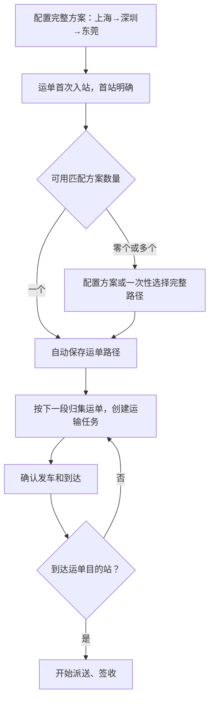

# JINGPO 鲸破 · PRD V6

> 2026-09-30 · BE 已实现并通过隔离库验收；开发库已于 2026-10-01 升级到 e61a7c93b204，FE/Agent 独立交接。

## 1. 问题与目标

每到一站都要重新挑线路，操作重复，也容易选错。V6 配置一次可复用的完整路径方案，让多张运单按首站和目的站采用；每张运单保存自己的路径，到下一站直接使用下一段。



运单路径是全程安排；运输任务是一段线路上一批运单的一趟运输。路径自动匹配不代表车辆发车或货物到达。首次入站已在运单目的站时直接可以派送，无需配置零距离路径。

## 2. 本版范围

| 增强 | 规则 |
| --- | --- |
| 可复用方案 | 起终点固定、有序线路连续、未来路径内无循环；配置版本与启停 |
| 路径确定时机 | 首站首次入站时明确；一个可用匹配方案自动采用，多个时一次选择，无方案则显示待规划 |
| 自动匹配失败 | 不阻止真实入站；入站成功后暂不能创建下一段任务，需补充完整安排 |
| 运单路径快照 | 不受方案后续编辑/停用影响；每次调整保留旧版本与原因 |
| 下一段运输 | 创建任务可自动采用下一段；所有运单必须同一段，位置/占用/版本仍重新校验 |
| 兼容显式选线路 | 保留原请求，但只允许当前路径下一段；不能跳过路径约束 |
| 未来调整 | 在站从当前站接续；运输中从本段终点接续；最终站仍是运单目的站 |
| 已完成/正在运输 | 段 ID、任务、起终点、位置及轨迹不改写，冻结前缀保留 |
| 待发车任务 | 先取消，再改路径；不自动取消整批任务，也不擅自移除单张运单 |
| 取消后重新安排 | 原段恢复可安排，取消历史保留；可以重新创建该段或更改未来路线 |
| 网络停用 | 方案停用不改绑定；线路停用阻止未来新任务、已有任务可继续；未来路径引用的站点保护 |
| 更正目的站 | 沿用 V5 时机限制；废弃旧未来段，保留已完成段，唯一新方案可自动绑定，否则重规划 |

没有自动最短路/成本/时效优化、班次/车辆容量、自动派车、按收件地址推断目的站或修改运输中任务。首次入站的首站尚未知时不猜完整路径。

## 3. 调整示例

```text
原安排：上海 → 深圳 → 东莞
当前事实：上海 → 深圳正在运输
新未来安排：深圳 → 广州 → 东莞
结果：上海 → 深圳保持原任务和原段；后续变为深圳 → 广州 → 东莞
```

如果深圳→东莞已经创建待发车任务，先取消该任务再调整。若原段已经完成，调整从当前站接续，已完成历史继续保留。若最终目的站要变更，走 V5 更正流程，不能通过路径编辑绕过阶段限制。

## 4. 页面与客户端交接

- 网络配置新增完整路径方案：按顺序选择已有线路，展示站点链；编辑带版本，停用提示不影响已绑定路径。
- 运单详情展示“完整路径与当前进度”：已到达/运输中/待发车占用/未来段，当前下一段和阻塞说明。没有方案时引导配置；多个方案只需选择一次。
- 创建任务预填/自动使用下一段；批量列表按 next_route_code 归集，不自动拆批。自动创建提交每张运单的路径版本，避免过期页面采用新的线路。
- “调整未来路径”弹窗显示冻结前缀、接续站、目的站，只编辑未来部分；填写原因。待发车占用时跳转任务取消。
- 单独展示版本历史，区分“运输安排变化”和“实际物流轨迹”。旧运单绑定前完成的历史从任务/轨迹查询，不声称系统曾保存完整路径。
- 成功后刷新详情，版本/接续站冲突时刷新再确认；幂等缓存重放不当作当前状态。

FE 及 Agent 由其负责方独立实现和验收。本次仅 BE，不把接口通过记为页面通过。

## 5. 验收项

| 编号 | 必须证明 | BE 结果 |
| --- | --- | --- |
| V6-01 | 唯一方案自动绑定；无/多个方案入站成功但需一次规划 | 已通过 |
| V6-02 | 两张运单共享任务，自动用下一段，中转无需重新选路线 | 已通过 |
| V6-03 | 仅改未来段，完成/运输段身份不变，待发车先取消 | 已通过 |
| V6-04 | 方案版本、路径快照和旧版本保留；方案编辑/停用不改已有绑定 | 已通过 |
| V6-05 | 连续性/循环/起终点/启停/版本/严格参数校验，候选与实际创建规则一致 | 已通过 |
| V6-06 | 目的站更正不改地址/位置/轨迹，旧未来段失效、已完成前缀保留 | 已通过 |
| V6-07 | 路径/任务竞争唯一成功，路径版本故障和自动绑定失败完整回滚 | 已通过 |
| V6-08 | 历史数据与旧 key 保留，旧任务继续，新增任务不绕过规划；空库/旧库升级、旧版回归 | 已通过 |

数据与接口见 [spec](../../技术方案/v6/be/spec.md)，实际验证与发布步骤见 [plan](../../技术方案/v6/be/plan.md)。开发库已备份并升级到 e61a7c93b204，存活与数据库就绪检查通过；详细证据见 plan。
