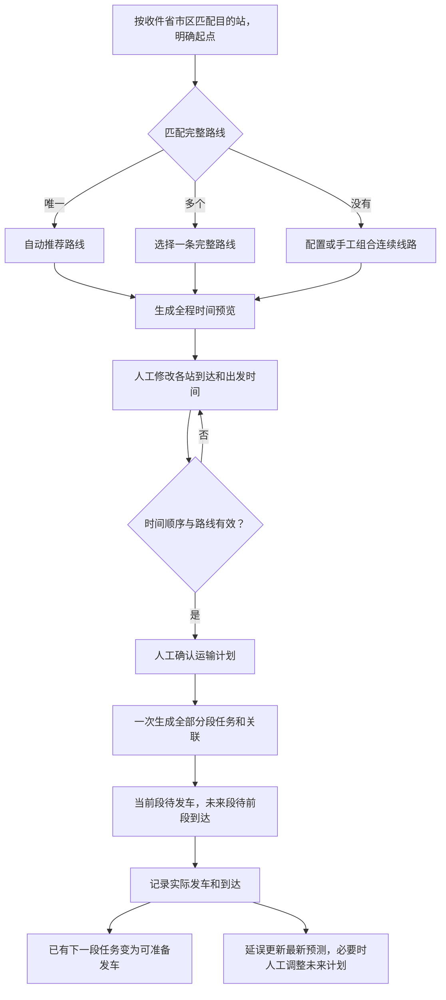

# JINGPO 鲸破 · PRD V7

> 2026-10-01 · 根据会话 `01a0f630-e7e5-70c2-a0b4-60b08ff2f56b` 的讨论与用户提供的截图修订。BE 已实现并验证；FE/查询 Agent 独立接入和验收。

## 1. 问题与目标

用户需要在运单中看到完整路线、各站到达和离开时间，确认这套安排可执行。只自动选路、再逐段手工建任务操作繁琐；直接根据参考耗时自动执行安排，也会让用户无法提前审核时间。

V7 的正常流程是：根据订单收件省市区及站点服务范围自动确定目的站，再选择完整路线，系统生成全程运输计划预览，用户可以修改每个站点的时间，确认后一次生成所有分段运输任务。运单页面直接显示各段任务编号、计划时间和执行状态。

一个运输任务仍代表一段线路上一批运单的一趟运输。A→B→C 的完整路线包含 A→B、B→C 两段任务，两段在计划确认时就有编号。后段需要等货物实际到达起点，才能发车。

## 2. 用户流程与界面示意



路线切换后同步生成对应预览，保留原已确认安排直到新方案被确认。存在手工改过的时间时，切换前提示这些修改将重置，不能把旧路线的时间直接套给新路线。

```text
目的站：C                    完整路线：A → B → C
运输计划预览（可编辑）
站点     计划到达                  计划出发
A        实际首站入站时间          今天 20:00
B        明天 04:00                明天 06:00
C        明天 12:00                —
提示：AB 参考 8 小时，B 中转参考 2 小时，BC 参考 6 小时
操作：切换路线、修改各站时间、确认运输计划
```

确认后，同一页面展示：

| 自动生成的任务 | 计划时间 | 初始执行状态 |
| --- | --- | --- |
| TRIP-001 · A→B | 今天 20:00 → 明天 04:00 | 待发车（货物已在 A） |
| TRIP-002 · B→C | 明天 06:00 → 明天 12:00 | 待前段到达 |

预览和确认不会写入发车、到达轨迹。若首站尚未明确，需要先选择计划起点才能预览；货物尚未实际入站时，确认生成的首段显示“待首站入站”，未来段仍显示“待前段到达”。实际首站与计划起点不符时提示调整计划，不能修改真实入站记录来适配原路线。

## 3. 时长参考与人工审核

| 配置位置 | 内容 | 用途 |
| --- | --- | --- |
| 线路 | 标准运输分钟数，正整数 | 生成每一段建议到达时间 |
| 站点 | 默认中转处理分钟数，非负整数 | 生成下一段建议出发时间 |
| 路径方案 | 中间站处理时长覆盖值，可选 | 对这条完整路线提供更适合的中转参考 |
| 运单运输计划 | 每段计划出发和到达时间 | 人工审核后确定本次安排，写入各段任务 |

绝对日期时间在运单计划和任务中确定，配置路线时保存参考耗时。默认首段建议出发时间采用当前演示时间，用户可修改；首站不自动套中转耗时，目的站无需填写下一段出发时间。

用户可修改各站未来到达、出发时间。必须满足每段到达晚于出发、下一段出发不早于前段到达；未来首段出发不得早于确认时演示时间。输入时间可短于参考耗时，页面提示偏差并要求确认，不能把参考值变成不可修改的硬限制。已实际发生的时间只读。

缺少参考耗时时，预览标明缺项并留空对应建议时间，用户可以手工补全后确认。没有完整路线、时间不完整或前后矛盾时不能确认。

| 时间 | 保存与变化 |
| --- | --- |
| 计划时间 | 人工确认时保存版本；后续明确重规划再保存新版本 |
| 最新预计时间 | 根据实际运输、已审核时长和当前演示时间滚动估算 |
| 实际时间 | 对应真实发车、到达被确认时保存 |

任务 `expected_arrival_at` 仍有用：它保存人工确认的本趟计划到达时间，是判断本趟延误的基准。原全程计划保留，后续更新预测不会抹掉之前的延误。

## 4. 生成、执行与调整规则

| 场景 | 系统行为 |
| --- | --- |
| 唯一路线匹配或首次入站自动绑定路径 | 自动推荐并生成预览，等待人工确认 |
| 选择/切换路线、编辑时间 | 只更新候选预览；不创建任务、不改已确认计划 |
| 确认计划 | 全部未来段一次生成任务编号及运单关联，整笔成功或整笔失败 |
| 未来段等待 | 已有任务和关联，保留待前段到达状态；不占用运单当前执行位置 |
| 前段实际到达 | 释放本段执行占用，激活已有下一段关联；不重复创建任务 |
| 同一运单 | 可关联多个未来任务，但最多有一个当前执行占用；同一段只有一个未结束安排 |
| 多运单同趟 | 线路、已确认出发与到达时间、延误监测一致时可共用任务；预览显示共享信息 |
| 共享任务发车 | 所有成员都已到起点、前段完成且满足已审核中转时间后才允许发车 |
| 发生延误 | 显示新的预计时间及原计划偏差；需要修改未来任务时间时再人工确认 |
| 调整未来路线或每站时间 | 生成新预览，冻结已完成和运输中部分；确认后替换未执行安排并保留历史 |
| 共享任务需要调整 | 明示受影响运单；本版先解除相关未执行共享安排，再为受影响运单重新确认 |
| 取消未发车任务 | 取消该趟并使关联运单的下游未执行安排失效，提示重新确认；不自动重建 |
| 线路停用或实际首站不符 | 停用线路阻止新确认，已有任务可继续并显示风险；首站不符显示阻塞，保留真实事实并重新审核 |
| 到达目的站 | 站间运输完成，派送与签收沿用已有流程 |

未来任务正常等待时不属于运单当前位置或实际在途任务。若共享下一段的一部分成员尚未到站，任务继续等待并列出缺少哪些运单。

## 5. 范围和客户端影响

V7 包含参考时长、全程预览、每站时间编辑、人工确认、所有分段任务提前生成、未来任务等待与激活、延误预测、取消及未来重规划。实际发车、到达由操作或物流事实记录驱动；固定班次、车辆容量、最短路优化、自动演示发到、自动派送签收暂不纳入。

- BE：支持确认时生成任务链，拆分未来关联与当前执行占用，保证事务、依赖和版本正确。
- FE：运单中直接完成路线选择、各站时间审核和确认；展示全部任务及时间，减少反复跳转任务详情。
- Agent：只读解释已确认计划、未来任务等待、当前运输和延误，不能把已生成未来任务解释为实际已到站。

旧运单和旧任务继续原流程，迁移不自动生成计划或任务。用户可在后续规划时采用 V7；新运单使用“预览—确认”流程，系统推荐也必须经人工确认。

## 6. 验收示例

| 编号 | 必须证明 | 当前状态 |
| --- | --- | --- |
| V7-01 | 参考耗时、副本和覆盖值校验；耗时缺失允许人工补全，短于参考值提示后可审核确认 | BE 已实现并验证，证据见 plan |
| V7-02 | 选择目的站/路线生成全程预览；切换同步更新，预览不创建任务且不改已确认安排 | BE 已实现并验证，证据见 plan |
| V7-03 | 可修改每站未来到达/出发时间；缺项、逆序、过期首段、未确认参考偏差被拒绝 | BE 已实现并验证，证据见 plan |
| V7-04 | 一次确认 A→B→C 后两段都有编号和关联；后段在 B 实际到达前不能发车 | BE 已实现并验证，证据见 plan |
| V7-05 | 多未来关联与单当前执行占用并存；前段到达激活已有后段，任务数量不增加 | BE 已实现并验证，证据见 plan |
| V7-06 | 已确认时间一致才共用任务；所有成员到站后可发车，共享成员变化要求重新确认 | BE 已实现并验证，证据见 plan |
| V7-07 | 延误只更新预测；人工确认后才调整未来任务时间；完成/运输段和原计划历史保留 | BE 已实现并验证，证据见 plan |
| V7-08 | 取消、未来路径及目的站调整使受影响下游安排失效；不自动重建，不误取消无关运单 | BE 已实现并验证，证据见 plan |
| V7-09 | 确认/激活/取消并发和故障整笔回滚；幂等重放不重复生成或激活，旧数据兼容 | BE 已实现并验证，证据见 plan |
| V7-10 | 运单页面展示全段任务、各站时间及异常；Agent 区分未来任务与实际运输 | BE 已提供契约；客户端由各自负责方适配验收 |

本轮用户明确前端由单独 Agent 负责，后端通过不表示客户端已验收。客户端接入示例见 [接入说明](../../技术方案/v7/be/client-contract.md)。

数据流和契约见 [BE 规格](../../技术方案/v7/be/spec.md)，实施与证据状态见 [plan](../../技术方案/v7/be/plan.md)。

## 补充：订单地址自动确定目的站（2026-10-02）

用户填写收件省市区后，系统匹配负责派送的站点，创建运单时复制订单地址并保存目的站。区县配置优先，其次城市、省级。无匹配需配置服务范围，有冲突需修正配置，不随机选择站点。旧文本订单保留手选目的站；已有运单不随配置变化自动改站。运输路线和时间计划仍按原流程预览、确认。

BE 配置、预览、自动创建逻辑与结构迁移已实现，开发库已初始化城市站演示范围；只读匹配检查完成，功能写流程和 FE 页面待验收。接口与发布状态见 [服务范围技术说明](../../技术方案/v7/be/station-service-areas.md)。

## 补充：寄件地址确定计划首站

寄收件地址分别匹配计划首站和目的站，运单创建后即可获取直达或多段候选以及可编辑的时间预览。参考耗时缺失时提示人工填写，不阻止查看候选；确认计划后才生成任务。揽收与实际入站仍分别确认，实际入站默认带出计划首站。BE 已适配，写流程与页面仍待验收，见 [计划首站说明](../../技术方案/v7/be/planned-origin-and-preview.md)。用户提出统一线路管理，目前是讨论方案，未替换现有业务模型。

## 统一运输线路（2026-10-02，已确认并实现 BE）

用户只管理运输线路：直达是两站线路，中转是多站线路。同一起终站允许多条线路，运单按寄收区域匹配起终站后展示候选、推荐一条，用户选线并修改时间，确认后生成各分段任务。前端合并原“线路管理”“路径方案”入口，后台保留分段执行与历史版本。

国内演示覆盖现有 44 个城市站的区域直达、双向枢纽干线与跨区中转，1,892 个有向组合均有线路。时间是可修改的演示参考参数。BE 接口、迁移与初始化已交付，实际页面及业务写链路仍待验收，见 [统一线路说明](../../技术方案/v7/be/unified-transport-lines.md)。
