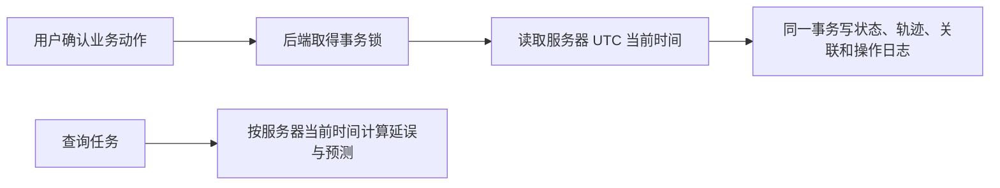

# 服务器时间：取消模拟时钟

揽收、收货入站、发车、到达、派送、签收等动作，由后端在执行时记录服务器当前时间。用户只确认动作，不填写实际发生时间。

| 时间 | 规则 |
| --- | --- |
| 实际动作时间 | 后端生成，保存为带时区的 UTC 时间；一个批量动作使用同一个时间 |
| 计划发车/到达 | 用户审核的计划基准，不替代真实执行时间 |
| 延误与预测 | 查询时按服务器当前时间计算，不使用浏览器时间 |
| 重试 | 保留首次动作时间，不重复写轨迹；查询最新状态使用 GET |
| 历史数据 | 保留旧轨迹及操作日志时间，不猜测真实发生时间 |

前端移除演示控制页、推进时间按钮和模拟时钟请求。`GET /api/v1/server-time` 返回 `server_time`，任务列表/详情及运输计划响应的观察时间也统一为 `server_time`；原 `/api/v1/simulation/*` 接口移除。Agent 使用后端返回的服务器时间解释延误。

原模拟时钟行同时承担全局并发锁。替换为 PostgreSQL 事务级 advisory lock，自动随提交/回滚释放；等待锁完成后再取时间，保留现有防重与批量事务保护。

运输计划预览签名保留计算时刻，确认时既复核配置与版本，也检查计划出发时间是否已经过去；不会因几微秒流逝就错误拒绝，也不会执行过期计划。

## 数据库切换

迁移 `c84e2b19a607` 接 `30ec3dbeb8ac`，仅删除 `simulation_settings` 表，不修改业务轨迹、任务或操作日志。旧幂等响应读取时适配观察时间字段，原 key/hash 和动作时间保留。

部署时停止旧服务、备份、执行 `alembic upgrade head` 后重启新服务。不能让使用时钟行锁的旧进程与新进程同时写库。回退恢复升级前备份，不提供伪造模拟时钟的 downgrade。

## 验证状态（2026-10-02）

隔离 PostgreSQL 数据库从空库升级到当前 Alembic head（含服务器时间与地址服务范围合并迁移）成功，`alembic check` 无模型差异。服务器时间 HTTP 回归覆盖揽收、入站、发车、到达、派送、签收和幂等重试；后端 67 项中 66 项通过。唯一失败是既有地址校验用例 `test_non_abc_http_flow_and_contract`：当前接口对缺少寄收地址返回 409，测试仍期待 422，与本次服务器时间改动无关。

Agent 22 项测试、前端 lint 和 production build 通过。前端构建有既有大 chunk 提示。开发库未执行迁移：当前 shell 未配置 `DATABASE_URL`，因此没有更改真实开发库。
