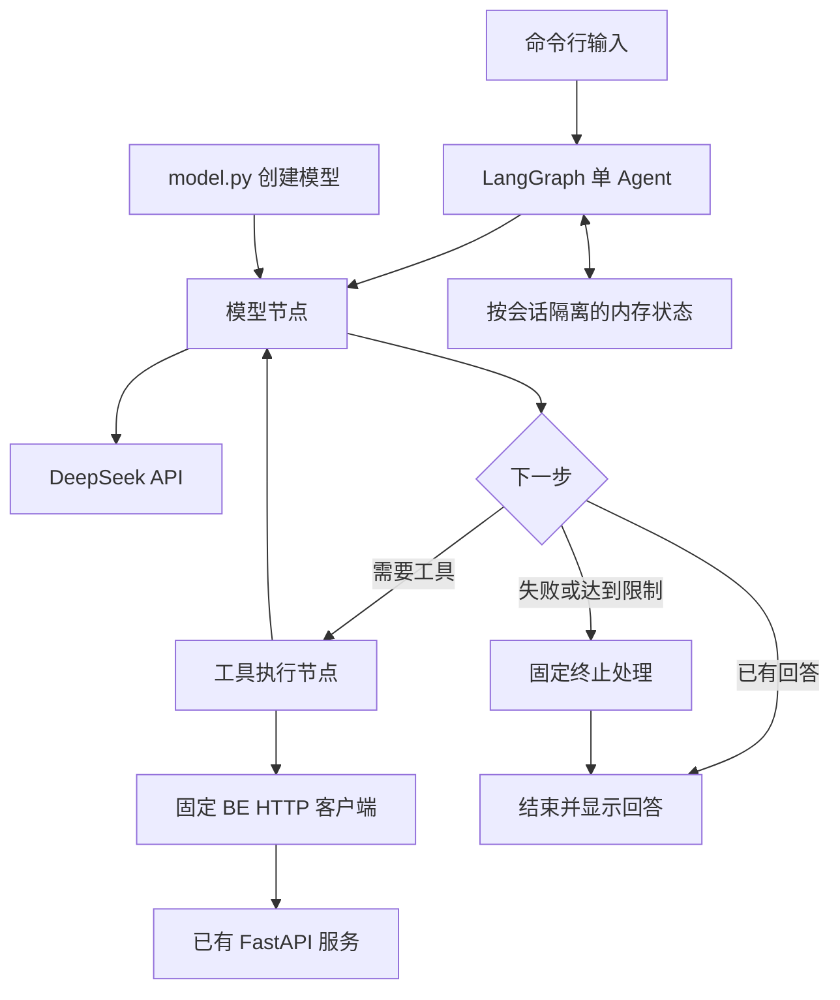

# JINGPO Agent V1 · 技术方案

> 2026-09-28 · 草案，供评审。方案不代表已实现；评审后编写 plan.md，由助手逐步实现、用户 review。

## 1. 目标与已确定选型

依据 [Agent 规格](spec.md)，提供本地命令行物流查询助手，支持订单、运单轨迹、任务及延误查询和会话内追问。

| 项目 | 选择 | 职责 |
| --- | --- | --- |
| 语言 | Python，沿用本机 3.12 环境 | 与 BE 使用相同语言，Agent 使用独立虚拟环境 |
| 流程 | LangGraph StateGraph | 显式定义节点、状态、条件分支与结束条件 |
| 模型组件 | langchain-deepseek 的 ChatDeepSeek | 首版接入 DeepSeek |
| 通用组件 | langchain-core | 消息、模型接口、工具声明 |
| 工具参数 | Pydantic | 校验类型、字段和业务参数范围 |
| HTTP | httpx AsyncClient | 调用已有 BE 只读接口 |
| 会话 | InMemorySaver | 按 thread_id 保存当前进程中的会话状态 |
| 交互 | 本地 CLI | 接收问题、展示回答及可选调用记录 |

显式编写 LangGraph 节点和连线。无需使用 LangChain create_agent，也无需引入完整 langchain 包来管理循环。模型具体名称通过配置指定，不将供应商当前型号写死在业务代码中。

依赖版本在首个实现步骤确认并固定；工具调用、消息转换和运行时取消能力通过最小连通验证后再继续开发。

## 2. 总体架构



模型负责理解问题、提出工具调用、解释返回结果。执行层负责实际调用、参数验证、预算与只读限制。物流阶段、关联关系和延误判断由 BE 提供；Agent 不连接业务数据库，也不导入 BE service 函数。

一个查询可以经过多次模型与工具交互，仍是单 Agent。各节点不会创建独立角色或子 Agent。

## 3. 模型适配与替换边界

### 3.1 统一入口

`model.py` 提供 `create_chat_model(settings) -> BaseChatModel`，当前只实现 provider=deepseek，对应 ChatDeepSeek。

- CLI 启动时创建一次模型实例；模型节点不直接构造厂商客户端。
- 节点依赖 LangChain 通用消息，以及模型的 ainvoke、bind_tools 接口。
- provider、model、api_key、base_url 来自配置。供应商专有参数只在 model.py 中映射，不散落在图或工具代码中。
- 未支持的 provider 启动时报明确配置错误，不静默回退到另一供应商。
- API 密钥缺失、模型名称为空和超限预算在启动时校验。

### 3.2 后续更换模型

增加供应商时，仅在模型创建入口增加适配分支与依赖。例如 OpenAI 可接 ChatOpenAI，Claude 可接对应 Anthropic 组件，Qwen 根据实际使用的服务端接口选适配器。

此处预留扩展入口，不提前实现三家未经验证的接入。更换后必须验证普通回答、工具调用、工具结果回传、多轮消息、超时及特有字段，不能假定只修改模型名称即可兼容。

### 3.3 DeepSeek 模式

首版优先使用支持工具调用的非思考模式，减少消息协议复杂度。具体模型与禁用思考的参数，在接入时依据 DeepSeek 对应型号文档确认，并在 model.py 中配置。

若后续启用思考模式，应由适配器正确保存并回传协议要求的字段；不把模型返回消息简化为仅 content，从而丢失工具调用或供应商元数据。界面及应用日志不展示内部推理内容。

## 4. 图、状态与五次限制

### 4.1 节点

| 节点 | 行为 |
| --- | --- |
| prepare_turn | 保留会话消息，重置本轮计数、结果摘要和终止原因；按完整交互裁剪历史 |
| model | 调用前检查并增加计数；每次均使用相同的工具绑定与正常处理逻辑，最多调用五次 |
| tools | 根据固定注册表串行执行工具；校验参数、检查预算、记录结果，并逐个返回 ToolMessage |
| stop | 不再调用模型，用固定模板说明失败或限制；可附已验证的对象、阶段等结构化事实 |

连线为 START → prepare_turn → model。模型输出普通回答或澄清问题即 END；输出工具调用则进入 tools。工具执行完成后，模型调用次数小于 5 时回到 model，否则进入 stop → END；异常或其他预算耗尽同样进入 stop。

### 4.2 计数定义

“最多 5 次”指每条用户消息最多发起 5 次模型 API 请求，包括最后回答；不是整个会话最多五次，也不是 LangGraph 的五个节点步骤。

1. 第 1～5 次模型请求均正常处理；任意一次返回最终回答或澄清问题，都立即结束本轮。
2. 每次模型要求工具调用时，均按同一规则执行工具；第 5 次也允许执行工具，但仍受工具数量、HTTP 数量与时间预算约束。
3. 第 5 次的工具执行完后，不发起第 6 次模型请求，直接进入固定终止处理，提示“已达到本轮模型调用上限，查询未完成”。可附已确认事实，但不把工具原始结果当作模型最终回答。空响应按协议错误终止。
4. 禁用模型 SDK 自动重试，失败请求也占用次数，确保没有隐式额外模型请求。
5. 后续用户追问开始新一轮，模型计数归零，保留合法会话历史。

### 4.3 默认执行预算

| 限制 | 默认值 | 执行位置 |
| --- | --- | --- |
| 模型调用 | 每轮最多 5 次 | 模型节点调用前检查 |
| 工具调用 | 每轮最多 8 次 | tools 节点；包含无效工具调用尝试 |
| BE HTTP 请求 | 每轮最多 24 次 | 每个实际请求前检查，包括工具内部组合请求 |
| 单次 BE 请求 | 最多 10 秒 | HTTP 客户端及异步总时限 |
| 单次模型请求 | 最多 45 秒 | 模型客户端及异步总时限 |
| 整轮执行 | 最多 120 秒 | CLI 外层包住整次图执行的异步时限 |
| 图执行步数 | recursion_limit=30 | 防止图连线错误的第二道限制 |

工具轮次、工具数量和 HTTP 数量分别计数。一次模型响应可能包含多个工具调用，一个工具也可能调用多个接口。V1 串行执行工具与内部 HTTP 请求，便于理解顺序和预算。

剩余整轮时间小于单次时限时，以剩余时间为准。模型与 HTTP 均不自动重试；用户可重新发起查询。异步取消后不启动新请求；已经发到远端的请求仍可能被远端处理，无法保证撤销计费。

recursion_limit 不替代模型调用计数。达到模型调用上限后不再请求模型，但可以处理第 5 次返回的工具调用；其余预算继续独立生效。因限制终止时不能声称完整查询成功。

### 4.4 状态与运行上下文

| 字段 | 用途 | 生命周期 |
| --- | --- | --- |
| messages | HumanMessage、AIMessage、ToolMessage；使用 add_messages 合并 | 当前会话 |
| model_calls、tool_calls | 本轮模型与工具尝试次数 | 每轮重置 |
| verified_facts | 本轮工具已确认的少量结构化事实，供失败时展示 | 每轮重置 |
| stop_reason | 超时、预算、协议或模型错误 | 每轮重置 |

HTTP 次数、monotonic 截止时间、客户端实例及 trace_id 放在每轮运行上下文中，不交给模型填写，也不作为会话长期状态。API 密钥不进入图状态。

所有请求产生的 tool_call_id 必须与 ToolMessage 配对，包括非法参数、未知工具或预算阻止执行的调用。正常失败通过节点返回合法消息；外层超时或意外中断后，恢复到上一轮完整会话检查点，再保存本轮用户输入和固定失败提示，丢弃中断轮的未配对消息。同一会话不并发执行两轮。

## 5. 工具设计与 BE 映射

工具按查询意图组织，允许一个工具组合多个已有接口。返回数据经过字段筛选，不把 BE 原始响应全部交给模型。

### 5.1 工具清单

| 工具 | 输入 | 执行行为 |
| --- | --- | --- |
| search_orders | order_no、shipment_no、stage、page、page_size | GET /api/v1/orders；返回订单候选及分页 |
| get_order | order_id 或 order_no，二选一 | ID 直接查询详情；编号先查列表并解析，再 GET /api/v1/orders/{id}；包含关联运单摘要 |
| search_shipments | shipment_no、stage、page、page_size | GET /api/v1/shipments；返回运单候选及分页 |
| get_shipment_tracking | shipment_id 或 shipment_no，二选一；include_tasks=false | 解析对象、查询运单详情和站点；需要时读取轨迹关联任务详情，返回阶段、轨迹和延误事实 |
| search_transport_tasks | task_no、route_code、status、page、page_size | GET /api/v1/transport-tasks；返回任务、延误字段和分页 |
| get_transport_task | task_id 或 task_no，二选一 | 解析对象并 GET /api/v1/transport-tasks/{id}；返回线路、时间及延误 |

站点解释通过 GET /api/v1/stations 在运单工具内完成；同一轮可缓存站点映射。站点接口失败时返回原 station_id 并标记名称未知，不推断名称。

### 5.2 编号解析与参数校验

- ID 必须是正整数；业务编号是非空字符串。不能把业务编号直接放入详情 ID 路径。
- 工具输入模型禁止额外字段；枚举沿用 BE，page≥1，page_size 默认为 10、上限 20。
- 编号查询不能假定 BE 筛选一定是精确匹配。优先确认返回项的完整编号精确相等；无精确匹配时返回候选，不自动选取模糊结果。
- 当前页没有精确匹配且仍有后续页时，返回“尚未确认”和分页信息，由用户补充编号或继续翻页；不自动扫描所有页。
- 多个精确候选或对象类型不明时要求澄清；唯一模糊候选也需确认。明确 ID 查询得到 404 时直接报告不存在。
- HTTP 层只接受固定方法与路径模板，不接受模型提供的 URL；禁用自动跟随重定向，查询参数由客户端编码。

### 5.3 关联查询与延误

订单问物流时，get_order 返回 shipment.id，再调用 get_shipment_tracking。询问延误时设置 include_tasks=true，从 tracking_events 中非空 task_id 去重并读取任务详情。

固定 V1 AB/BC 链路通常只有两个已执行运输任务。工具最多读取两个去重任务 ID；出现更多关系时只返回最近两个，并标记关联结果不完整，不能声称已经检查全部历史。

每个任务保留自身 route_code、status、simulation_time、delay_status、delay_minutes。当前运输与历史晚到分别表达；无任务轨迹不等于不存在待发车任务。BE 未提供的信息不通过扫描所有任务反推。

| BE 值 | 回答含义 |
| --- | --- |
| OVERDUE | 该 AB 任务运输中超时，分钟数沿用 BE |
| LATE_ARRIVAL | 该 AB 任务已到达，存在历史晚到 |
| NONE | 该任务当前无延误提示，不保证后续准时 |
| NOT_APPLICABLE | 该线路不适用延误计算，不等于已确认没有延误 |

时间展示注明北京时间或明确时区，业务时间以 simulation_time 为准。AB 计划到 B 的时间不解释成送达买家的时间。

### 5.4 统一工具结果

工具返回可 JSON 序列化的结果：

```json
{
  "status": "ok",
  "data": {},
  "error": null,
  "warnings": [],
  "meta": {
    "request_ids": [],
    "pagination": null,
    "truncated": false
  }
}
```

status 取 ok、empty、ambiguous、partial、error。error 使用 code、message 字段；分页包含 page、page_size、total。一个组合工具可能对应多个 BE request_id。

运单详情成功但任务查询失败时返回 partial，保留轨迹并说明无法确认延误。空列表与服务失败分开处理。轨迹默认最多传最近 50 条，保持 BE 顺序并附总条数及 truncated 标记；未返回部分不视为不存在。

查询订单默认仅返回编号、状态、商品摘要及关联运单；移除收发人姓名和完整地址。查询状态及轨迹只返回对应必需字段。单次工具序列化结果上限建议 32 KiB，超限时通过字段/列表裁剪返回有效 JSON 并标记 truncated，禁止直接截断字符串破坏 JSON。

## 6. 会话与上下文

首版使用 InMemorySaver；启动 CLI 创建随机 thread_id，同一会话的追问沿用该值。/new 创建新会话，/exit 退出。进程退出后会话丢失，README 明确说明。

- 记忆保存消息及查询对象引用，用于理解“它”“上一单”和候选选择。
- 历史结果只能帮助定位对象；询问当前状态或延误必须重新请求 BE。
- 提供给模型的历史最多保留最近 10 个完整用户交互，并控制序列化消息总量不超过 64 KiB；先移除最旧的完整交互，不能拆开工具请求和对应结果。
- 用户单次输入最多 4,000 字符；超限在 CLI 提示缩短，不调用模型。
- 被裁剪的指代信息无法确认时，重新询问编号；不使用模型自动摘要引入额外模型调用。
- 保留系统提示，且不重复追加到持久消息。对内存检查点设置会话清理：每轮完成后仅保留恢复所需的最新完整状态；新建会话时清理已放弃会话，避免检查点无限积累。具体清理 API 在实现时核对固定版本。

后续若要求重启恢复或多进程共享会话，再更换 PostgreSQL checkpointer，使用独立的 Agent 数据库或 schema。短期记忆可以持久化，但不会因此自动变成跨会话长期记忆。

## 7. 错误、只读约束与调用记录

| 场景 | 处理 |
| --- | --- |
| 缺编号、歧义 | 提问并结束本轮，用户补充后继续 |
| BE 404 / 空列表 | 区分详情不存在与当前筛选没有结果 |
| 参数错误 / BE 422 | 返回可理解的错误，允许在剩余预算内纠正 |
| BE 500、503、网络失败 | 报告服务问题，保留已有事实，不伪造缺失结果 |
| 模型认证失败、限流、超时 | 固定提示，隐藏底层密钥与响应敏感内容 |
| 未知工具、异常消息 | 拒绝执行，返回对应错误；协议无法修复时终止 |
| 请求修改物流数据 | 告知 V1 仅支持查询；工具注册表没有任何写操作 |
| 业务文本包含指令 | 当作数据处理，不能改变工具注册表、URL 或系统规则 |

每轮生成 Agent trace_id，记录工具名、必要编号和分页参数、状态、耗时以及 BE request_id。显示调用结果摘要，不打印完整消息、原始 HTTP 内容、密钥、地址或推理内容。没有 BE request_id 的失败只使用 Agent trace_id，不伪造后端标识。

所有外部文本都是不可信数据；系统提示约束回答，工具白名单和代码校验约束实际行为。V1 只读并不提供生产级访问控制，公开服务需要另行设计认证和数据权限。

## 8. 目录与配置

以下为目标结构，按 plan.md 逐步创建，首步不生成全部空文件。

```text
agent/
├── cli.py                 # 输入、会话命令、整轮超时及显示
├── config.py              # 环境变量与配置校验
├── model.py               # 统一模型创建与供应商参数映射
├── graph.py               # 节点、连线、路由及停止处理
├── state.py               # 会话状态与本轮运行上下文
├── prompts.py             # 系统规则、只读范围与回答依据
├── be_client.py           # 固定只读接口、超时及 HTTP 错误转换
├── tools.py               # 六个查询工具、字段筛选与结果结构
├── tracing.py             # 脱敏调用记录
├── requirements.txt       # 接入验证后固定依赖版本
├── .env.example           # 仅占位符；实际密钥由环境变量提供
└── README.md              # 环境、配置、启动与验证说明
```

| 环境变量 | 约定 |
| --- | --- |
| LLM_PROVIDER | deepseek；首版唯一已实现 provider |
| LLM_MODEL | 必填，接入时选定并记录实际验证型号 |
| LLM_API_KEY | 必填，密钥不进入日志或图状态 |
| LLM_BASE_URL | DeepSeek 接入地址，默认 https://api.deepseek.com |
| BE_BASE_URL | 默认 http://127.0.0.1:8000 |
| AGENT_DEBUG | 默认 false；开启仅展示脱敏调用信息 |

执行预算初期作为 config.py 中明确常量；模型最大调用次数硬上限为 5。模型名称、供应商专有参数和超时由创建入口校验，不允许用户对话覆盖配置。

## 9. 典型执行过程

用户：“订单 ORD… 到哪里了，有没有延误？”

1. 模型第 1 次调用选择 get_order；工具按编号解析并返回关联 shipment.id。
2. 模型第 2 次调用选择 get_shipment_tracking，include_tasks=true。
3. 工具查询运单、站点及轨迹关联任务，整理成结构化事实。
4. 模型第 3 次调用直接回答物流阶段、相关区段和延误情况，结束。
5. 用户追问“现在呢”，开始新一轮，保留对象引用、重置预算，并重新查询 BE。

这是预期示例，模型不保证固定三次完成。若对象不唯一，先澄清；若任务信息缺失，回答必须明确说明。

## 10. 实现与验收顺序

2026-09-29 调整：已有循环、预算、会话恢复与消息限制保留，接下来优先完成 A15～A19 的业务查询主链路。剩余结果裁剪、检查点清理、响应校验、日志和综合异常验证统一记入 [plan.md](plan.md) 第 9 节 TODO，主链路完成后逐项补齐。上述技术设计仍为目标，不将暂缓项视为已实现。执行顺序以 [plan.md](plan.md) 为准。

在早期就验证工具结果可以回传模型；用受控模型响应验证提前结束、模型调用最多五次、第 5 次工具正常执行且没有第 6 次模型请求、多工具预算，以及中断后再次追问不会出现未配对工具消息。真实接口用例与模拟异常证据分开记录。2026-09-29 起由助手写入代码并验证，用户 review 后推进下一步。

## 11. 官方资料

- [LangGraph Quickstart](https://docs.langchain.com/oss/python/langgraph/quickstart)：模型、工具节点和条件循环的基础参考。
- [ChatDeepSeek](https://docs.langchain.com/oss/python/integrations/chat/deepseek)：DeepSeek 模型组件及接入说明。
- [会话短期记忆](https://docs.langchain.com/oss/python/langchain/short-term-memory)：内存与数据库 checkpointer 的区别。
- [DeepSeek Tool Calls](https://api-docs.deepseek.com/guides/tool_calls/)：工具调用协议，具体型号能力在接入时核对。

节点、预算、工具组合和文件划分为本项目设计，不是框架默认行为。官方 API 以实现时固定依赖版本为准。
