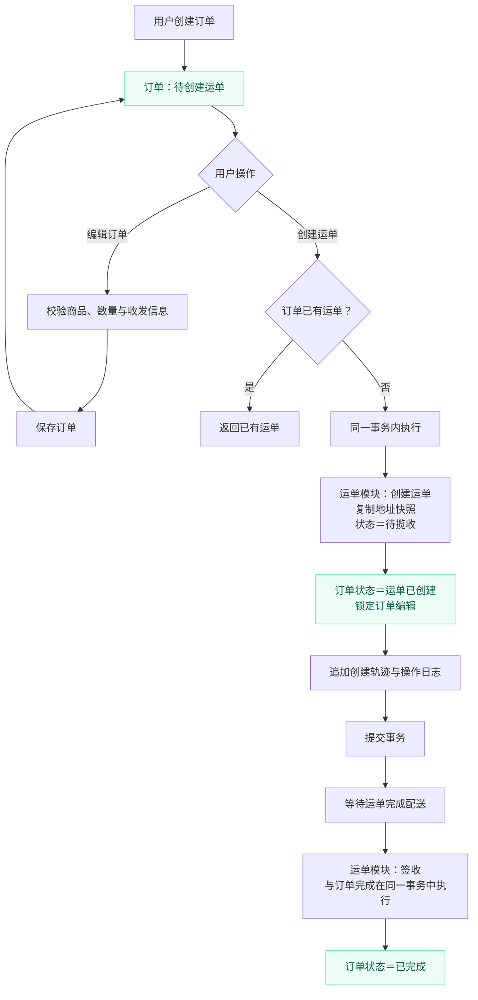
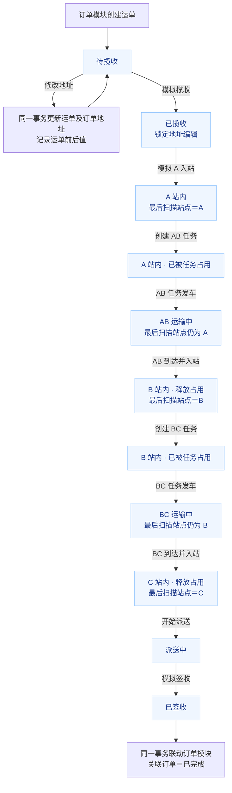
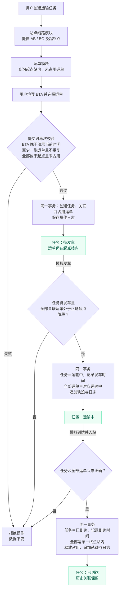
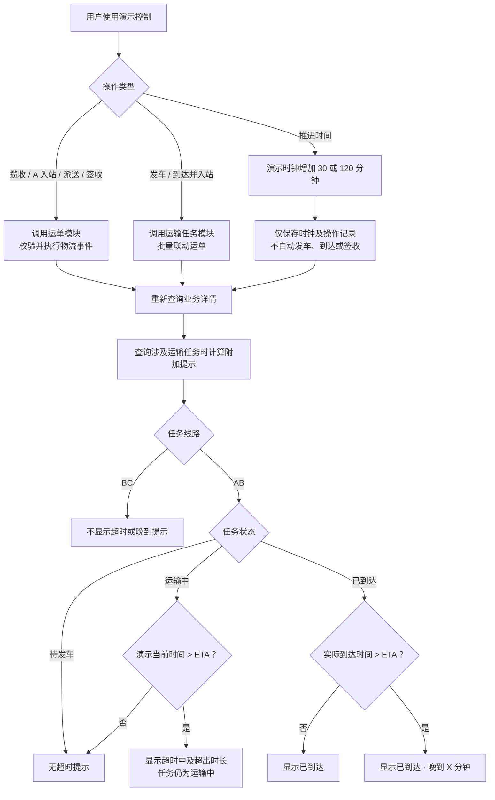
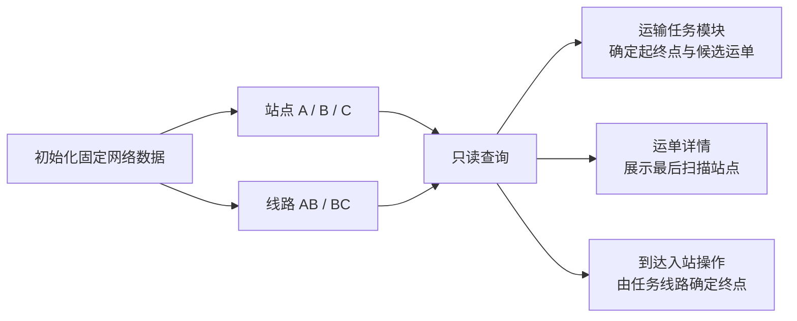
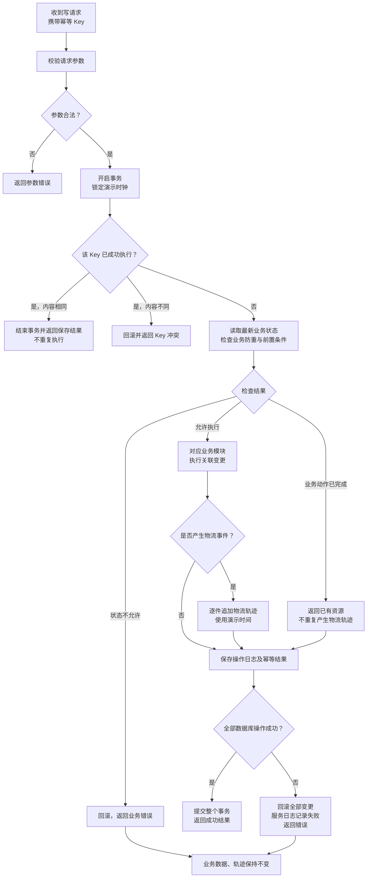
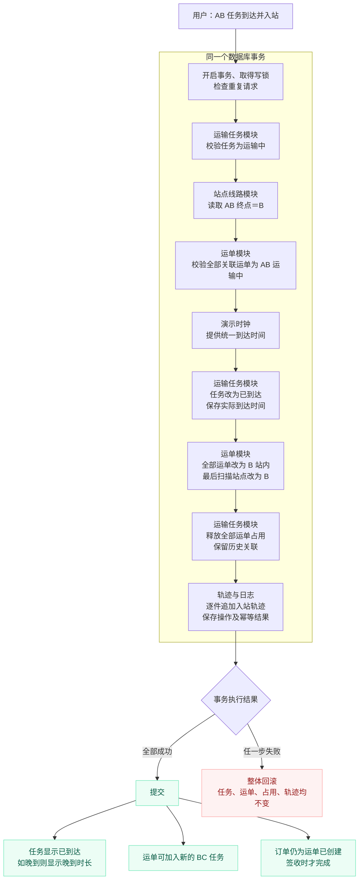

# JINGPO 后端 V1 技术方案

> 2026-09-20 · 待评审。技术栈和业务范围已确认，以下实现细节作为开发依据供评审；尚未编写业务代码。
>
> 需求依据：[V1 PRD](../../../prd/v1/JINGPO-logistics-system-v1.md)。超时提示仅针对 A → B。

## 阅读导航

- [PostgreSQL 建表 SQL](#31-postgresql-建表-sql)：9 张表、字段约束与查询索引。
- [固定数据初始化 SQL](#32-固定数据初始化-sql)：A/B/C 站点、AB/BC 线路与演示时钟。
- [模块状态与联动流程图](#10-模块状态与联动流程图)：7 张 Mermaid 图，涵盖订单、运单、任务、超时、固定网络、事务防重和到达入站。

## 1. 目标与技术选型

实现卖家 → 揽收 → A → B → C → 派送 → 签收的完整模拟链路。首版采用一个后端服务、本地运行、一个 PostgreSQL 数据库，不实现 Agent、登录权限、动态路由和独立异常中心。

| 层面 | 选型 | 用途 |
| --- | --- | --- |
| 接口框架 | Python + FastAPI | REST API、参数校验、OpenAPI 文档 |
| 服务运行 | Uvicorn | 启动 ASGI 应用 |
| ORM | SQLAlchemy，采用 2.x 风格 API | 数据模型、查询、事务 |
| 数据库 | PostgreSQL | 业务数据与演示时钟持久化 |
| 数据库驱动 | Psycopg 3 | 同步连接 PostgreSQL |
| 接口模型 | Pydantic | 输入校验与响应字段定义 |
| 表结构迁移 | Alembic | 版本化管理建表、约束和索引 |
| 数据访问方式 | 同步 Session + 普通 `def` 路由 | 简化首版事务处理 |

开发时使用 `venv + pip` 即可，环境变量通过标准库读取，日志使用标准库 `logging`。测试采用 pytest + HTTPX。uv、Ruff、pydantic-settings、Docker Compose 均不作为启动前提。不引入 Redis、消息队列或定时任务。

具体 Python、PostgreSQL 和依赖补丁版本在初始化时验证兼容后固定，记录在运行说明和依赖文件中，不使用无版本约束的生产安装方式。

## 2. 服务结构

接口层接收请求，业务层校验规则并控制事务，SQLAlchemy 完成数据库读写。首版不额外搭建通用 Repository 或通用工作流框架。

```text
backend/                       # 规划结构，当前不创建代码
├── app/
│   ├── main.py                # FastAPI、路由、错误处理、CORS
│   ├── config.py              # 环境变量
│   ├── db.py                  # Engine、Session、Base
│   ├── errors.py              # 业务错误定义
│   └── modules/
│       ├── orders/            # 订单与创建运单
│       ├── shipments/         # 运单、地址、轨迹、单件事件
│       ├── transport/         # 运输任务、发车、到达
│       ├── network/           # 只读站点与线路
│       └── simulation/        # 演示时钟、写操作与幂等公共逻辑
├── migrations/               # Alembic
├── tests/
└── requirements.txt
```

业务模块按需包含 `router.py`、`schemas.py`、`models.py`、`service.py`。轨迹模型归属 shipments，任务关联模型归属 transport，操作日志与时钟模型归属 simulation。跨模块操作在同一个业务事务中完成，不通过内部 HTTP 调用。

## 3. 数据设计

保持 PRD 的 8 张业务表，另加 1 张单行演示配置表。内部主键采用 PostgreSQL bigint identity；接口中的 ID 统一输出字符串，避免前端整数精度问题。业务编号使用主键生成固定前缀，如 `ORD-000001`、`SHP-000001`、`TRIP-000001`，编号不要求连续。

时间列采用 `timestamptz`。物流发生时间和任务发到时间取演示时钟；数据创建、更新及请求日志时间取服务器真实时间，两者分开命名。

| 表 | 核心字段 | 约束与说明 |
| --- | --- | --- |
| `orders` | id、order_no、product_name、quantity、sender_name、sender_address、recipient_name、recipient_address、region_code、status、created_at、updated_at | order_no 唯一；quantity > 0；区域固定 Z |
| `shipments` | id、shipment_no、order_id、sender_address、recipient_address、region_code、stage、last_scanned_station_id、created_at、updated_at | shipment_no、order_id 分别唯一；地址创建时复制自订单，待揽收修改时与订单同步 |
| `stations` | id、code、name | code 唯一；预置 A、B、C |
| `transport_routes` | id、code、origin_station_id、destination_station_id | code 唯一；预置 AB、BC，不提供管理接口 |
| `transport_tasks` | id、task_no、route_id、status、expected_arrival_at、departed_at、arrived_at、created_at | task_no 唯一；创建后路线、ETA、运单清单不可编辑 |
| `task_shipments` | id、task_id、shipment_id、released_at | `(task_id, shipment_id)` 唯一；released_at 为空表示仍占用 |
| `tracking_events` | id、shipment_id、event_type、occurred_at、station_id、task_id、operation_id、created_at | 只追加；`(operation_id, shipment_id, event_type)` 唯一 |
| `operation_logs` | id、idempotency_key、request_hash、action、resource_type、resource_id、before_data、after_data、response_body、response_status、occurred_at、created_at | idempotency_key 唯一；JSONB 保存必要快照和成功响应 |
| `simulation_settings` | id、current_time、updated_at | 固定 id=1；初始为 `2026-09-20T08:00:00+08:00` |

姓名从关联订单读取，首版运单只开放地址文本修改。状态采用字符串字段加 CHECK 约束，接口使用对应枚举，避免客户端任意赋值。关系字段设置外键，首版不提供业务删除接口。

关键索引：

- `task_shipments(shipment_id) WHERE released_at IS NULL` 唯一索引：阻止同一运单被两个未结束任务占用。
- `tracking_events(shipment_id, occurred_at DESC, id DESC)`：读取倒序轨迹。
- `shipments(stage, id)`、`transport_tasks(status, id)`：列表筛选。
- 业务编号采用精确查询，使用唯一索引；不引入全文搜索。

当前任务通过未释放的 task_shipments 关联查询。到达时释放占用，保留历史关联。不要在多个表冗余维护“当前任务”字段。

### 3.1 PostgreSQL 建表 SQL

以下 SQL 按外键依赖顺序组织，面向空数据库中的应用 schema；仅为评审文档，尚未在数据库执行。落地时转换为 SQLAlchemy 模型和 Alembic 初始迁移，不在服务启动时反复运行建表脚本。

约定：

- `NOT NULL` 表示必填；其余字段允许 NULL。外键默认禁止删除被引用记录，不做级联删除。
- 订单、运单、任务编号由数据库生成列根据主键生成，最少六位，超过六位不截断。应用不能直接写这些编号字段。
- `created_at`、`updated_at` 是真实时间；`occurred_at`、`departed_at`、`arrived_at`、`released_at` 使用演示时间。`updated_at` 的默认值仅在插入时生效，后续更新由业务代码显式设置。
- `current_time` 与 SQL 时间关键字重名，建表和原生 SQL 引用时使用双引号；SQLAlchemy 模型沿用该列名并正确引用。

#### 3.1.1 站点与线路

```sql
CREATE TABLE stations (
    id bigint GENERATED BY DEFAULT AS IDENTITY PRIMARY KEY,
    code varchar(1) NOT NULL UNIQUE,
    name varchar(100) NOT NULL,
    CONSTRAINT ck_stations_code CHECK (code IN ('A', 'B', 'C')),
    CONSTRAINT ck_stations_name CHECK (length(btrim(name)) > 0)
);

CREATE TABLE transport_routes (
    id bigint GENERATED BY DEFAULT AS IDENTITY PRIMARY KEY,
    code varchar(2) NOT NULL UNIQUE,
    origin_station_id bigint NOT NULL REFERENCES stations(id),
    destination_station_id bigint NOT NULL REFERENCES stations(id),
    CONSTRAINT ck_routes_code CHECK (code IN ('AB', 'BC')),
    CONSTRAINT ck_routes_distinct_stations
        CHECK (origin_station_id <> destination_station_id),
    CONSTRAINT uq_routes_endpoints
        UNIQUE (origin_station_id, destination_station_id)
);
```

#### 3.1.2 订单与运单

```sql
CREATE TABLE orders (
    id bigint GENERATED BY DEFAULT AS IDENTITY PRIMARY KEY,
    order_no varchar(32) GENERATED ALWAYS AS (
        'ORD-' || lpad(id::text, greatest(6, length(id::text)), '0')
    ) STORED NOT NULL UNIQUE,
    product_name varchar(100) NOT NULL,
    quantity integer NOT NULL,
    sender_name varchar(100) NOT NULL,
    sender_address varchar(500) NOT NULL,
    recipient_name varchar(100) NOT NULL,
    recipient_address varchar(500) NOT NULL,
    region_code varchar(1) NOT NULL DEFAULT 'Z',
    status varchar(32) NOT NULL DEFAULT 'PENDING_SHIPMENT',
    created_at timestamptz NOT NULL DEFAULT now(),
    updated_at timestamptz NOT NULL DEFAULT now(),
    CONSTRAINT ck_orders_quantity CHECK (quantity > 0),
    CONSTRAINT ck_orders_region CHECK (region_code = 'Z'),
    CONSTRAINT ck_orders_status CHECK (
        status IN ('PENDING_SHIPMENT', 'SHIPMENT_CREATED', 'COMPLETED')
    ),
    CONSTRAINT ck_orders_nonblank CHECK (
        length(btrim(product_name)) > 0
        AND length(btrim(sender_name)) > 0
        AND length(btrim(sender_address)) > 0
        AND length(btrim(recipient_name)) > 0
        AND length(btrim(recipient_address)) > 0
    )
);

CREATE TABLE shipments (
    id bigint GENERATED BY DEFAULT AS IDENTITY PRIMARY KEY,
    shipment_no varchar(32) GENERATED ALWAYS AS (
        'SHP-' || lpad(id::text, greatest(6, length(id::text)), '0')
    ) STORED NOT NULL UNIQUE,
    order_id bigint NOT NULL UNIQUE REFERENCES orders(id),
    sender_address varchar(500) NOT NULL,
    recipient_address varchar(500) NOT NULL,
    region_code varchar(1) NOT NULL DEFAULT 'Z',
    stage varchar(32) NOT NULL DEFAULT 'PENDING_PICKUP',
    last_scanned_station_id bigint REFERENCES stations(id),
    created_at timestamptz NOT NULL DEFAULT now(),
    updated_at timestamptz NOT NULL DEFAULT now(),
    CONSTRAINT ck_shipments_region CHECK (region_code = 'Z'),
    CONSTRAINT ck_shipments_stage CHECK (stage IN (
        'PENDING_PICKUP', 'PICKED_UP', 'AT_A', 'IN_TRANSIT_AB',
        'AT_B', 'IN_TRANSIT_BC', 'AT_C', 'OUT_FOR_DELIVERY', 'SIGNED'
    )),
    CONSTRAINT ck_shipments_addresses CHECK (
        length(btrim(sender_address)) > 0
        AND length(btrim(recipient_address)) > 0
    ),
    CONSTRAINT ck_shipments_scanned_station CHECK (
        (stage IN ('PENDING_PICKUP', 'PICKED_UP')
            AND last_scanned_station_id IS NULL)
        OR
        (stage NOT IN ('PENDING_PICKUP', 'PICKED_UP')
            AND last_scanned_station_id IS NOT NULL)
    )
);
```

`shipments.order_id` 唯一保证一张订单最多一张运单。进入 A 站前无扫描站点；此后保存最后扫描站点，不代表实时物理位置。

#### 3.1.3 运输任务与运单关联

```sql
CREATE TABLE transport_tasks (
    id bigint GENERATED BY DEFAULT AS IDENTITY PRIMARY KEY,
    task_no varchar(32) GENERATED ALWAYS AS (
        'TRIP-' || lpad(id::text, greatest(6, length(id::text)), '0')
    ) STORED NOT NULL UNIQUE,
    route_id bigint NOT NULL REFERENCES transport_routes(id),
    status varchar(32) NOT NULL DEFAULT 'PENDING_DEPARTURE',
    expected_arrival_at timestamptz NOT NULL,
    departed_at timestamptz,
    arrived_at timestamptz,
    created_at timestamptz NOT NULL DEFAULT now(),
    CONSTRAINT ck_tasks_status_times CHECK (
        (status = 'PENDING_DEPARTURE'
            AND departed_at IS NULL AND arrived_at IS NULL)
        OR
        (status = 'IN_TRANSIT'
            AND departed_at IS NOT NULL AND arrived_at IS NULL)
        OR
        (status = 'ARRIVED'
            AND departed_at IS NOT NULL AND arrived_at IS NOT NULL
            AND arrived_at >= departed_at)
    )
);

CREATE TABLE task_shipments (
    id bigint GENERATED BY DEFAULT AS IDENTITY PRIMARY KEY,
    task_id bigint NOT NULL REFERENCES transport_tasks(id),
    shipment_id bigint NOT NULL REFERENCES shipments(id),
    released_at timestamptz,
    CONSTRAINT uq_task_shipments UNIQUE (task_id, shipment_id)
);

-- 未释放的关联属于待发车或运输中任务，同一运单只能占用一次。
CREATE UNIQUE INDEX uq_task_shipments_active
    ON task_shipments (shipment_id)
    WHERE released_at IS NULL;
```

不约束 ETA 必须晚于实际发车时间：任务可能等待很久后才发车。创建时“ETA 晚于演示当前时间”由业务层校验，不能与真实 `created_at` 比较。允许发车和到达发生在同一演示时刻。

#### 3.1.4 操作日志与物流轨迹

```sql
CREATE TABLE operation_logs (
    id bigint GENERATED BY DEFAULT AS IDENTITY PRIMARY KEY,
    idempotency_key uuid NOT NULL UNIQUE,
    request_hash varchar(64) NOT NULL,
    action varchar(64) NOT NULL,
    resource_type varchar(32) NOT NULL,
    resource_id bigint NOT NULL,
    before_data jsonb,
    after_data jsonb,
    response_body jsonb NOT NULL,
    response_status smallint NOT NULL,
    occurred_at timestamptz NOT NULL,
    created_at timestamptz NOT NULL DEFAULT now(),
    CONSTRAINT ck_logs_hash CHECK (request_hash ~ '^[0-9a-f]{64}$'),
    CONSTRAINT ck_logs_action CHECK (length(btrim(action)) > 0),
    CONSTRAINT ck_logs_resource_type CHECK (
        resource_type IN ('ORDER', 'SHIPMENT', 'TRANSPORT_TASK', 'CLOCK')
    ),
    CONSTRAINT ck_logs_resource_id CHECK (resource_id > 0),
    CONSTRAINT ck_logs_response_status
        CHECK (response_status IN (200, 201))
);

CREATE TABLE tracking_events (
    id bigint GENERATED BY DEFAULT AS IDENTITY PRIMARY KEY,
    shipment_id bigint NOT NULL REFERENCES shipments(id),
    event_type varchar(32) NOT NULL,
    occurred_at timestamptz NOT NULL,
    station_id bigint REFERENCES stations(id),
    task_id bigint REFERENCES transport_tasks(id),
    operation_id bigint NOT NULL,
    created_at timestamptz NOT NULL DEFAULT now(),
    CONSTRAINT fk_events_operation
        FOREIGN KEY (operation_id) REFERENCES operation_logs(id)
        DEFERRABLE INITIALLY DEFERRED,
    CONSTRAINT uq_events_operation
        UNIQUE (operation_id, shipment_id, event_type),
    CONSTRAINT ck_events_type CHECK (event_type IN (
        'SHIPMENT_CREATED', 'PICKUP', 'ENTER_A',
        'DEPART_AB', 'ARRIVE_B', 'DEPART_BC', 'ARRIVE_C',
        'START_DELIVERY', 'SIGN'
    )),
    CONSTRAINT ck_events_task CHECK (
        (event_type IN ('DEPART_AB', 'ARRIVE_B', 'DEPART_BC', 'ARRIVE_C')
            AND task_id IS NOT NULL)
        OR
        (event_type NOT IN ('DEPART_AB', 'ARRIVE_B', 'DEPART_BC', 'ARRIVE_C')
            AND task_id IS NULL)
    ),
    CONSTRAINT ck_events_station CHECK (
        (event_type IN ('ENTER_A', 'DEPART_AB', 'ARRIVE_B', 'DEPART_BC', 'ARRIVE_C')
            AND station_id IS NOT NULL)
        OR
        (event_type IN ('SHIPMENT_CREATED', 'PICKUP', 'START_DELIVERY', 'SIGN')
            AND station_id IS NULL)
    )
);
```

事件字段约定：`DEPART_AB` / `DEPART_BC` 关联起点，`ARRIVE_B` / `ARRIVE_C` 关联终点；到达及入站合并为一条轨迹。派送、签收轨迹不填站点，运单的最后扫描站点仍保留 C。

`operation_logs.resource_id` 是按 resource_type 区分的多类型业务引用，不能设置一个同时指向多张表的外键，由业务层保证对象存在。`request_hash` 使用规范化请求的 SHA-256 小写十六进制字符串。before_data、after_data 无适用内容时为 NULL，避免使用空快照伪装实际数据。

轨迹先写、成功日志后写时，在事务内先用 `nextval(pg_get_serial_sequence('operation_logs', 'id'))` 预留日志 ID，轨迹引用此 ID，最后显式插入同 ID 的完整日志。该外键延迟到提交时检查，若日志未成功插入则整个事务无法提交。SQLAlchemy 需为预留 ID 显式赋值；序列消耗不回滚，因此 ID 存在空洞是正常行为。也可先准备完整日志再写轨迹，但不得拆为两次提交。

#### 3.1.5 演示时钟

```sql
CREATE TABLE simulation_settings (
    id bigint PRIMARY KEY,
    "current_time" timestamptz NOT NULL
        DEFAULT TIMESTAMPTZ '2026-09-20 08:00:00+08:00',
    updated_at timestamptz NOT NULL DEFAULT now(),
    CONSTRAINT ck_simulation_singleton CHECK (id = 1),
    CONSTRAINT ck_simulation_start CHECK (
        "current_time" >= TIMESTAMPTZ '2026-09-20 08:00:00+08:00'
    )
);
```

该表固定 id=1，不使用自增主键。主键和 CHECK 保证最多一行，初始化脚本负责插入这行；业务服务写请求必须先取得此行锁。若该行缺失，返回服务不可用，不使用真实时间兜底。

#### 3.1.6 查询索引

```sql
CREATE INDEX ix_shipments_stage_id ON shipments (stage, id DESC);
CREATE INDEX ix_shipments_last_station ON shipments (last_scanned_station_id);
CREATE INDEX ix_tasks_status_id ON transport_tasks (status, id DESC);
CREATE INDEX ix_tasks_route_id ON transport_tasks (route_id, id DESC);
CREATE INDEX ix_task_shipments_shipment ON task_shipments (shipment_id, task_id);
CREATE INDEX ix_events_shipment_time
    ON tracking_events (shipment_id, occurred_at DESC, id DESC);
CREATE INDEX ix_events_task ON tracking_events (task_id);
CREATE INDEX ix_logs_resource ON operation_logs (resource_type, resource_id, id DESC);
```

主键、业务编号唯一约束、订单与运单一对一约束已自动建立索引，不重复建索引。`uq_task_shipments` 的首列是 task_id，已支持按任务查询运单；新增 shipment_id 索引用于反向查询历史任务。未释放关联的部分唯一索引负责占用防重。

### 3.2 固定数据初始化 SQL

在上述表建立后执行。重复执行不覆盖已有配置、不重置时钟；如果发现已有线路映射与约定不符，初始化命令应报告配置错误，不能静默修改。

```sql
BEGIN;

INSERT INTO stations (code, name) VALUES
    ('A', '始发站 / 分拣中心'),
    ('B', '目的分拣中心'),
    ('C', '末端配送站')
ON CONFLICT (code) DO NOTHING;

INSERT INTO transport_routes (code, origin_station_id, destination_station_id)
SELECT 'AB', a.id, b.id
FROM stations a CROSS JOIN stations b
WHERE a.code = 'A' AND b.code = 'B'
ON CONFLICT (code) DO NOTHING;

INSERT INTO transport_routes (code, origin_station_id, destination_station_id)
SELECT 'BC', b.id, c.id
FROM stations b CROSS JOIN stations c
WHERE b.code = 'B' AND c.code = 'C'
ON CONFLICT (code) DO NOTHING;

INSERT INTO simulation_settings (id) VALUES (1)
ON CONFLICT (id) DO NOTHING;

COMMIT;
```

### 3.3 数据库约束与业务校验的边界

| 数据库直接保证 | 业务层在事务中保证 |
| --- | --- |
| 主键、编号唯一、外键存在 | 状态只能按既定顺序变化，不能跳站 |
| 一订单最多一运单 | 创建运单后订单不可编辑，揽收后地址不可编辑 |
| 一运单最多一个未释放任务关联 | 运单阶段及最后扫描站点与线路起终点匹配 |
| 单条任务记录的状态与发到时间一致 | 任务至少一张运单、最多 100 张，创建后配置不可改 |
| 事件类型、任务/站点字段空值规则 | 事件对应正确线路、运单和扫描站点；历史轨迹只追加 |
| 同 key 日志唯一、同操作轨迹唯一 | 不同 key 的业务重复操作仍不重复生成事件 |
| 演示时钟最多一行且不早于初始时间 | 时钟每次仅推进 30/120 分钟且不倒退 |
| 行内必填、正数、状态枚举 | AB 映射 A→B、BC 映射 B→C，跨表更新一起提交 |

CHECK 约束只验证当前记录，不能代替跨表校验或前后状态比较。首版不加入触发器，所有业务写入通过服务层完成。SQLAlchemy 模型应与上述生成列、延迟外键、CHECK 和部分唯一索引保持一致；Alembic 生成迁移后仍需审查。

## 4. 状态与操作规则

订单状态：`PENDING_SHIPMENT → SHIPMENT_CREATED → COMPLETED`。

| 操作 | 前置条件 | 操作后运单阶段 | 其他变化 |
| --- | --- | --- | --- |
| 创建运单 | 订单尚无运单 | `PENDING_PICKUP` | 锁定订单直接编辑，复制地址，追加创建轨迹；待揽收时通过运单地址接口同步订单地址 |
| 揽收 | `PENDING_PICKUP` | `PICKED_UP` | 地址进入不可编辑阶段 |
| A 入站 | `PICKED_UP` | `AT_A` | 最后扫描站点=A |
| AB 发车 | 任务待发车，全部关联运单为 `AT_A` | `IN_TRANSIT_AB` | 任务运输中，记录发车时间 |
| 到达 B 并入站 | AB 任务运输中 | `AT_B` | 任务已到达，最后扫描站点=B，释放占用 |
| BC 发车 | 任务待发车，全部关联运单为 `AT_B` | `IN_TRANSIT_BC` | 任务运输中，记录发车时间 |
| 到达 C 并入站 | BC 任务运输中 | `AT_C` | 任务已到达，最后扫描站点=C，释放占用 |
| 开始派送 | `AT_C` | `OUT_FOR_DELIVERY` | 追加派送轨迹 |
| 签收 | `OUT_FOR_DELIVERY` | `SIGNED` | 订单同步完成 |

任务状态为 `PENDING_DEPARTURE → IN_TRANSIT → ARRIVED`。创建任务仅占用运单，不改变运单阶段。请求只传任务 ID，起终点、关联运单和目标阶段由后端读取决定。

创建任务时必须：线路为 AB/BC，ETA 晚于演示当前时间，运单至少一张且不能重复，全部位于起点且未被占用。候选列表只是界面辅助，提交时再次校验。

订单仅在创建运单前可编辑；运单仅在揽收前可修改两端地址文本，区域 Z 不允许修改。接口模型拒绝未定义字段，禁止通过 PATCH 设置状态、位置、轨迹或区域。地址修改前后值进入操作日志。

详情返回 `allowed_actions` 及各操作的 `enabled`、`reason_code`、`reason`，供页面禁用按钮。写操作仍独立校验，不依赖前端权限判断。

## 5. 演示时钟与超时

所有演示事件使用数据库中的 `current_time`。推进接口只接受 `minutes=30` 或 `120`，累计推进，不允许回退或任意设置时间。重启服务不重置时钟，推进不会自动触发发车、到达或签收。

任务查询返回本次计算使用的 `simulation_time`，同一列表使用一次读取的时钟，避免列表内不一致。

| 条件 | delay_status | delay_minutes |
| --- | --- | --- |
| BC 任务，任意状态 | `NOT_APPLICABLE` | null |
| AB 待发车，或运输中且当前时间 ≤ ETA | `NONE` | 0 |
| AB 运输中且当前时间 > ETA | `OVERDUE` | 当前时间与 ETA 的差值 |
| AB 已到达且实际到达 > ETA | `LATE_ARRIVAL` | 实际到达与 ETA 的差值 |
| AB 已到达且实际到达 ≤ ETA | `NONE` | 0 |

差值以整分钟向下取整；不足一分钟时可返回 OVERDUE 且分钟数为 0，页面显示“超时不足 1 分钟”。ETA 输入限定到分钟精度，带时区。相等不算超时。BC 保存预计和实际时间，但不产生超时或晚到提示。

不保存独立超时状态，不建异常表，不需要定时扫描。刷新、推进时间或操作后的查询实时计算。轨迹按 `occurred_at DESC, id DESC` 排序，同一演示时刻按写入序号排序。

## 6. 事务、并发与重复请求

每个请求独立创建 Session，使用完关闭，不跨请求共享。查询不提交业务变更。每个写操作由业务入口统一 `Session.begin()`，成功提交、异常回滚，模块内部只执行查询和 flush，不自行 commit。

首版明确采用简单策略：**所有业务写操作先锁定单行 simulation_settings，再读取状态和写入数据**，使用 `SELECT ... FOR UPDATE`，直到事务结束释放。这样演示时间推进、地址修改与揽收、不同任务争抢运单，都按数据库中的确定顺序执行。

这是针对单人演示的有意简化，写请求会串行。事务中不调用外部服务、不执行耗时工作；查询不取该写锁。未来多人运行时，再改为按订单、运单、任务锁定，不能直接删除锁而不补充并发策略。数据库唯一约束仍保留作为最终防线。

合并到达的一次事务包含：检查任务及全部运单 → 更新任务实际到达时间 → 更新全部运单阶段和最后扫描站点 → 释放全部关联占用 → 逐件追加轨迹 → 写成功操作日志。任意一步失败，全部回滚。

所有写请求要求 `Idempotency-Key`，由前端为一次用户操作生成 UUID；网络失败重试复用，新的操作重新生成。规则如下：

1. 取得时钟行锁后查 operation_logs；指纹为 HTTP 方法、规范化路径和校验后的请求体，不包含当前时间。
2. 同 key、同指纹且已成功：返回保存的 HTTP 状态码和响应，不重复执行。
3. 同 key、不同指纹：返回 409 `IDEMPOTENCY_KEY_REUSED`。
4. 未执行成功：在当前事务内执行业务并保存成功结果；失败回滚，不留下成功幂等记录，允许修正或重试。

额外业务防重：同一订单即使换 key 再创建运单，仍返回原运单；已发生的物流事件即使换 key 再提交，也通过已有轨迹或任务时间识别，返回当前资源，不新增轨迹或回退状态。对于尚未发生且不符合当前阶段的事件，返回状态冲突。

创建订单、创建任务及推进时钟无法凭相似输入判断是否是用户新意图，因此必须复用 key 才能可靠防重。前端响应丢失时保留该 key，不重新生成。

operation_logs 记录已提交的业务操作；失败请求记录到服务日志，避免随业务回滚丢失。重复请求命中成功结果时不新增业务操作日志。返回保存的旧响应后，前端重新查询详情获取最新状态。

## 7. API 清单

统一前缀 `/api/v1`，JSON 请求与响应，字段使用 snake_case。ID 以字符串表示，时间采用带时区 ISO 8601，前端按 Asia/Shanghai 展示。接口由 Pydantic 模型生成 OpenAPI。

| 方法与路径 | 用途 / 主要输入 |
| --- | --- |
| `GET /orders` | 订单列表；order_no、shipment_no、stage、page、page_size |
| `POST /orders/create` | 创建订单；商品、数量、收发姓名及地址，区域服务端固定 Z |
| `GET /orders/{id}` | 订单详情及关联运单摘要 |
| `PATCH /orders/{id}` | 创建运单前编辑订单白名单字段 |
| `POST /orders/{id}/shipment` | 创建或返回已有运单 |
| `GET /shipments` | 运单列表；shipment_no、stage、page、page_size |
| `GET /shipments/{id}` | 运单详情、地址、最后扫描站点、当前任务、轨迹、可执行操作 |
| `PATCH /shipments/{id}/address` | 修改 sender_address、recipient_address |
| `POST /shipments/{id}/events` | event_type：PICKUP、ENTER_A、START_DELIVERY、SIGN |
| `GET /stations`、`GET /routes` | 读取固定网络数据 |
| `GET /transport-tasks` | 任务列表；task_no、route_code、status、page、page_size |
| `GET /transport-tasks/candidates` | route_code、page、page_size；待出站且未占用的运单 |
| `POST /transport-tasks/create` | route_code、expected_arrival_at、shipment_ids |
| `GET /transport-tasks/{id}` | 任务、关联运单、发到时间、延误计算、可执行操作 |
| `POST /transport-tasks/{id}/depart` | 发车并更新全部关联运单 |
| `POST /transport-tasks/{id}/arrive` | 到达并入站，终点由线路决定 |
| `GET /simulation/clock` | 查询演示时钟 |
| `POST /simulation/clock/advance` | minutes=30 或 120 |

`/transport-tasks/candidates` 静态路由先于 `/{id}` 注册。首版没有运输任务编辑、取消、删除接口，也没有任意覆盖运单状态的接口。

列表默认 page=1、page_size=20，最大 100，按 id 倒序。列表结构为 `{items, total, page, page_size}`；含时间计算时附加 simulation_time。详情直接返回资源对象，业务事件成功返回更新后的详情。创建返回 201；返回已有资源和普通操作返回 200。

请求体缺字段、空白名称/地址、非整数数量、非法事件值、无时区时间返回 422。商品名称和姓名上限 100 字符，地址上限 500 字符，任务一次关联最多 100 张运单，作为首版接口限制供评审。

统一错误示例：

```json
{
  "error": {
    "code": "INVALID_STATE",
    "message": "任务尚未发车，不能执行到达入站",
    "details": {"task_id": "12", "current_status": "PENDING_DEPARTURE"}
  },
  "request_id": "请求追踪标识"
}
```

| HTTP 状态 | 使用场景 |
| --- | --- |
| 404 | 订单、运单、任务或线路不存在 |
| 409 | 状态冲突、运单占用、幂等 key 复用冲突 |
| 422 | 参数校验失败；details 提供字段路径和原因，不回显完整敏感输入 |
| 503 | 数据库暂不可用或锁等待超时；回滚后可使用同 key 重试 |
| 500 | 未预期错误；不向前端暴露 SQL 或堆栈 |

## 8. 初始化、配置与运行

Alembic 负责建表及后续迁移。初次迁移后运行幂等初始化命令，插入 A/B/C、AB/BC 和单条演示时钟配置；再次运行不修改已有时钟、不清空业务数据。首版通过界面创建演示订单，不强制预置完整业务链路。

配置最小集：`DATABASE_URL`、`CORS_ORIGINS`、`LOG_LEVEL`。数据库连接形式为 `postgresql+psycopg://<user>:<password>@<host>:5432/<database>`，使用 SQLAlchemy 连接池；密码不提交到仓库。示例配置只提供占位符。

先使用已有本地 PostgreSQL，或由开发者自行安装；Docker Compose 后续按需要补充。本地启动流程：创建虚拟环境 → 安装固定依赖 → 配置环境变量 → `alembic upgrade head` → 执行初始化命令 → `uvicorn app.main:app --reload`。初始化命令的具体模块路径在实现时补充。

本地前端来源配置到 CORS 白名单；OpenAPI 文档使用 `/docs`。提供 `/health` 检查服务、`/health/ready` 执行轻量数据库检查，数据库不可用时 readiness 返回 503。当前不设计公网部署和权限系统。

请求日志记录 request_id、方法、路径、状态码、耗时及异常；不记录完整地址、姓名、数据库密码或完整请求体。地址修改快照仅保存在业务操作日志中。HTTP 响应携带 X-Request-ID，方便关联排错。

## 9. 验证与实现顺序

使用独立测试 PostgreSQL 数据库验证唯一索引、事务和锁行为，不以 SQLite 替代这些测试。测试数据库与开发数据库分离，测试准备和清理不能作用于开发数据。

重点验收：

| 场景 | 预期 |
| --- | --- |
| 完整物流链路 | 九个运单阶段正确，签收后订单完成，轨迹完整 |
| 重复发货、重复事件、重试同 key | 不增加第二张运单、不重复轨迹、不重复推进时间 |
| 同 key 不同内容 | 返回 409，无数据变化 |
| 两任务同时关联同一运单 | 仅一个成功，另一个返回占用冲突 |
| 地址编辑与揽收并发 | 按提交顺序执行，揽收后的编辑被拒绝 |
| 多运单合并到达中途故障 | 任务、运单、关联释放、轨迹和成功日志全部回滚 |
| AB 等于 ETA / 超过 ETA / 晚到 | 分别无超时、超时中、已到达且保留晚到时长 |
| BC 超过 ETA | 不显示超时及晚到提示 |
| 跳站、提前签收、编辑任务 | 被拒绝且数据不变 |
| 重启与同一时刻多个事件 | 状态和时钟恢复，轨迹次序稳定 |

实现分三步：先完成迁移、固定数据、订单与运单；再完成运输任务和整条状态链路；最后补齐时钟、AB 超时计算、幂等与并发验证。事务和防重约束从各模块首次实现时加入，不留到最后补救。

本方案交付仅包含文档。评审后再创建后端代码；前端技术方案单独编写。

## 10. 模块状态与联动流程图

以下流程图与前文规则配套阅读。订单、运单、运输任务具有业务状态；站点线路、演示时钟、轨迹和日志提供支撑能力。图中的关联写入共用同一个事务，任一步失败均整体回滚。

### 10.1 订单模块



### 10.2 运单模块

“已被任务占用”是关联关系，不是新的运单阶段。创建任务不会推进物流状态。



### 10.3 运输任务模块

任务创建后不可编辑、取消或删除。AB 与 BC 共用任务状态流转。



### 10.4 演示控制与超时计算

演示控制是操作入口，物流规则仍由对应业务模块执行。只有 AB 任务计算超时及晚到提示。



### 10.5 站点与线路模块



### 10.6 共用事务、防重、轨迹与日志

所有事务步骤发生数据库异常时，均进入整体回滚分支；最后的结果判断代表整个事务结果，而非只检查最后一次写入。



### 10.7 跨模块联动：到达 B 并入站

下图展开首次执行且非重复请求的业务路径。重复请求与非法状态按 10.6 处理，事务内任一步失败均整体回滚。



## 11. 官方参考

- [FastAPI 同步与异步](https://fastapi.tiangolo.com/async/)：普通 def 路由在线程池中执行，与本方案同步数据库调用配套。
- [FastAPI 数据库与 Session 依赖](https://fastapi.tiangolo.com/tutorial/sql-databases/)：请求级 Session 的提供和关闭方式。
- [SQLAlchemy PostgreSQL / Psycopg](https://docs.sqlalchemy.org/en/20/dialects/postgresql.html)：Psycopg 3 使用独立的 psycopg 方言。
- [SQLAlchemy Session 与事务](https://docs.sqlalchemy.org/en/20/orm/session_basics.html)：显式组织提交和回滚边界。
- [PostgreSQL 行锁](https://www.postgresql.org/docs/17/explicit-locking.html)：FOR UPDATE 在事务期间协调并发写入。
- [Alembic](https://alembic.sqlalchemy.org/en/latest/)：数据库结构迁移工具。
- [PostgreSQL 约束](https://www.postgresql.org/docs/18/ddl-constraints.html)：CHECK、外键、唯一约束与部分唯一索引的职责。
- [PostgreSQL 生成列](https://www.postgresql.org/docs/17/ddl-generated-columns.html)：使用不可变的当前行表达式生成业务编号。
