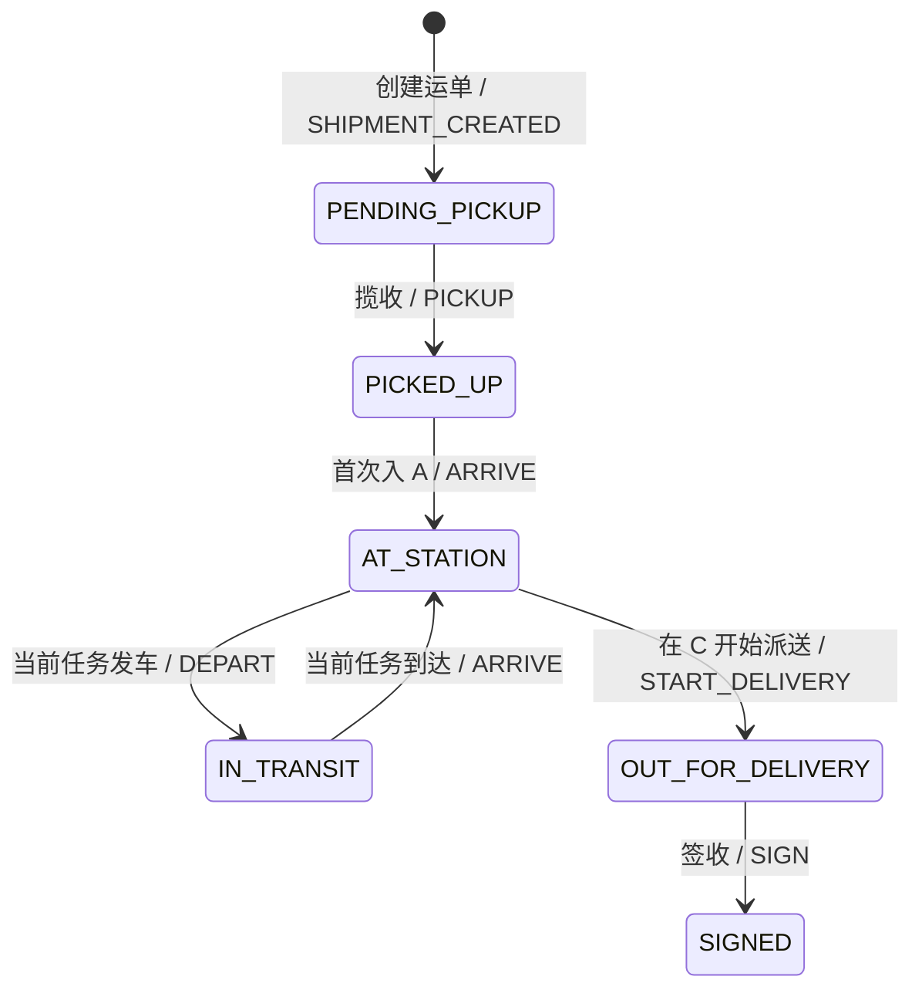

# JINGPO 后端 V2 · 开发规格

> 2026-09-30 · V2 实现规格。验证结果见 [实施与验证记录](plan.md)。

依据：[V2 PRD](../../../prd/v2/JINGPO-logistics-system-v2.md)、[V1 后端规格](../../v1/be/spec.md) 与 [领域术语](../../../../be/CONTEXT.md)。V1 未被本文明确改变的业务规则继续有效。

## 1. 目标模型

### 运单阶段

`PENDING_PICKUP → PICKED_UP → AT_STATION → IN_TRANSIT → AT_STATION → IN_TRANSIT → AT_STATION → OUT_FOR_DELIVERY → SIGNED`。

阶段枚举只有 `PENDING_PICKUP`、`PICKED_UP`、`AT_STATION`、`IN_TRANSIT`、`OUT_FOR_DELIVERY`、`SIGNED`。同一阶段可以在一张运单上多次出现；不得再以事件类型是否出现过来判断整类操作已经完成。

`DEPART` 是状态转换事件，不是运单阶段：创建任务后运单仍为 `AT_STATION`；执行任务发车时，在同一事务中将任务由 `PENDING_DEPARTURE` 改为 `IN_TRANSIT`、关联运单由 `AT_STATION` 改为 `IN_TRANSIT`，记录发车时间并为每张运单追加 `DEPART` 轨迹。发车这一事实可从轨迹和任务时间追溯。若未来需要装车、待出站等有持续时间且需要单独操作的环节，再定义相应阶段。

| 阶段 | 位置与任务含义 |
| --- | --- |
| `PENDING_PICKUP`、`PICKED_UP` | 尚无已扫描站点；揽收不自动入站 |
| `AT_STATION` | `last_scanned_station_id` 是当前已入站站点；待发车任务可以占用运单，但不会改变阶段 |
| `IN_TRANSIT` | 从未释放的运输任务关联确定当前任务和线路；`last_scanned_station_id` 仍是起点扫描记录，不代表实时位置 |
| `OUT_FOR_DELIVERY`、`SIGNED` | 保留最近一次入站的 C 站扫描记录；派送和签收本身不新增站点扫描 |

运输任务状态仍为 `PENDING_DEPARTURE`、`IN_TRANSIT`、`ARRIVED`。V2 保留固定 AB、BC 两条线路：首次入站仅允许 A；在 A 可创建 AB 任务，在 B 可创建 BC 任务；只有在 C 才能开始派送。线路起终点从 `transport_routes` 的关联站点读取，运单阶段不编码站点和线路。V2 不自动决定下一条线路。

### 轨迹事件

事件类型集中定义为稳定的应用枚举，并由数据库约束验证：`SHIPMENT_CREATED`、`PICKUP`、`ARRIVE`、`DEPART`、`START_DELIVERY`、`SIGN`。这不要求使用 PostgreSQL 原生 ENUM；具体存储类型由迁移设计决定，但应用和数据库可接受的值必须一致。

| 来源 | 事件 | station_id | task_id |
| --- | --- | --- | --- |
| 创建运单 | `SHIPMENT_CREATED` | 空 | 空 |
| 揽收 | `PICKUP` | 空 | 空 |
| 首次入站 | `ARRIVE` | A | 空 |
| 任务发车 | `DEPART` | 线路起点 | 当前任务 |
| 任务到达并入站 | `ARRIVE` | 线路终点 | 当前任务 |
| 开始派送、签收 | `START_DELIVERY`、`SIGN` | 空 | 空 |

轨迹继续追加，不覆盖事件 ID、发生时间、原操作 ID 和任务关联。首站入站与任务到达共享 `ARRIVE` 类型，以 `task_id` 是否存在区分来源。一次运单可以有多个 `ARRIVE` 和 `DEPART`；防重必须使用幂等 key、任务状态以及具体站点/任务/业务阶段，不得以 `shipment_id + event_type` 当作唯一业务事件。

### 三者的联动状态机

运单 `stage` 是这件货当前所处环节；任务 `status` 是某一段运输的进度；轨迹 `event_type` 是已发生、只追加的事实。一个运单可以先后参加多个任务，因此当前运单阶段不能从某个历史任务的状态直接推断。`POST /shipments/{id}/events` 的 `event_type` 是请求执行某项业务操作；校验成功并完成状态变更后，才生成对应的轨迹记录。业务操作在一个事务中更新当前状态、写轨迹和操作日志。

图中 `AT_STATION ↔ IN_TRANSIT` 可以随 AB、BC 任务重复；图上的事件是转换成功后留下的轨迹。运输任务本身按 `PENDING_DEPARTURE → IN_TRANSIT → ARRIVED` 前进，到达后释放运单占用，历史任务仍保留。

| 业务操作 | 运单阶段变化 | 当前任务状态变化 | 新增轨迹及关联 |
| --- | --- | --- | --- |
| 创建运单 | 新建 `PENDING_PICKUP` | 无 | `SHIPMENT_CREATED`，无站点、任务 |
| 揽收 | `PENDING_PICKUP → PICKED_UP` | 无 | `PICKUP`，无站点、任务 |
| 首次入 A | `PICKED_UP → AT_STATION`，最后扫描=A | 无 | `ARRIVE`，站点=A、无任务 |
| 创建 AB/BC 任务 | 保持 `AT_STATION`，建立未释放的任务关联 | 新建 `PENDING_DEPARTURE` | 不新增物流轨迹；创建操作另记操作日志 |
| 任务发车 | `AT_STATION → IN_TRANSIT`，最后扫描仍为起点 | `PENDING_DEPARTURE → IN_TRANSIT` | 每张关联运单记 `DEPART`，站点=起点、任务=本任务 |
| 任务到达并入站 | `IN_TRANSIT → AT_STATION`，最后扫描=终点；释放任务占用 | `IN_TRANSIT → ARRIVED` | 每张关联运单记 `ARRIVE`，站点=终点、任务=本任务 |
| 在 C 开始派送 | `AT_STATION → OUT_FOR_DELIVERY` | 无当前任务 | `START_DELIVERY`，无站点、任务 |
| 签收 | `OUT_FOR_DELIVERY → SIGNED`；订单完成 | 无当前任务 | `SIGN`，无站点、任务 |

同一张运单完成 AB 后，可以在 B 再创建 BC 任务并重复“创建任务 → 发车 → 到达”这段循环。已到达的 AB 任务保留为历史记录；它的 `ARRIVED` 状态不会使运单永远停留在 B。

## 2. API 与展示契约

- 产品 V2 与 HTTP 路径版本分开。本轮沿用现有 `/api/v1` 路径，但改变内部演示接口的阶段/事件值；前端和只读 Agent 必须在同一交付中升级。V1 没有承诺外部客户端兼容性，发布前应记录这一契约变更；后续对外开放接口时再确定正式版本策略。
- 运单事件请求继续使用 `POST /api/v1/shipments/{id}/events`。`PICKUP`、`ARRIVE`、`START_DELIVERY`、`SIGN` 可由此提交；首次入站请求形如 `{"event_type":"ARRIVE","station_id":"<A站ID>"}`，且只接受固定首站 A。其余单件事件不得携带 `station_id` 或借此伪造运输任务到达。
- `POST /api/v1/transport-tasks/{id}/depart` 和 `/arrive` 保持任务操作入口。发车生成 `DEPART`；到达在同一事务中更新任务、全部运单、占用关系和 `ARRIVE` 轨迹，终点由任务线路决定。
- 运单详情保留 `stage`、`last_scanned_station_id` 和原有轨迹字段，增加可空的 `active_transport_task`，包含 `id`、`route_code`、`origin_station_id`、`destination_station_id`、`status`。它表示尚未释放的任务关联：待发车或运输中时有值，任务到达释放后为空。前端和 Agent 据此展示当前运输起终点，不从历史轨迹猜测当前线路。
- 订单/运单列表的 `stage` 筛选改用通用阶段；任务候选查询同时检查 `AT_STATION`、最后扫描站点等于线路起点以及不存在未释放任务占用。前端操作按钮继续以服务端 `allowed_actions` 和提交时重新校验为准。
- 订单地址为下单信息；运单地址为履约信息。揽收前修改运单地址不回写订单，变更前后值进入操作日志。

## 3. 历史数据与迁移

| V1 值 | V2 值 |
| --- | --- |
| `AT_A`、`AT_B`、`AT_C` | `AT_STATION` |
| `IN_TRANSIT_AB`、`IN_TRANSIT_BC` | `IN_TRANSIT` |
| `ENTER_A`、`ARRIVE_B`、`ARRIVE_C` | `ARRIVE` |
| `DEPART_AB`、`DEPART_BC` | `DEPART` |

其他阶段和事件类型保持原值。迁移必须先检查历史记录是否能按站点、任务和阶段一致地映射；有冲突时停止并报告，不静默猜测。迁移后替换 `shipments.stage`、`tracking_events.event_type` 及事件任务/站点空值的数据库约束，验证历史轨迹、任务关联、重复类型事件和站点外键。已提交的 `operation_logs.response_body` 可能包含旧阶段和事件值，幂等重放时必须转换为 V2 响应或通过有版本的读取层规范化；不能把旧格式直接返回给新响应模型，也不能删除成功日志以规避问题。

迁移在独立测试数据库和含 V1 样本数据的副本上验证；执行前备份，失败时事务回滚。回退方案需说明新值无法仅凭阶段字符串还原为 `AT_A`/`AT_B`/`AT_C`，必须结合站点、任务或备份，不能提供虚假的无损 downgrade。

## 4. 验收条目

| 编号 | 必须满足的行为 | 验收示例 |
| --- | --- | --- |
| V2-01 | 通用阶段与位置一致 | A、B、C 入站均为 `AT_STATION` 且站点分别正确；AB、BC 发车均为 `IN_TRANSIT`，运输中最后扫描站点仍为起点 |
| V2-02 | 首次入站独立于揽收 | `PICKUP` 后不能创建 AB；提交 A 站 `ARRIVE` 后才成为候选；未揽收或错误站点返回业务错误 |
| V2-03 | 通用事件及关联正确 | 首次 `ARRIVE` 无 task_id；任务 `DEPART`/`ARRIVE` 有 task_id 且站点与线路匹配；历史轨迹允许多次同类型事件 |
| V2-04 | 任务联动仍具原子性 | 创建任务不改变运单阶段；发车、到达更新全部关联运单；故障时任务、运单、轨迹、占用和日志整体回滚 |
| V2-05 | 防重及重试正确 | 同 key 重放结果一致；不同 key 重复同一次到达不增加轨迹；AB 的 `ARRIVE` 不阻止后续 BC 的 `ARRIVE` |
| V2-06 | 历史迁移与幂等缓存可读 | 含 V1 全阶段/全事件样本的库升级后，事件 ID、时间、顺序和关联不丢失；旧 key 重放返回 V2 契约 |
| V2-07 | 展示和筛选正确 | 前端与 Agent 在 `IN_TRANSIT` 时从当前任务展示 A→B 或 B→C；在站时显示具体站点；通用阶段筛选正确 |
| V2-08 | V1 业务约束保留 | 订单地址不随运单编辑改变；仅 C 可开始派送；签收完成订单；AB 延误计算、并发占用、错误码和演示时钟回归通过 |

## 5. 完成定义

V2-01～08 均有可重复的数据库/API 或端到端验证记录。使用含历史运单、历史轨迹和幂等日志的数据副本完成迁移演练；新建链路、历史链路、前端和 Agent 查询均通过。仅文档完成不代表 V2 功能完成。
