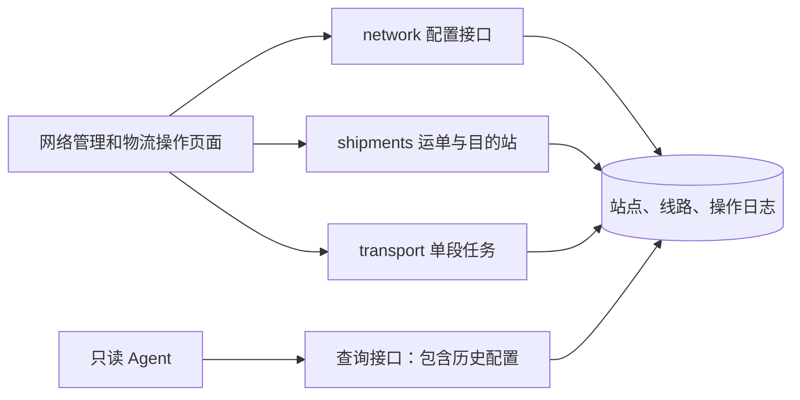

# JINGPO V3 · 开发规格

> 2026-09-30 · BE 实现规格；验收证据见 [plan](plan.md)。本轮按用户指示只负责 BE，客户端由其他工作负责。依据 [V3 PRD](../../../prd/v3/JINGPO-logistics-system-v3.md)。

## 1. 怎么解决

沿用 V2 阶段、事件、任务状态机。把站点能力和线路属性移到数据库，把运单目的站独立保存，服务端使用这些数据校验业务。前端从接口读取选项，Agent 接受通用线路编码。

## 2. 数据契约

| 对象 | 新字段或变化 | 约束 |
| --- | --- | --- |
| Station | code 扩为 VARCHAR(32)，enabled、allows_first_arrival、allows_delivery | 编码 `^[A-Z0-9][A-Z0-9_-]{0,31}$`，唯一且不可改；名称 1～100 字符，去除首尾空白 |
| TransportRoute | code 扩为 VARCHAR(32)，enabled、delay_monitoring_enabled | 同编码规则；起终点不同，外键有效，保留起终点唯一约束；编码和起终点不可改 |
| Shipment | destination_station_id 非空外键 | 创建时目的站启用且允许派送；本版不可改；详情和候选查询返回此字段 |
| TransportTask | delay_monitoring_enabled 非空布尔 | 创建时复制线路配置；计算延误使用任务值，不再判断 AB 字符串 |
| OperationLog | resource_type 增加 STATION、ROUTE | 配置写操作记录前后值、响应、幂等 key；时间继续使用演示时钟 |

目的站放在运单上，订单保留下单信息。继续保留最近扫描站点；不能用目的站取代当前所在站。

V3 配置规模按演示项目处理，GET 网络列表默认沿用数组结构；传分页参数时返回分页对象。列表默认含停用记录，接受 enabled 过滤；分页每页默认 20 条，最大 100 条。

## 3. 接口契约

沿用 `/api/v1`，本版需要 BE、FE、Agent 同步更新。

| 接口 | 行为 |
| --- | --- |
| GET /stations、GET /routes | 返回能力、启用状态、线路监测配置；不传 enabled 时含历史配置。传 `page` 或 `page_size` 时返回 `items/total/page/page_size`（默认 20 条，最大 100 条）；不传分页参数仍返回完整数组以兼容旧客户端 |
| POST /stations | 创建站点：code、name、enabled、allows_first_arrival、allows_delivery |
| PATCH /stations/{id} | 修改名称、能力和启用状态，禁止提交 code |
| POST /routes | 创建线路：code、origin_station_id、destination_station_id、enabled、delay_monitoring_enabled |
| PATCH /routes/{id} | 修改启用状态及监测开关，禁止提交编码与起终点 |
| 创建运单的现有 POST | 增加必填 destination_station_id；纳入请求 hash。已存在运单的新 key 请求须目的站一致，否则冲突；同 key 返回首次响应 |
| POST /shipments/{id}/events | 首次 ARRIVE 仍传 station_id，校验首站能力；派送校验当前扫描站=运单目的站且允许派送 |
| 任务创建、候选与查询 | route_code 改为通用编码；创建/候选校验线路存在及启用，未知线路 404；列表按编码筛选，无匹配时空列表 |

路径均以 `/api/v1` 为前缀。创建运单目的站及创建线路起终点 ID 为 JSON 正整数；响应 ID 为字符串，首次入站 station_id 仍为正整数字符串。配置写入要求 Idempotency-Key；采用现有事务和日志缓存机制，服务端禁止忽略未知字段。

网络业务错误码：NETWORK_RESOURCE_NOT_FOUND（404）、NETWORK_CODE_CONFLICT（409）、NETWORK_RESOURCE_DISABLED（409）、NETWORK_RESOURCE_IN_USE（409）、INVALID_NETWORK_CONFIGURATION（409）。保留 V2 物流操作错误码，响应结构不变。

## 4. 一致性与停用规则

- 网络写操作与创建运单、首次入站、任务创建沿用全局演示时钟锁，再按固定顺序锁定配置和业务记录；状态校验及写入同一事务，防止“校验启用后被并发停用”。未来高并发再拆锁粒度。
- 停用站点要求：无 AT_STATION 运单在该站；无 PENDING_DEPARTURE/IN_TRANSIT 任务以其为端点；无未 SIGNED 运单以其为目的站；没有启用的关联线路。
- 关闭 allows_first_arrival 无需阻断已有在站运单，后续首次入站不再允许。关闭 allows_delivery 则要求没有未 SIGNED 目的运单，避免阻止既定派送。
- 线路启用时两个端点必须启用；停用线路不终止已有任务。已有任务发车、到达使用固定端点和任务监测快照，不能因为线路停用而拒绝。
- 到自身目的站的运单不能再成为运输候选；任意可派送站不能替代它的目的站。首站等于目的站允许直接派送。
- 配置编辑只记操作日志，不追加物流轨迹。物流事件仍由揽收、入站、任务发到、派送、签收生成。
- 编码和线路端点不可修改、没有删除入口。名称修改后历史查询展示现名，V3 不承诺名称时间快照。

## 5. 客户端影响

前端新增“网络配置”入口，分别管理站点、线路。运单创建增加目的站选择；首次入站增加站点选择；创建任务、任务列表、演示页取消 AB/BC 枚举和 A/C 判断。更换线路时清空候选选择，重新加载候选；无可用站点或线路时显示可操作的空状态。

历史详情名称解析使用包含停用数据的网络列表；新业务使用 enabled=true 及相应能力过滤，任务筛选可以选择停用线路。按钮仍以服务端 allowed_actions 为准，提交时重新校验。

Agent 保持只读；RouteCode、当前任务和任务响应由 AB/BC Literal 改为通用编码，提示词取消固定线路与 AB 专属延误描述。目的站与当前站分开说明，延误直接采用 BE 返回字段，不调用配置写接口。

## 6. 迁移与回退

从 V2 head 新增迁移，不能修改已发布迁移：

1. 扩展编码长度，替换固定编码 CHECK；增加网络字段与任务监测字段。
2. 既有站点均启用；A 允许首次入站、C 允许派送，其他能力 false。既有线路启用；AB 监测 true、BC false。
3. 既有运单目的站回填 C；旧任务按旧线路规则回填监测快照。含运单但不存在 C，或端点与旧网络不一致时停止并报告。真正空库允许迁移，网络需后续初始化。
4. 校验回填后再设置非空约束，保留运单、事件、任务 ID、时间与关联。
5. 为旧创建运单日志补齐目的站和新请求 hash；转换旧缓存中出现的运单与任务响应（V2 网络只有查询接口，没有配置写响应缓存）。以旧 key 和新契约请求实际重放验证，不能删除成功日志绕过兼容。

先备份，使用 V2 副本和空库演练。进入任意新网络数据后无法通用还原为 V2 固定编码约束；downgrade 明确拒绝猜测，回退恢复备份。发布时重启客户端并刷新页面。

## 7. 验证门槛

逐项覆盖 PRD V3-01～08，特别验证：非 ABC 网络全流程、首站即目的站、经过另一个配送站仍不能派送、线路停用后已有任务完成、停用与新业务并发、延误快照稳定、全阶段 V2 迁移和幂等缓存重放。

本轮 BE 验收通过 PostgreSQL 集成测试和真实 HTTP 测试证明；FE/Agent 的适配和页面验收由其负责方记录，不作为本轮后端交付的完成声明。开发库迁移尚未执行。
