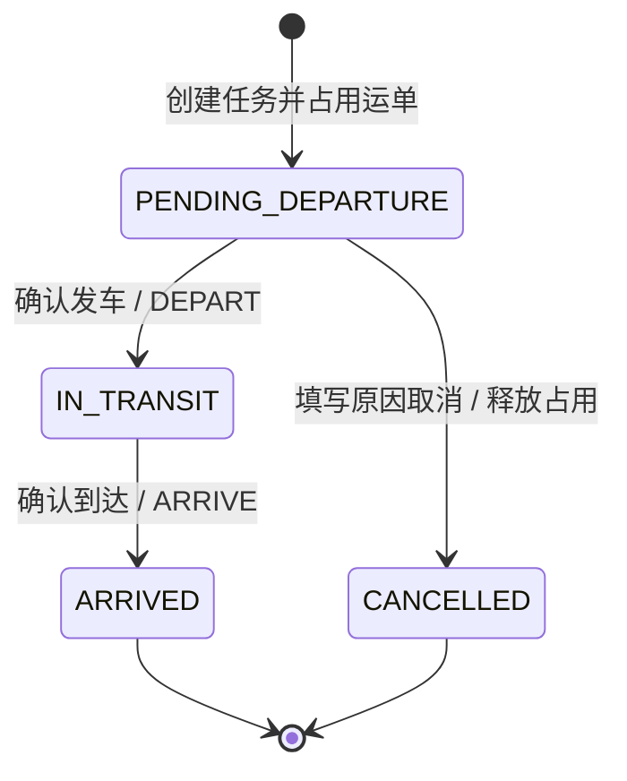

# JINGPO V4 · BE 开发规格

> 2026-09-30 · BE 已实现并通过隔离库验收；开发库已备份升级并重启。依据 [PRD](../../../prd/v4/JINGPO-logistics-system-v4.md)。前端由其负责方实现。

## 1. 怎么解决

在运输任务状态机中加入 CANCELLED，保存取消原因/时间；复用 task_shipments.released_at 释放占用，保留关联历史。现有运单事件和任务发到接口继续使用，服务端返回操作资格，客户端把入口放回业务页面。



到达改变运单位置并记录物流轨迹；取消只撤销未执行的运输安排，运单仍在起点。两种终态都释放占用。

## 2. 数据与响应契约

| 对象 | 变化 | 规则 |
| --- | --- | --- |
| 运输任务状态 | 集中定义 TaskStatus：PENDING_DEPARTURE、IN_TRANSIT、ARRIVED、CANCELLED | 查询筛选、应用校验、数据库约束及客户端一致 |
| TransportTask | cancelled_at 可空时间、cancel_reason 可空 VARCHAR(500) | 取消时两者必有；非取消状态两者为空；取消状态 departed_at/arrived_at 为空 |
| TaskShipment | 保留行；取消时更新 released_at | 仅释放本任务未释放关联，不能按 shipment_id 释放其他任务 |
| TrackingEvent | 无新增类型 | 取消不伪造货物移动；事件枚举及运单阶段保持 V3 |
| OperationLog | action=CANCEL_TRANSPORT_TASK | 记录原任务状态、关联 ID、取消结果、幂等响应和演示时间 |

任务详情、列表和任务写响应增加可空的 cancelled_at、cancel_reason；非取消任务返回 null。任务详情 shipments 表达原关联运单，其 stage 仍为运单当前阶段，不能据此推断运单仍被历史任务占用。

取消任务的 delay_status 返回 NOT_APPLICABLE、delay_minutes=null，无论其 delay_monitoring_enabled 快照为何。保留监测快照，取消与关闭监测是两种不同的不适用原因；客户端可结合 status 区分。现有四种延误值不扩展。

## 3. API

路径继续使用 `/api/v1`。

### 取消任务

`POST /transport-tasks/{id}/cancel`，要求 Idempotency-Key。

```json
{"reason": "线路选择错误，重新安排运输"}
```

请求拒绝未知字段、非字符串、空白和超过 500 字符原因；原因按去首尾空白后的值保存并计算 hash。成功返回 200 和更新后的任务详情，包含取消信息、关联运单、allowed_actions 与延误信息。

沿用现有错误结构与错误码：不存在任务 404；状态不允许、重复取消原因不同、key 内容冲突 409；参数错误 422；时钟未初始化 503。请求必须校验，不能信任页面按钮状态。

### 操作资格

- 任务详情 allowed_actions 增加 CANCEL，只在 PENDING_DEPARTURE 启用。取消后发车、到达、取消操作均禁用，但接口仍支持幂等重试。
- 运单详情 allowed_actions 增加 CREATE_TRANSPORT_TASK：在站、无未释放任务、未到自身目的站、当前站启用且存在起终点均启用的启用出站线路时可用。它不代表已选线路或保证目的站可达，创建提交仍校验线路和候选。
- 原 PICKUP、ARRIVE、START_DELIVERY、SIGN、UPDATE_ADDRESS 规则及接口保持；原任务发车/到达保持批量原子性。
- active_transport_task 继续只取未释放关联；已取消任务不会成为当前任务，且取消后的旧请求重放不能修改新关联。

### 运单任务历史

`GET /shipments/{id}/transport-tasks?page=1&page_size=20`，page>=1，page_size 1～100。运单不存在返回 404；无历史返回空分页。

从 task_shipments 查询，按关联 ID 倒序分页，不以轨迹中的 task_id 发现历史。items 包含任务 id、task_no、route_code、status、起终点 ID、cancelled_at、cancel_reason 和该关联 released_at；返回 total/page/page_size。所有 ID 为字符串，时间有时区。当前占用、已到达与已取消都可查询；这是只读历史入口，不提供关联编辑或删除。

## 4. 事务、防重与竞争

操作顺序：演示时钟锁 → 幂等日志查询 → 任务锁 → 按 shipment_id 排序的关联及运单锁 → 业务校验 → 取消和释放 → 响应/日志 → 提交。遵循现有写流程，发车、到达、创建任务和网络配置同样先锁时钟。

首次取消必须校验任务待发车、有未释放关联、全部关联运单在起点且为 AT_STATION；关联数量/状态冲突时拒绝，不盲目修复。取消必须更新整个批次，关联 released_at=cancelled_at=演示时间，运单字段不变。

| 请求情况 | 结果 |
| --- | --- |
| 同 key、同规范化内容 | 返回首次成功缓存，允许是历史快照；随后 GET 查看最新业务状态 |
| 同 key、不同内容 | 409，无写入 |
| 已取消，新 key、同原因 | 返回当前任务详情，记录重试日志；不再次更新占用/取消信息 |
| 已取消，新 key、不同原因 | 409，首次原因保留 |
| 已发车或已到达 | 409，无释放 |
| 发车与取消并发 | 一个改变状态，另一个看到新状态后拒绝 |
| 取消后创建新任务，再重试旧取消 | 新任务占用保留，旧任务不可复活 |

查询停用保护时，未完成任务限定 PENDING_DEPARTURE/IN_TRANSIT。当前 V3 用 status != ARRIVED，必须修改，否则 CANCELLED 也会错误阻止站点停用。取消后在站货物和未签收目的运单仍然保护站点，不能把“释放任务”理解成站点可直接停用。

## 5. 迁移与兼容

从 `a83c9e14d602` 新增迁移，不修改已发布文件：添加取消字段，替换任务状态/时间 CHECK，旧任务取消字段为 null，保留旧状态、时间、事件、占用和操作日志。

旧任务缓存响应补齐 null 取消字段；若缓存是任务详情，补齐 CANCEL 动作资格；若为完整运单详情，补齐 CREATE_TRANSPORT_TASK 的当时资格。历史资格不能根据当前网络猜测，缺少足够快照时新增动作禁用并提示刷新详情，客户端重放成功后重新 GET。保持原 key/hash 和既有物流事件，不能删除日志规避兼容。

先在 V3 副本与空库演练，验证旧创建任务/发车/到达 key 重放和响应校验。存在 CANCELLED 数据后不能无损恢复 V3 状态约束；回退恢复升级前备份，downgrade 拒绝猜测。已在隔离 V3 副本和临时空库演练，开发库已按用户授权完成备份、升级和重启。

## 6. 客户端交接

BE 提供上述接口和操作资格；FE 新增独立运单列表/详情，迁移业务按钮和确认表单，保留任务详情批量动作，将演示页缩为时钟工具。接口并不要求原控制台作为来源，业务动作无需重新实现。

Agent 仍只读，适配 CANCELLED/取消字段及不适用延误含义。查询运单关联任务历史时应使用新历史入口，不能认为没有发车轨迹就没有任务；未采用历史入口时明确查询覆盖范围，不声称查询到所有任务。

本轮实现 BE 并提供交接契约，不修改 FE/Agent 文件或把客户端验收记为通过。

## 7. 验证门槛

覆盖 PRD V4-01～06 的 BE 部分：多运单取消、新任务重建、无物流轨迹变化、保留历史、同/不同 key、原因冲突、旧取消不能释放新任务、发车竞争、第二张运单更新失败整批回滚、停用保护、取消延误不适用、任务历史分页、错误结构和迁移缓存重放。

业务页面与时钟入口迁移由 FE 单独验收。正常 V3 新网络履约、地址隔离、派送目的站、并发占用、延误快照及迁移回归必须保留。
