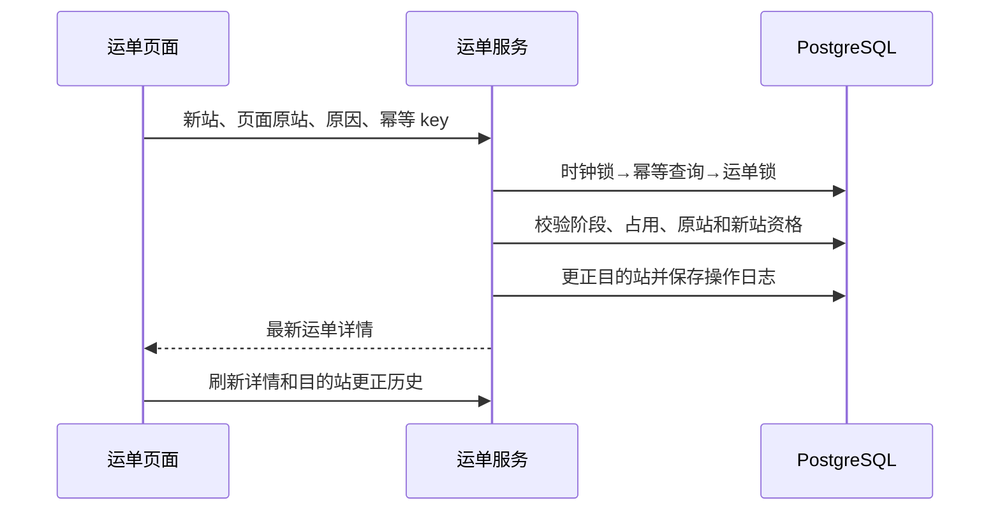

# JINGPO V5 · BE 开发规格

> 2026-09-30 · BE 已实现并通过隔离库验收，依据 [PRD](../../../prd/v5/JINGPO-logistics-system-v5.md)。仅 BE。

## 1. 怎么解决

复用运单目的站字段和 OperationLog；事务内更正并返回最新运单详情。用原目的站作为提交前提，拒绝过期页面覆盖；物流轨迹不记录目的站安排变化。



## 2. 写接口

`PATCH /api/v1/shipments/{id}/destination`，要求 UUID Idempotency-Key。请求拒绝未知字段：

```json
{"expected_destination_station_id": 6, "destination_station_id": 5, "reason": "原目的站选择错误，深圳负责配送"}
```

两个站点 ID 为严格正整数（拒绝字符串、浮点、布尔值）；原因严格字符串，去首尾空白后 1～500 字符。成功 200，返回 ShipmentDetailResponse，不增加必填响应字段。

| 校验 | 结果 |
| --- | --- |
| 运单不存在 | 404 |
| 待揽收、已揽收、在站 | 只有不存在未释放任务关联时可更正 |
| 运输中且存在 ACTIVE 的 IN_TRANSIT 任务 | 可更正；当前任务和当前路径段保持不变，本运单的 PLANNED 后续关联释放并重排 |
| 运输中但没有 ACTIVE 的 IN_TRANSIT 任务、派送中、已签收 | 409 |
| expected_destination_station_id 与当前不同 | 409，防止过期提交 |
| 新站与当前相同 | 409，无写入，无更正历史 |
| 新站不存在 | 404，沿用 NETWORK_RESOURCE_NOT_FOUND |
| 新站停用或不允许派送 | 409，沿用 INVALID_NETWORK_CONFIGURATION |
| 参数/幂等 key 非法 | 422 |
| key 内容冲突 | 409 |
| 演示时钟未初始化 | 503 |

规范化 body 和 action/shipment_id 计算 hash；事务先锁时钟，与任务创建、网络配置、事件写操作一致，再查 key。已有同 key 同 hash 返回首次缓存，即使当前阶段/目的站已变化；不同 hash 拒绝。新 key 重复目标若当前未变化则按无变化拒绝，不制造第二次更正。

更新 destination_station_id、updated_at（系统实际更新时间）及必要的运输安排状态；状态、扫描站、履约地址、订单和物流事件不因更正而伪造。运输中更正保留 ACTIVE 在途任务；逐条释放本运单未发车的后续关联并保留释放原因，共享任务上的其他运单不受影响；没有其他成员的未来任务取消。路径冻结当前在途段，运输计划标记 NEEDS_RECONFIRMATION，待当前段实际到站后从该站按新目的站重新安排。记录 action=UPDATE_SHIPMENT_DESTINATION，resource_type=SHIPMENT，before_data 包含原目的站，after_data 包含新目的站及规范化 reason，occurred_at 使用演示时钟，response_body 为成功详情。更新、任务关联释放和日志在同一事务，失败必须整体回滚。

并发：两个相同原站前提的不同目标只有一个成功；更正与任务创建只允许符合顺序的合法结果，不能让有任务占用的运单被更正；更正与目标站停用/移除派送能力共用时钟锁，不能留下目的站失效的未签收运单。

## 3. 操作资格与历史

运单详情 allowed_actions 新增 UPDATE_DESTINATION：待揽收/已揽收/在站要求无未释放任务关联；运输中要求存在 ACTIVE 的 IN_TRANSIT 任务。无目标站参数的资格不保证目标可用或路径可达，提交重新校验。不可用原因区分阶段、任务占用和缺少当前在途任务；已有动作规则保持。

`GET /api/v1/shipments/{id}/destination-changes?page=1&page_size=20`，page>=1，page_size=1..100。不存在运单404；无更正返回空分页。按成功更正日志 id 倒序读取，不从物流轨迹推断。

| 返回字段 | 含义 |
| --- | --- |
| items[].id | 操作记录 ID，字符串 |
| previous_destination_station_id | 原目的站 ID，字符串 |
| destination_station_id | 新目的站 ID，字符串 |
| reason | 更正原因 |
| occurred_at | 有时区演示时间 |
| total/page/page_size | 总数与分页 |

不暴露请求 hash/key；重复缓存重放不新增记录。站点名称可改，历史事实按站点身份记录，客户端通过站点 ID 展示名称。

## 4. 兼容与交接

不新增数据库字段或约束，V5 无 Alembic 迁移，数据库版本保持 d92f4b76e301。历史缓存允许动作列表缺少新动作，维持历史快照和旧 key/hash；客户端写操作成功后重新 GET，以当前资格为准。不回填历史更正记录。

FE 提供弹窗和记录页，使用原目的站前提，失败保留输入但过期冲突后重新确认。Agent 只读查询新历史接口，不把更正当作货物移动，不声称旧物流轨迹包含全部安排变化。本轮不修改客户端。

未来路径规划按 [V6 草案](../../../prd/v6/JINGPO-logistics-system-v6.md) 推进；V5 不预先绑定线路或自动修改运输任务。

## 5. 验证

隔离 *_test 库覆盖允许/拒绝阶段、占用取消、更正到当前站后派送、地址和轨迹隔离、原站前提与规范化幂等、目标站校验、真实并发、日志故障回滚、网络停用保护、新历史分页、真实 HTTP 错误结构与 Request-ID、旧创建缓存重放及 V2/V3/V4 回归。
