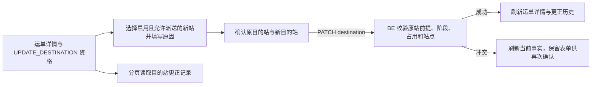

# JINGPO V5 · FE 适配与验证记录

> 2026-09-30 · 运单详情已接入目的站更正和更正历史。后端规则以 V5 BE spec 为准。

## 用户会看到什么

在运单详情中，用户可以查看目的站更正记录。只有 BE 允许更正时，“更正目的站”按钮才可用；操作会先让用户选择新站并填写原因，再确认原站和新站。更正不会改变包裹所在位置、物流轨迹或收件地址。

## 实现

- API 客户端新增目的站更正 `PATCH` 和更正记录分页 `GET`，写请求沿用 `Idempotency-Key`。
- 运单详情使用后端 `UPDATE_DESTINATION` 资格启用按钮，并展示后端返回的不可用原因。
- 站点选项只包含启用且允许派送的其他站点；用户必须填写 1～500 字符原因。
- 二次确认明确展示更正前后站点。409 等失败会刷新运单与历史，保留用户输入，避免用过期目的站覆盖当前数据。
- 新增独立“目的站更正记录”分页表格，不把安排更改伪装成物流轨迹。

## 验证

| 检查 | 结果 |
| --- | --- |
| `npm run lint` | 通过 |
| `npm run build` | 通过；Vite 仍提示现存大 chunk 超过 500 kB |
| `git diff --check` | 通过 |
| 浏览器端端到端操作 | 未执行；本轮以 API 契约、类型检查、lint 和生产构建验证 |

没有调用目的站更正写接口，也没有改动运单业务数据。
