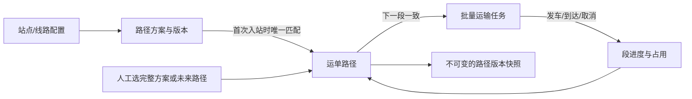

# JINGPO V6 · BE 开发规格

> 2026-09-30 · BE 已实现并通过隔离库验收；开发库已于 2026-10-01 升级到 e61a7c93b204。依据 [PRD](../../../prd/v6/JINGPO-logistics-system-v6.md)。仅 BE。

## 1. 怎么解决

网络配置可复用的完整路径方案；运单首次入站后匹配一次并保存自己的路径。任务只承载当前下一段的一批运单。未来修改追加路径版本，保留已执行和运输中的段及关联，不改写货物事实。



首站未知时不猜路径；零个或多个匹配方案不阻止实际入站，只显示需要规划。到自己的目的站可直接派送，不要求零距离路径配置。配置方案不会自动创建任务，也不会自动发车或到达。

## 2. 数据模型与版本

| 对象 | 保存什么 | 规则 |
| --- | --- | --- |
| PathPlan | 编码、名称、启停、版本、固定起终点 | 编码和起终点不可修改；版本从 1 开始；修改含原版本前提 |
| PathPlanLeg | 方案的有序线路 | 连续、未来路径内站点不重复；最多 100 段；方案编辑可替换这些配置行 |
| Shipment.path_version | 当前路径版本，0 表示未绑定 | 单调增加，默认 0 |
| ShipmentPathLeg | 运单自己的段、顺序、线路、被替代时间 | 当前段位置唯一；被替代未来段保留，不删除；实际任务引用段 ID |
| ShipmentPathVersion | 每次绑定/调整的完整段布局快照、目的站、方案来源/版本、原因和演示时间 | 同运单版本唯一，布局 JSON 不被后续修改；来源方案指本次新未来部分采用的方案 |
| TaskShipment.path_leg_id | 本次占用关联的运单段 | 可空兼容旧任务；同段最多一个未释放关联，取消只释放占用 |

段状态由关联任务得出，不另存一套状态机：无有效任务为 PENDING，待发车占用为 RESERVED，运输中为 IN_TRANSIT，已到达为 ARRIVED。取消任务保留关联历史，但段恢复 PENDING。运单路径状态枚举：WAITING_FIRST_ARRIVAL、NEEDS_PLANNING、READY、RESERVED、IN_TRANSIT、COMPLETED、BLOCKED。

版本是“安排变化”的次数，发车/到达/取消不增加路径版本；接续站随货物进度变化，所以提交必须同时带路径版本和页面看到的接续站。已完成段和运输中段复用原段 ID；未来段替换为新行，旧行标记 superseded_at。已有任务及轨迹中的线路、站点、时间和关联不改写。

旧运单绑定前的完成历史仍从任务/轨迹查询，不补造它曾有完整路径。旧运输中任务可在补规划时把原线路作为冻结段关联；之前已完成的段不推测加入路径。路径历史覆盖从绑定时开始的安排。

## 3. 路径方案 API

- `GET /api/v1/path-plans`：返回方案数组，支持 enabled、origin_station_id、destination_station_id 筛选。包含 usable 和不可用 reason；启用记录也可能因线路停用而不可用。
- `POST /api/v1/path-plans`，201：`{"code":"SH_SZ_DG","name":"上海深圳东莞","route_ids":[1,2],"enabled":true}`。enabled 可省略，默认 true。
- `PATCH /api/v1/path-plans/{id}`，200：`{"expected_version":1,"route_ids":[1,3,4]}`；可修改 name/route_ids/enabled，至少一项非空，拒绝未知字段。

全部写入要求 UUID Idempotency-Key。ID 为严格正整数，bool 为严格布尔；线路 1～100 段，编码使用网络编码规则。方案起终点由首尾线路确定，修改时必须保持原起终点。启用方案需要所有线路及站点启用、最终站允许派送；停用方案可保留失效配置，重新启用时重校验。

方案修改带 expected_version 防止过期覆盖，每次成功修改加一；同 key 同内容返回首次缓存。重复编码409，资源缺失404，无效路径/停用/版本冲突409，参数422，时钟未初始化503。日志 resource_type=PATH_PLAN、action=CREATE_PATH_PLAN/UPDATE_PATH_PLAN；前后完整方案快照、成功缓存和演示时间原子保存。

方案编辑/停用只影响新匹配，已绑定运单布局不自动变化。方案的来源版本写入运单路径历史，保留当时采用的布局。无删除 API。

## 4. 运单路径 API

| 接口 | 内容 |
| --- | --- |
| GET /shipments/{id}/path | 当前路径、段进度、接续站、下一段、阻塞原因 |
| GET /shipments/{id}/path-options | 当前路径和从接续站到运单目的站的可用完整方案数组 |
| PUT /shipments/{id}/path | 一次性设置或替换未来部分，返回当前路径 |
| GET /shipments/{id}/path-history?page=1&page_size=20 | 路径版本布局快照倒序分页 |

路径写入示例（前缀由服务端保留）：

```json
{"expected_version":1,"expected_anchor_station_id":2,"route_ids":[3,4],"reason":"后续线路调整"}
```

或一次选择方案：

```json
{"expected_version":0,"expected_anchor_station_id":1,"plan_id":8,"expected_plan_version":2,"reason":"选择完整方案"}
```

plan_id 与 route_ids 二选一，选方案必须带方案版本；route_ids 是完整未来部分（0～100 段，只有接续站等于目的站才能为空）。原因严格字符串，去首尾空白后 1～500 字符；拒绝未知字段。仅 AT_STATION/IN_TRANSIT 可写。未释放待发车任务存在时拒绝，必须先取消；运输中允许从当前运输段的终点重规划，不能改变该段。

版本变化返回 PATH_VERSION_CONFLICT，接续站变化返回 PATH_ANCHOR_CONFLICT，待发车占用返回 PATH_TASK_OCCUPIED，其余不连续/循环/终点错误返回 INVALID_TRANSPORT_PATH；上述为409。方案/线路不存在404，参数422，时钟未初始化503。运单不存在404。不同 key 可以形成新版本，原版本前提仍必须正确；同 key 同规范化内容重放，不重复产生段或版本。

运单详情增加 path_version（默认0）、transport_path（缓存可默认null）和 UPDATE_PATH 资格。READY 才能创建任务；下一段用 next_route_id/next_route_code 表示。在运输中即使未来段不可用，当前任务仍可继续，reason_code=PATH_FUTURE_BLOCKED 提示重规划。无需完整方案就能查询实际任务历史。

path-history items 包含 version、destination_station_id、source_plan_id/source_plan_version、reason、occurred_at、legs（段 ID、顺序、线路及起终点快照）。ID 字符串、时间有时区，page>=1，page_size=1..100；空历史返回空分页，不存在运单404。它是安排历史，段进度从当前真实任务计算，不能把版本布局当作物流事件。

## 5. 下一段任务与现有业务集成

`POST /transport-tasks/create` 继续支持原 route_code 请求形状，但服务端必须校验所有运单的下一段一致且等于该线路，不能绕过路径。可省略 route_code，按当前路径自动取下一段：

```json
{"shipment_ids":[10,11],"expected_arrival_at":"2026-10-02T12:00:00+08:00","expected_path_versions":{"10":1,"11":2}}
```

自动创建必须带所有运单当前版本；字典 key 与 shipment_ids 精确一致，版本严格正整数。混合下一段、过期版本、无完整路径、占用或当前位置不符返回现有 InvalidTaskShipmentError/HTTP409，整批无写入。不自动拆批；前端先按 next_route_code 分组。

原显式 route_code 请求 hash 保持原算法；仅提供 expected_path_versions 时才将它加入 hash。旧 key 缓存重放不经过新的路径校验，保留原响应。新 key 创建时，尚未绑定但已有唯一可用方案的在站运单可在同一事务先自动绑定；无方案或多个方案则拒绝创建。

候选查询只返回路径下一段等于指定线路、无占用、在正确站点且未来线路全部可用的运单。首站入站和旧任务到达时，若尚无未来段且不是目的站，自动绑定唯一可用方案。已有绑定路径不会在每次中转重选。

发车/到达继续改真实任务、运单阶段/扫描站和物流事件；段进度随任务变化。取消保留 path_leg_id 并释放占用，原下一段可再次安排；旧取消重放不释放新任务。

V5 更正目的站时冻结已到达前缀、废弃旧未来段、产生新路径版本；若当前站有唯一到新目的站的完整方案则追加新版本自动绑定，否则提示重规划。更正到当前站时路径完成，可以派送。地址、订单和物流轨迹不改写。未来部分内部不允许循环；更正目的站需要返回曾到过的站时，不删除原实际前缀。

## 6. 并发、停用和故障

所有写操作先锁模拟时钟，再查幂等日志，再锁业务对象，沿用当前 BE 的一致顺序。路径、任务、网络及目的站修改共享此锁，避免交叉竞争和死锁。路径写入还校验版本及接续站；方案写入校验方案版本。

路径替换、旧未来段标记、创建新段、版本递增、版本快照和日志整体提交。首次入站中的自动绑定与入站事件整体提交，绑定写入失败回滚入站以便同请求重试。发车/到达批量原子性沿用 V4。

停用方案不改旧绑定。停用线路允许，但阻止沿失效未来路径创建新任务，已有任务仍可完成；运单路径提示 BLOCKED/未来阻塞并允许合法重规划。站点除既有保护外，未签收运单仍有未执行当前路径段引用时拒绝停用；被替代路径和已完成段不阻止停用。

## 7. 迁移与客户端交接

新 revision=e61a7c93b204，上一版 d92f4b76e301。四张新表、运单 path_version=0、关联 path_leg_id=null、约束/索引和 PATH_PLAN 日志资源类型。旧物流事实和 key/hash/缓存不改写，不自动生成路径，不推测历史任务属于曾经的完整方案。新响应字段有缓存兼容默认值，写后客户端刷新当前详情。

旧待发车任务可发车或取消，旧运输中任务可到达。旧运单后续新任务必须有完整剩余路径；唯一方案可自动采用，也可显式绑定。迁移先在 V5 副本和临时空库演练；开发库需停服务、备份、升级、重启。downgrade 拒绝，回退使用升级前备份。

FE 增加路径方案配置、运单完整路径/下一段/一次选择/未来调整/版本历史展示；自动任务创建带版本、按下一段归集候选。成功后重新 GET；版本/接续站409后刷新再确认，不自动覆盖。Agent 只读适配，区分路径安排与已经发生的物流事实，旧运单绑定前的历史仍通过任务/轨迹查询。BE 完成不代表 FE/Agent 已验收。

## 8. 验证门槛

覆盖唯一/零/多个方案、连续性/循环/端点/严格参数、批量自动下一段、中转不用再选、绑定快照独立、冻结完成/运输段、待发车取消、历史版本、V5 目的站更正、路径/任务与网络停用竞争、批量失败/版本及自动入站绑定故障回滚、候选与实际创建一致、旧任务继续和新任务拒绝绕过、旧缓存重放、V5副本和空库迁移、V2～V5 联合回归及真实 HTTP 错误结构。
