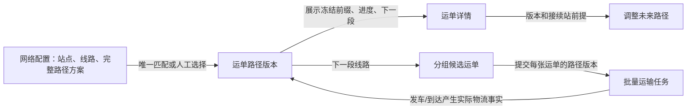
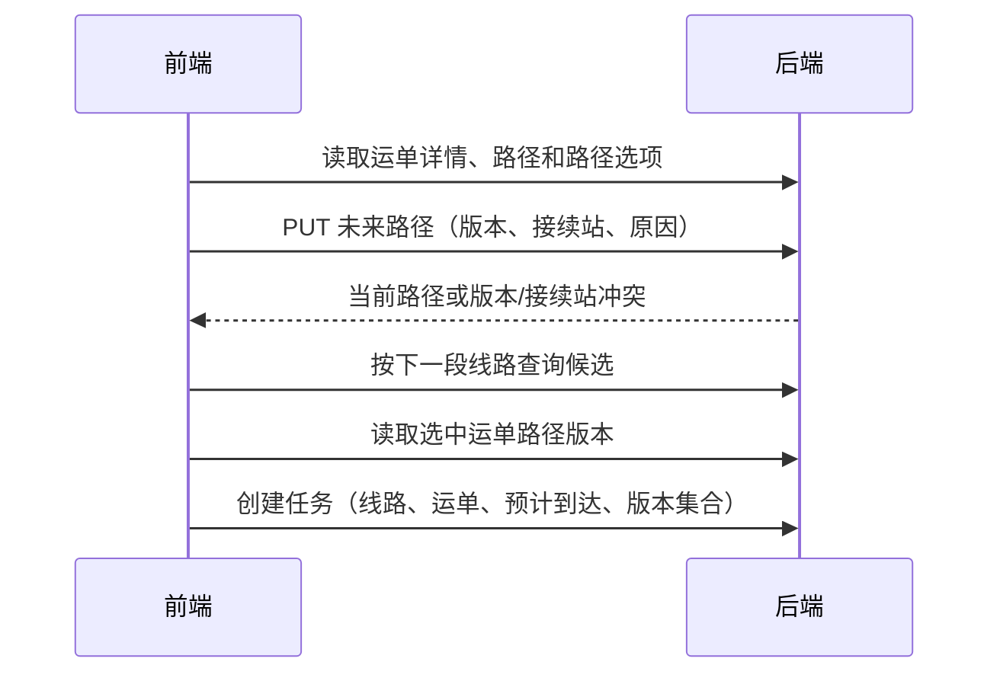

# JINGPO V6 · FE 适配与验证记录

> 2026-10-01 · 前端已接入完整路径方案、运单路径安排和版本化任务创建。BE 契约与规则以 [V6 BE spec](../be/spec.md) 为准。

## 用户会看到什么

网络配置可以维护复用的完整路径方案。线路不再塞进一个可删标签的多选框，而是逐段添加、删除和调整顺序，并实时预览完整站点链。运单调整未来路径也使用同一编辑器，同时校验接续站、连续性和最终目的站。运单入站后会显示自己的全程安排、当前段进度和下一段；没有路径或需要改未来安排时，可以选择可用方案或逐段配置线路。运输任务按下一段线路分组，创建时提交每张运单当前看到的路径版本。

路径安排记录与实际物流轨迹分开显示。调整只影响接续站之后的未来段，页面确认已完成或运输中的冻结前缀；BE 负责再次检查版本、接续站、占用和线路有效性。

## 实现范围

- **网络配置**：新增完整路径方案列表、创建、编辑和启停；编辑提交方案版本；以逐段线路编辑器配置顺序，可添加、删除和上下移动线路；实时显示站点链，并阻止不连续的方案提交。
- **运单详情**：显示路径版本、段状态、接续站和下一段；允许选择完整方案或用逐段编辑器配置未来线路；实时显示站点链并校验接续站、连续性和目的站；确认冻结前缀、接续站、目的站和原因；单独分页展示路径版本历史。
- **目的站更正**：V5 更正接口成功后刷新详情，展示 BE 返回的路径变化，不把路径安排变化加入轨迹。
- **任务创建**：先按下一段线路筛选候选，再读取用户所选运单的路径版本；批量提交显式线路和精确的 `expected_path_versions` 集合，BE 最终校验整批一致性。
- **冲突恢复**：路径版本或接续站冲突后重新读取路径选项/详情，保留编辑内容并要求再次确认；任务表单可刷新所选运单的路径版本。

第一张图说明各页面如何传递完整路径；第二张图说明路径更新和任务创建都以 BE 当前数据复核为准。

## 验证与边界

V6 的路径方案和运单路径只保存线路顺序与路径版本，不保存逐站预计到达时间。预计到达时间仍由每个运输任务单独设置；若需要在运单路径上逐站维护预计时间，必须先扩展 BE 数据契约与接口，再由 FE 接入，不能只在编辑器本地显示。

| 检查 | 结果 |
| --- | --- |
| `npm run lint` | 通过 |
| `npm run build` | 通过；Vite 仍报告现存大 chunk 超过 500 kB |
| `git diff --check` | 通过 |
| 本地只读接口 | readiness、方案列表、运单详情/路径/选项/历史、线路、任务候选返回结构已核对 |
| 浏览器端完整操作 | 未执行；本轮没有通过界面提交方案、路径或运输任务 |

接口核对只使用 GET 请求。没有创建或修改路径方案、运单路径、运输任务，也没有改动物流业务数据。页面行为仍需在真实 V6 页面做一次操作验收。
