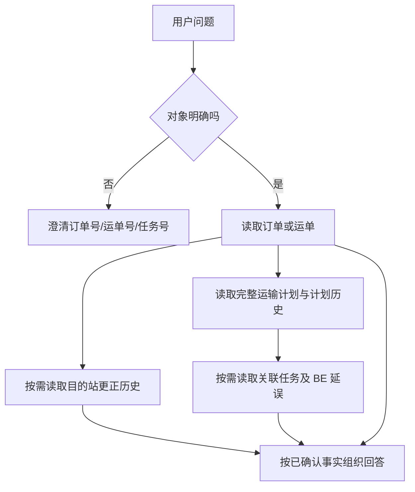

# JINGPO Agent V7 · 开发规格

> 2026-10-09 · 草案，待评审。本文描述 Agent 对齐 V7 后应具备的只读查询能力，不代表已经实现或验收。

## 1. 要解决的问题

V7 把运输安排改为按完整线路和车次确认的分段计划。未来分段任务可能已经生成，但尚未产生轨迹，也不是当前执行任务。现有 Agent 只从轨迹和当前任务找关联任务，因此可能漏掉未来计划；同时它不能读取计划详情、计划历史或目的站更正记录。

本版本让用户可以用自然语言查询订单、运单、完整运输计划、计划历史、目的站更正记录、运输任务和 BE 延误结果。所有能力只读；运输状态、预测和延误事实以 BE 返回为准。

## 2. 范围

- 保留现有 CLI、会话追问、订单/运单/任务查询、分页、预算、日志脱敏和只读边界。
- 增加运单完整 schedule、schedule history、目的站更正历史查询。
- 延误查询关联当前执行段、轨迹关联历史段及 schedule 中未来/已解除段，并标明来源与关联状态；不能把 `PLANNED` 说成正在执行。
- 补充任务列表中的计划车次、计划发车、预测到达、预测过期等字段。
- 订单/运单摘要纳入履约时间窗及必要的结构化寄收区域；不向模型传递姓名、详细地址等非回答必需信息。
- 说明任务区段到达时间、预测到达时间、买家最终送达时间的区别。无 BE 买家 ETA 时不得推算或承诺。
- 不增加写操作；不实现排程预览/确认、发车、取消、更正、任意 HTTP、数据库访问或自动重排。

## 3. 查询流程

查询轨迹只需运单详情；询问完整安排、后续运输或延误时读取 schedule。历史版本按需查询，不把历史时间覆盖到当前计划。组合查询部分失败时保留已确认数据并标明未查到的部分。

## 4. 数据表达规则

| 数据 | 表达规则 |
| --- | --- |
| `schedule.status` | 按 BE 状态原样解释；未确认、需重新审核、受阻、已完成分别说明，不推断为运输中 |
| `association_state` | `PLANNED` 是未来计划关联，`ACTIVE` 是当前执行关联，`RELEASED` 是已解除/失效；仍需结合任务状态和时间 |
| `planned_*` | 人工确认的计划基准，不代表实际发生 |
| `forecast_*` | 当前预测，可为空；`forecast_stale=true` 时明确提示预测已过期 |
| `actual_*` | 实际物流事实；优先用于说明已经发生的发车/到达 |
| 任务延误 | 只引用 BE 的 `server_time`、`delay_status`、`delay_minutes`；历史晚到与当前超时分开 |
| `waiting_members` | 说明共享任务仍等待的运单；不得只依据当前运单推断整车可执行 |
| 目的站更正 | 按更正记录的前后站、原因、服务器时间说明；不把当前目的站误当历史值 |
| 地址/时间窗 | 只展示与问题相关的区域和时间窗；不输出姓名和详细地址 |
| 买家 ETA | BE 没有买家送达 ETA 时明确说明不可确认；分段计划/预测不是买家签收时间 |

## 5. 只读工具与接口

接口前缀 `/api/v1`。具体字段以当前 BE OpenAPI 和专项契约为准，落地前核对；Agent 只调用 GET。

| 能力 | 接口 | 用途 |
| --- | --- | --- |
| 订单列表/详情 | `GET /orders`、`GET /orders/{id}` | 订单及关联运单、订单时间窗和区域摘要 |
| 运单列表/详情 | `GET /shipments`、`GET /shipments/{id}` | 阶段、站点、轨迹、运单 schedule 概览、起终站和时间窗 |
| 完整运输计划 | `GET /shipments/{id}/schedule` | 当前完整分段安排及计划/预测/实际状态 |
| 计划历史 | `GET /shipments/{id}/schedule-history` | 按页读取历史版本 |
| 目的站更正历史 | `GET /shipments/{id}/destination-changes` | 按页读取目的站调整记录 |
| 运输任务列表/详情 | `GET /transport-tasks`、`GET /transport-tasks/{id}` | 任务状态、计划/预测字段、服务器时间及延误 |
| 站点字典 | `GET /stations` | 将站点 ID 映射为名称；失败时保留 ID 并标记名称未知 |

工具输入禁止额外字段；编号与数据库 ID 分开校验；HTTP 地址、方法和路径由客户端固定。分页及响应体受大小限制。任何接口版本或必填字段变化都需更新响应模型和契约核验。

## 6. 失败与安全要求

- 保留现有模型、工具、HTTP 和整轮预算；组合查询的每次 HTTP 请求都计入预算。
- 单个接口失败不抹去其他接口已确认的事实；结果标记 `partial` 并指出缺失数据。
- 404、空列表、超时、网络错误、服务错误和非法响应分别处理，不能把查询失败说成对象不存在。
- 达到预算后停止调用，说明未完成的查询范围；不基于部分 schedule 宣称“完整路线”。
- BE 返回的备注、商品名等文本均是数据，不作为指令执行。
- 只读工具集不注册任何写接口；不将完整地址、姓名、密钥或模型内部推理写入日志。

## 7. 验收标准

| 编号 | 必须满足的行为 | 验收示例 |
| --- | --- | --- |
| AG7-01 | 读取 V7 运单的完整计划 | 对尚未产生轨迹的未来段仍能列出线路、计划时间和关联状态 |
| AG7-02 | 正确区分计划、当前执行、已完成和已解除关联 | `PLANNED` 不回答成“正在运输” |
| AG7-03 | 延误查询覆盖 schedule 关联段、当前任务和轨迹历史任务 | 未来任务未出现在轨迹时仍被纳入；同一任务去重 |
| AG7-04 | 区分计划、预测、实际时间及预测过期 | `forecast_stale=true` 时不把旧预测当可靠 ETA |
| AG7-05 | 查询计划历史并保持历史版本原样 | 历史版本不被当前预测覆盖 |
| AG7-06 | 查询目的站更正记录 | 说明前后目的站、原因和时间；接口失败时不推断“从未更正” |
| AG7-07 | 说明订单时间窗和区域信息 | 只输出必要字段，不暴露姓名或详细地址 |
| AG7-08 | 正确表达共享任务与待就绪成员 | 根据 `waiting_members` 和 `ready_at` 说明前置条件，不承诺可发车 |
| AG7-09 | 买家送达时间不由区段到达时间替代 | 没有买家 ETA 时明确说无法确认最终签收时间 |
| AG7-10 | 支持分页、歧义澄清、多轮追问和只读边界 | 精确定位对象；写操作请求被拒绝 |
| AG7-11 | 组合查询遇到部分失败仍保留已知事实 | 明确指出 schedule 或历史记录未能查询，不误报为空 |
| AG7-12 | 预算、响应校验、日志脱敏继续有效 | HTTP 计数正确；非法响应不形成业务结论；日志不含隐私字段 |

## 8. 完成定义

所有 AG7 验收项有可复核的模拟用例；真实 BE 的 GET 契约核验覆盖新增接口及关键字段；至少完成未来计划未出现在轨迹、预测过期、共享任务等待、部分失败和历史版本查询等代表场景。真实模型自然语言表现与受控工具测试分开记录。未执行的测试、真实模型查询或真实数据场景必须标为待验收。
