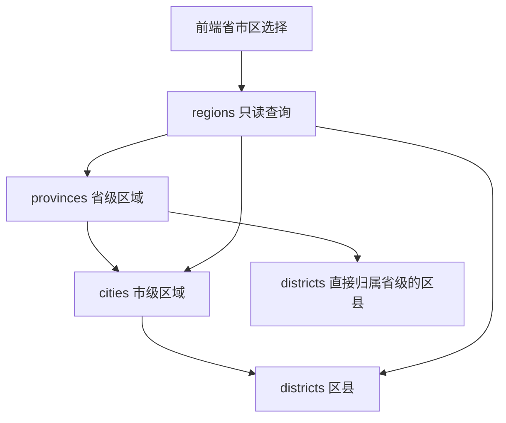

# 国内地址库：省、市、区县三表

## 1. 解决什么问题

订单页面需要选择寄收件省市区，后端用独立的地址字典提供候选区域。本次完成三张表、数据库迁移和只读联动接口。全国区域数据已于 2026-10-02 初始化（34 个省级、355 个市级、3,241 个区县；首次导入后补齐两项）；订单区域字段随后已接入，见 [结构化地址说明](structured-addresses.md)；常用地址簿、站点服务范围和自动匹配尚未接入。

自治区、直辖市等属于省级区域。是否缺少市级或区县级，依据具体数据层级处理，不能根据“自治区”这个名称推断。



省级和市级都允许没有下级；不制造虚假的“市”或“区”。一省既有普通城市又有直管区县时，两条入口都保留。

## 2. 表与归属

三表均有 `id`（各表独立主键）、`code`（2～12 位数字字符串，各表唯一）、`name`、`enabled`、`sort_order`、`created_at`、`updated_at`。名称不能为空、排序不能为负。导入时应统一采用同一份数据源的编码形式，不从编码截取父级关系。

| 表 | 额外字段 | 约束 |
| --- | --- | --- |
| provinces | kind | PROVINCE / AUTONOMOUS_REGION / MUNICIPALITY / SPECIAL_ADMINISTRATIVE_REGION |
| cities | province_id | 必填，关联省级表；上级查询有索引 |
| districts | province_id、city_id | province_id 必填；city_id 可空，空表示直接归属省级 |

区县填写 city_id 时，用 `(city_id, province_id)` 联合外键保证城市属于同一省。仅两个独立外键不能阻止“广东区县绑定其他省的城市”。上级使用 RESTRICT 防止删除仍被子级引用的区域。

三个表的 id 可以相同，客户端必须同时知道层级，不能把 id 当作跨表通用标识。后续订单建议保存明确的省/市/区县字段，并允许缺失层级为空，再保留当时的地址名称快照；本次尚未修改订单。

## 3. 接口

返回各层级启用数据，按 sort_order、code 排序。停用上级的子级不提供给新地址选择。接口不依赖演示时钟。

| 接口 | 返回 |
| --- | --- |
| GET /api/v1/provinces | 省级列表；has_cities 表示启用城市，has_districts 表示启用的直管区县 |
| GET /api/v1/cities?province_id=1 | 指定省级下的城市；has_districts 表示是否有启用区县 |
| GET /api/v1/districts?province_id=1&city_id=2 | 指定城市下区县 |
| GET /api/v1/districts?province_id=1 | 仅该省级直接管辖的区县，不混入普通城市的区县 |

每项返回 id、code、name、level、province_id、city_id、kind、has_cities、has_districts。返回 ID 为字符串，查询 ID 为正整数。资源不存在 404，城市不属于指定省级 422，停用上级返回空列表。省列表为空时，前端应提示“地址库尚未配置”，不能认为全国无下级或自动填写地址。

没有下级时，前端允许地址选择停在真实末级；后台后续订单校验也应采用相同规则，不要求所有地址都必须填满三级。详细门牌地址仍另外填写。

代码入口：`be/models.py` 的 Province/City/District、`be/regions/router.py`。

## 4. 迁移与交付状态

迁移 `77292ad0db58` 接 V7 `f72d8a94c105`，只增加三张空表与约束/索引。原订单、运单、任务及旧 region_code 不变，不自动识别或改写旧地址。

已在隔离库 `jingpo_logistics_v7_regression_test` 升级，alembic check 无新迁移操作。开发库停服务后备份至 `be/backups/jingpo_logistics_before_regions_20261001_232319.dump`（104 KB，pg_restore 清单可读取），升级到 `77292ad0db58`，后端恢复在 `127.0.0.1:8000`。

发布后只读检查：后端就绪 200，省级接口 200 且返回空数组，OpenAPI 已包含三个字典查询接口，开发库三表记录数均为 0。

本轮未新增或运行功能测试。结构迁移检查已执行；业务样本、特殊层级数据和完整联动需正式数据导入后验证。迁移只建空表，不把虚构区域或未知版本的数据作为正式地址库。字典已有数据时禁止直接 downgrade，应恢复备份。

## 5. 全国地址初始化（2026-10-02）

开发库已导入 34 个省级区域、355 个市级区域和 3,239 个区县，其中 144 个区县直接归属省级。含港澳台常用地址层级；不包含街道、乡镇和门牌地址，也不等于站点已配置服务范围。

数据取自 [chinese_regions](https://github.com/kamaslau/chinese_regions/tree/c3ac97435218222a622ebc9ee3ff797fd6e94df1)，固定提交 `c3ac97435218222a622ebc9ee3ff797fd6e94df1`，上游说明数据更新于 2026-02-20、内地来源发布于 2025-04-25。本次采用这个固定版本，不声称涵盖之后所有区划调整。港澳台细分及编码采用该数据源的地址选择约定，不把全部扩展编码表述为统一的官方行政区划代码。

`be/regions/data/` 保存原始数据、整理后的数据、MIT 许可和含 SHA-256 的版本清单。整理规则：

| 数据情况 | 入库处理 |
| --- | --- |
| 与省级同名的市级占位项 | 不入库；直辖市、港澳直接选区县 |
| 区县 code=0 的分组标题、重复省级占位项 | 不入库 |
| 上游用名称末尾 `*` 标注的省直管区县 | 去掉标记，city_id 为空，防止错误挂在上一个城市下 |
| 普通区县 | 使用数据源明确的父级归属，不截取编码猜父级 |
| 东莞、中山、儋州等无区县城市 | 保留城市，不用街道补造区县 |
| 自治区 | 省级 kind 为 AUTONOMOUS_REGION，下级按实际归属保留 |

初始化入口 `be/regions/seed.py`。导入前核对文件哈希、数量、编码唯一性与父级归属；全量写入放在一个事务中，并使用与业务写操作相同的锁。按 code 复用已有 ID，相同数据跳过；已有名称或归属不一致时整批失败，需人工审核数据更新。不删除旧项，不重置已有停用状态，不改订单/运单历史地址。

```bash
# 在 be/ 下执行；先备份目标数据库
DATABASE_URL='postgresql+psycopg:///jingpo_logistics' .venv/bin/python -m regions.seed --dry-run
DATABASE_URL='postgresql+psycopg:///jingpo_logistics' .venv/bin/python -m regions.seed
```

`--dry-run` 只校验和报告，不写表、不消耗主键序列。区域数据作为独立初始化步骤，不需要新的结构迁移；其他环境升级空表迁移后需执行同一命令。

### 实际执行与只读检查

- 导入前完整备份：`be/backups/jingpo_logistics_before_region_seed_20261002_182518.dump`（122,259 字节），pg_restore 清单可读。
- 开发库仍为迁移版本 `30ec3dbeb8ac`，三表新增数量与版本清单一致。
- 导入后再次 dry-run：新增 0，现有一致项分别为 34 / 355 / 3,239。
- 后端原未运行，已启动在 `127.0.0.1:8000`；`GET /health/ready` 返回 200，三个地区接口读取成功。
- 只读样例：广东 21 个城市；广州 11 个区（含天河区）；东莞、中山无区县；北京无市级项、16 个直管区；湖北 4、海南 15、新疆 12 个省直管区县；台湾 22 个市县层级项；香港 18、澳门 8 个直接归属省级的地址分区。

本轮未新增或运行功能测试；检查覆盖数据导入和接口读取。订单地址写流程与前端页面联动仍待负责方验收。


## 6. 缺区反馈核对与前端接入问题（2026-10-02）

用户反馈“好多区没有”后再次核对。首次导入的行数正确，但这不足以证明地址选择完整；已确认源数据遗漏，以及前端展示问题，不能宣称页面已验收。

### 数据补齐

首次数据缺少塔城地区的乌苏市（654202）、沙湾市（654203）。参考 [新疆应急管理厅的塔城地区会议记录](https://yjgl.xinjiang.gov.cn/xjyjgl/c112888/202507/21cb279a8ed14b60a1663bd3fd665d9d.shtml) 核对归属，用固定版本的 [统计区划数据](https://github.com/modood/Administrative-divisions-of-China/tree/c49d495b40ac73eb1a66f6eeae5f8fd10696f035) 补齐编码。仅取这两个已核实的缺项，未批量合并旧版本全部差异。

补充来源原文件、许可、固定提交和两条补充记录已保存在 regions/data 与 manifest.json。导入前备份为 `be/backups/jingpo_logistics_before_region_correction_20261002_194955.dump`。本次新增 2 条、原 3,239 条未修改，当前共 3,241 个区县；初始化脚本已使用补齐后的数据。

两份内地数据的差异还包括开发区、园区、行政管理区和无区县城市的乡镇街道，以及已变更的旧区划。现有字典没有覆盖这些全部常用地址名称，不应把它表述为所有快递地址选项均已齐全。开发区不一定是行政区县；若要作为独立选择项，应明确其类别和真实归属再接入。用户具体缺项仍需按名称核对。

### 前端负责方需修复的展示问题

本轮按职责只改后端数据和文档，没有改 FE。接口数据与现有前端代码核对发现：

| 问题 | 现有原因 | 前端调整要求 |
| --- | --- | --- |
| 仙桃市、济源市等省直管区县不出现 | AddressRegionFields.loadData 在 has_cities 为 true 时只请求 cities，忽略同省 has_districts | 省级同时有两类下级时合并 cities 与省直管 districts 两个接口结果 |
| 部分城市展开后区列表异常，甚至覆盖其他层级选项 | attachChildren 只用裸 ID 在整棵树递归匹配；三表 ID 可重复 | 用完整路径定位节点，并包含 level 与父级上下文；不要全树用裸 ID 匹配 |
| 编辑时既有市级又有直管区县的省级选项被替换 | 初始化已选地址只装载其中一类下级 | 与加载逻辑一致，装载并合并两类下级，再沿已选节点层级恢复 |

实际冲突例子：河北省 id=3，秦皇岛市 id=3；北京市 id=1，石家庄市 id=1。裸 ID 冲突是三表独立主键的正常情况，不能通过重写字典 ID 掩盖前端定位问题。现有 level/province_id/city_id 足够定位，无需变更后端接口。

未新增或运行功能测试；实际执行补齐导入及只读接口检查。前端修复和具体缺项验收仍未完成。
