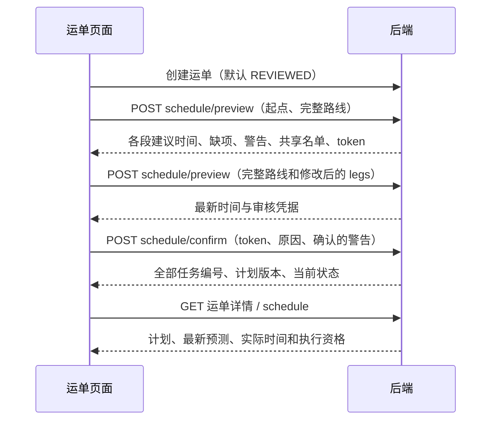

# V7 客户端接入说明

后端负责保存运输计划、生成全部任务和判断能否执行。前端由单独 Agent 实现；本说明用于接口交接，不表示页面已经验收。查询 Agent 也需要独立适配新状态。

## 1. 正常操作顺序



接口前缀为 `/api/v1`。预览无任务、日志或正式版本写入；真正确认需 UUID `Idempotency-Key`。用户改时间、路线或来源方案后，重新预览获取 token，再确认。token 有效期为真实时间 10 分钟；配置、共享成员或正式版本变化后重新预览。服务重启也可能使旧预览失效。多进程部署需设置同一 `SCHEDULE_SIGNING_KEY`，不能各进程使用随机签名密钥。

## 2. 预览与确认

预览地址：`POST /shipments/{id}/schedule/preview`。

| 字段 | 怎么填写 |
| --- | --- |
| origin_station_id | 首次入站前必须明确计划起点；入站后/运输中由后端确定接续站 |
| plan_id、expected_plan_version | 使用可复用完整路径方案；与 route_ids 二选一 |
| route_ids | 按顺序提供完整未来线路；已完成/运输中段由后端冻结 |
| expected_path_version、expected_schedule_version、expected_destination_station_id | 可选的页面前提，建议全部提供 |
| first_departure_at | 初次生成时可指定首段出发；否则按演示时间建议 |
| planned_origin_arrival_at | 首站尚未实际入站时，可选提供计划入站，未知则预测可能为空 |
| legs | 编辑后提交全部未来段，每段包含 route_id、planned_departure_at、planned_arrival_at |

ID 和版本用 JSON 数字，返回 ID 用字符串。时间带时区且精确到分钟，例如 `2026-10-02T04:00:00+08:00`。必须满足本段到达晚于出发、下一段出发不早于前段到达；未来首段不得早于当前演示时间。短于参考运输/中转耗时可以审核确认，不能在前端当作绝对禁止条件。

示例（ID 为示意值）：

```json
{
  "origin_station_id": 1,
  "route_ids": [1, 2],
  "legs": [
    {"route_id": 1, "planned_departure_at": "2026-10-01T20:00:00+08:00", "planned_arrival_at": "2026-10-02T04:00:00+08:00"},
    {"route_id": 2, "planned_departure_at": "2026-10-02T06:00:00+08:00", "planned_arrival_at": "2026-10-02T12:00:00+08:00"}
  ]
}
```

预览返回 `legs`、`warnings`、`missing`、`replacements`、`can_confirm` 和 `preview_token`。每段含参考耗时、已审核间隔及拟共享任务 ID/revision/运单名单。`can_confirm=false` 时展示缺项或已有共享安排，不能直接确认。共享安排需要先预览任务级取消影响、明确解除，再重新审核。

确认地址：`POST /shipments/{id}/schedule/confirm`：

```json
{
  "preview_token": "使用最新预览返回的凭据",
  "reason": "已审核全程时间",
  "acknowledged_warning_codes": ["TRAVEL_BELOW_REFERENCE:0"]
}
```

警告代码从当前预览中原样选取；没有警告传空数组。确认返回完整 schedule，每个未来段都已有 task_id、association_id 和 task_no。确认前不跳转逐段人工建任务。

## 3. 展示和执行

| 返回信息 | 页面怎么理解 |
| --- | --- |
| schedule.status | NOT_CONFIRMED 未确认；CONFIRMED 已确认；NEEDS_RECONFIRMATION 需重新审核；BLOCKED 起点/依赖受阻；COMPLETED 站间运输完成 |
| planned_departure_at / planned_arrival_at | 人工确认基准，不被预测覆盖 |
| forecast_departure_at / forecast_arrival_at | 最新预测，可空；forecast_stale 表示估算已过但未实际到达 |
| actual_departure_at / actual_arrival_at | 真实物流事实，只读 |
| WAITING_CARGO | 已有任务，等待首次真实入站 |
| WAITING_PREDECESSOR | 已有任务，等待前段真实到达；不能说明货物已经到了后段起点 |
| association_state=PLANNED | 未来关联；不是当前执行占用 |
| association_state=ACTIVE | 当前执行占用，仍须看任务发车资格及 ready_at |
| association_state=RELEASED | 已释放或失效；结合 release_reason、计划状态与历史说明 |
| waiting_members | 共享任务仍等待哪些运单，不能只看当前运单是否到站 |
| configuration_risks | 已绑定线路/站点停用提醒；已有任务仍可执行，新安排重新校验 |

完整计划使用 `GET /shipments/{id}/schedule`；运单详情也返回 schedule。时间历史为 `GET /shipments/{id}/schedule-history?page=1&page_size=20`。历史保存原计划和任务关联，不能拿实时预测替换历史基准。

`REVIEWED` 运单不能走人工 `/transport-tasks/create`。旧 `LEGACY` 运单继续原流程，也可确认 schedule 后转入 V7。新建运单缺省为 REVIEWED；旧 key 重放返回原响应，写操作之后重新 GET。

计划任务发车提交 `{"expected_schedule_revision": 当前revision}`；以任务详情 `allowed_actions` 为执行资格，发车/到达仍需显式确认。所有共享成员就绪后才能发车。前段到达只激活原后段，不新增任务。

## 4. 取消、改目的站和冲突

先 `POST /transport-tasks/{id}/cancel-preview`，请求 `{"reason":"调整安排"}`，展示 `impact` 中整趟及下游受影响运单/任务；再提交 cancel，包含 reason、cancel_token、expected_schedule_revision。下游共享任务只移除受影响成员，无关成员继续保留。

取消后运单为 NEEDS_RECONFIRMATION，不会自动建回任务。更正目的站前须明确取消未来安排；更正本身不创建任务，随后重新预览确认。运输中部分不能取消/修改。

| 错误/状态码 | 恢复方式 |
| --- | --- |
| 409 PREVIEW_STALE / PREVIEW_EXPIRED | 保留用户候选输入，重新预览并核对 |
| 409 SCHEDULE_WARNING_NOT_ACKNOWLEDGED | 展示当前警告，要求明确审核后提交 |
| 409 TASK_MEMBERSHIP_CONFLICT | 刷新任务名单、revision 和取消影响，重新确认 |
| 409 SHARED_TASK_REVIEW_REQUIRED | 展示共享安排，先任务级取消审核 |
| 409 TASK_NOT_READY / TASK_PREDECESSOR_NOT_ARRIVED | 展示就绪时间或等待成员，不能强制发车 |
| 422 | 定位输入字段、缺项和时间顺序问题 |
| 503 | 演示时钟未初始化，等待后端就绪 |

全部接口结构可查运行服务 `/openapi.json`。本轮未修改或验收 FE/查询 Agent，由各自负责方接入。

## 站点服务范围与订单目的站匹配（2026-10-02）

新增 network 服务范围配置、订单目的站只读预览及创建运单自动匹配。省/市/区县服务范围、错误码、客户端兼容规则和独立迁移发布记录见 [专项说明](station-service-areas.md)。创建运单现在可提交 `{}`，destination_station_id 可省略；旧客户端为结构化订单显式选站时必须与自动结果一致。后端默认 REVIEWED，完整运输计划仍需确认。

开发库备份并升级 d18a64b3902f，44 条演示范围已初始化。编译检查和只读 HTTP 检查已完成，未新增或运行功能测试；实际运单创建、优先级和冲突等写流程、客户端与页面仍待验收。本轮未执行 c84e2b19a607 模拟时钟表删除迁移；两条分支由 e26b07f94c31 合并。
