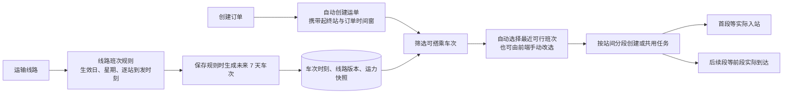

# 线路班次与计划车次

## 用户会看到什么

运输线路可以配置早班、晚班等重复服务，按有效日期和星期运行。新增或修改班次规则后，后端会在保存事务中自动生成未来 7 天的新版本车次。创建订单后系统自动建运单，并在已生成车次中选择最早出发且符合起终站和订单时间窗的一班，自动确认排程并生成全程分段任务；前端仍可手动改选班次。没有可行车次时订单和运单照常创建，运单保持未排班，后续可手动安排。

用户选择一趟车次后，后端为运单保存车次快照并生成站间任务。某运单到达中途目的站后，不会生成它不需要的后续任务；其他继续前往更远站点的运单仍可共用前段。

自动排班只考虑已生成且仍有效的计划车次；按发车时间从早到晚筛选，首段不早于服务器当前时间和订单最早交运时间，目的站到达不晚于订单截止时间。确认与建任务沿用同一排程事务及幂等机制。没有可行车次、无法确认预览时不回滚已创建的订单/运单，也不伪造任务；运单可继续通过现有接口人工选班次并确认。

运单在途时可更正目的站，但车辆仍按当前运输任务抵达原定终点；后端保留这段正在执行的任务，只释放该运单未发车的后续关联，共享任务中的其他运单不受影响。到站后再从实际站点按新目的站重新排程，避免目的地改了但运输任务链仍指向旧站。

## 主要规则

| 规则 | 后端处理 |
| --- | --- |
| 班次重复 | 按生效日期、有效星期和时区生成未来日期车次；一个班次、服务日期和版本最多一趟，早班/晚班配置为不同班次 |
| 保存班次规则 | 新增或修改后，同一事务自动生成未来 7 天内符合规则的车次；线路或班次停用时不生成 |
| 逐站时刻 | 每站记录到达、发车时间和相对服务日的跨日天数；首站只发车，末站只到达，全程时刻严格递增 |
| 车次快照 | 生成时冻结线路版本、班次版本、逐站时刻和运力配置；修改线路/班次不会静默改写已生成车次 |
| 中途上下车 | 运单起点和目的站可以是车次的任意两个有序站点，任务只覆盖两站之间的区间 |
| 时间窗 | 车次在运单起点的发车不早于最早可交运时间，且在运单目的站的到达不晚于最晚送达时间 |
| 订单自动排班 | 自动建运单后选择最早可行的已生成车次并确认，全程任务随之生成；没有可行车次时保留未排班运单，不阻断下单 |
| 任务依赖 | 首段继续等待实际入站；后续段继续等待前段实际到达和中转处理 |
| 错过班次 | 不能把任务改成“现在发车”继续执行；后端拒绝发车并提示重新审核、改排后续班次 |
| 运力 | 车次保存运力配置快照。当前运单没有重量/体积字段，因此本次只保留快照，不做容量预占或超载判断 |
| 改线 | 有启用班次的线路不能直接改变站点顺序；先停用并调整班次规则，已生成车次和任务保留原快照 |

## 接口

以下接口均使用 `/api/v1` 前缀。

| 接口 | 用途 |
| --- | --- |
| `GET /transport-lines/{line_id}/services` | 查询线路班次规则 |
| `POST /transport-lines/{line_id}/services` | 新增班次规则；需要 `Idempotency-Key` |
| `PATCH /transport-lines/{line_id}/services/{service_id}` | 修改规则并递增班次版本；需要 `expected_version` 和 `Idempotency-Key` |
| `POST /transport-lines/{line_id}/services/{service_id}/trips/generate` | 按日期区间幂等生成计划车次，最多 31 天 |
| `GET /shipments/{shipment_id}/service-options?from_date=YYYY-MM-DD&to_date=YYYY-MM-DD` | 按运单起终站和时间窗查询可搭乘车次，日期范围最多 31 天 |
| `POST /shipments/{shipment_id}/schedule/preview` | 提交 `scheduled_trip_id` 预览车次对应的分段计划 |
| `POST /shipments/{shipment_id}/schedule/confirm` | 确认预览，事务内保存车次、线路和计划快照并创建/共享分段任务 |

班次创建请求包含 `code`、`name`、`valid_from`、可选 `valid_until`、ISO 星期 `weekdays`（1=周一至 7=周日）、`timezone`、`capacity_snapshot` 和 `stops`。每个 stop 包含 `station_id`、`arrival_time`、`arrival_day_offset`、`departure_time`、`departure_day_offset`。站点序列必须与运输线路完全一致。

## 数据与兼容

新增 `line_services`、`line_service_stops`、`scheduled_trips`，并给 `transport_tasks` 和 `shipment_schedule_versions` 增加可空 `scheduled_trip_id`。旧任务和旧计划的该字段为空，不回填、不改写。车次唯一对应班次、服务日期和班次版本；修改班次可生成新版本车次，旧车次保留但不再被新运单选中。车次快照保留已生成车次使用的站点和时刻；运单计划历史仍保留原线路版本外键。若已写入班次或车次数据，降级必须恢复迁移前备份。

迁移为 `8f2c6d41a930`，接 `7c91b2e4d6f8`。开发库已先备份到 `be/backups/jingpo_logistics_before_line_services_20261007_222823.dump`，再升级到新迁移。已为 2,383 条线路写入每日 08:00 班次模板（每天运行、上海时区、有效期从 2026-10-07 起）；站间到达/发车按线路段耗时和中转站处理分钟数累计。迁移时有 8 条旧线路缺少运输耗时，因此未生成班次。之后为其中 5 条补了演示参考值：`L_SEG_3`、`L_SEG_4` 各 1,440 分钟，`L_SEG_5` 120 分钟，`L_SEG_6` 1,440 分钟，`L_SEG_7` 60 分钟。这些只是排程演示估值，不代表承运商时效；`A-B-C`、`L_SEG_1`、`L_SEG_2` 仍无参考值，且已停用。2026-10-08 又为这 5 条补了每日 08:00 班次规则，站间到达按参考分钟数累计；`L_SEG_3` 原有 09:35 规则保留。补参考时长不会自动创建班次规则；需要时可在该线路的班次页面手动增加。重复规则与具体日期的 `scheduled_trips` 分开维护，候选查询依赖后者。

2026-10-08 增加上海站→深圳站演示直达线路，参考时长 1,080 分钟，并创建每日 08:00 班次及当日计划车次。参考值按跨区域演示线路估算，不是承运商时效。订单 20 的最早交运时间为 09:20、最晚目的站到达时间为当日 16:00，因此这趟 08:00、18 小时的直达车次不符合订单时间窗，不会作为可选车次显示。

滚动生成脚本为 `python -m lines.generate_upcoming_trips --days 7`，每天按上海日期物化今天起 7 天内的有效班次；重复运行安全。每日运行同时清理超过 30 天且没有运单计划或运输任务引用的旧车次；被业务历史引用的车次保留，以保证追溯。可通过 `--retention-days` 调整保留天数。自动生成不为每条线路每天追加一条包含车次快照的操作日志，避免日志和车次快照重复累积；显式 API 写操作仍保留审计日志。开发机已安装 `com.jingpo.generate-upcoming-trips` LaunchAgent，每天 00:00 执行，登录/加载时也会补跑。首次执行已为 2,382 条启用班次生成 16,674 趟 2026-10-07 至 2026-10-13 的车次；有 1 条线路班次处于停用状态，不会生成车次。

## 当前边界

查询候选本身只读；新增或修改班次规则时自动物化未来 7 天车次，显式生成 API 和滚动脚本用于补齐其他日期。重复调用不会重复创建同班次、服务日期和班次版本的车次；修改班次后生成新版本车次，旧车次保留但不再出现在新候选中，已关联的运输任务和计划历史不受影响。车次状态预留 `PLANNED`、`CANCELLED`、`COMPLETED`；当前实现尚无单独的人工取消车次接口。运力快照不等于容量分配。
