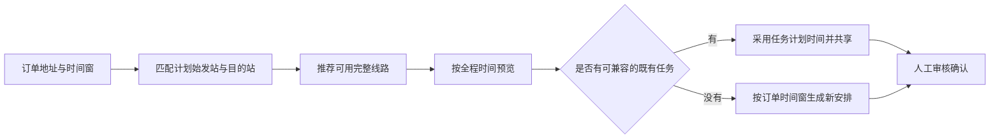

# 订单交运与送达时间窗

订单确定收发地址和时间要求后，系统按区域匹配计划始发站与目的站，再推荐线路。线路计划可复用时间合适的既有运输任务；订单时间表达可行范围，不要求与某趟任务的计划时间完全相等。

## 时间字段

| 字段 | 含义 | 可否留空 |
| --- | --- | --- |
| `earliest_handover_at` | 货物预计最早可在计划始发站交给运输环节的时间 | 可；表示不限制最早时间 |
| `latest_delivery_at` | 运单货物应到达目的站的最晚时间 | 可；表示不限制截止时间 |

时间使用带时区的整分钟时间。最早可交运时间不得晚于最晚送达时间。订单未创建运单前可修改；创建运单时复制到运单，作为履约时间窗快照。老订单和运单字段为空，保持原有行为。

## 共享条件

系统逐段检查完整路线上的既有任务。符合以下条件的任务可加入预览：

- 任务运输分段与运单当前路线段相同，任务仍待执行且未取消。
- 任务发车不早于货物在该段起点就绪时间。首段使用订单最早可交运时间；后续段使用前段到达加已确认的中转时间。
- 任务预计到达不晚于订单最晚送达时间。
- 任务延误监测配置一致，且未超过每趟任务 100 张运单的上限。

预览采用既有任务的计划发车和到达时间，显示任务及已有成员；不要求订单时间与这两个时间相等。完整路线可由多趟兼容任务组成；若有一段无法满足截止时间，预览标出原因并禁止确认。没有兼容任务时，系统按时间窗生成新任务建议。

订单没有时间窗时，兼容逻辑保持原样：只有线路、计划发车和预计到达都一致的任务才会被共享。实际入站、发车和到达仍由操作记录决定，计划匹配不代表货物已就绪或任务已执行。

## 接口与实现

订单创建和更新可传 `earliest_handover_at`、`latest_delivery_at`；订单详情与运单详情返回这两个字段。创建运单会复制时间窗。`POST /api/v1/shipments/{id}/schedule/preview` 按时间窗查找兼容任务，并在返回 `legs` 中显示采用的计划时间和拟共享任务。

新增迁移 `7c91b2e4d6f8`（基于仓库迁移头 `d63a19e85b40`），为订单和运单增加可空时间字段及顺序约束。代码已实现；开发库尚未执行迁移。
