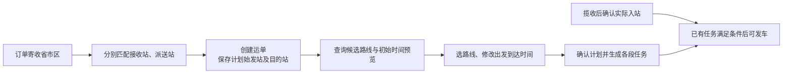

# 寄件地址匹配首站与创建后的计划预览

> 当前候选接口已统一为 `/shipments/{id}/line-options`，不再提供 path-options 或 route_ids 选路。本文旧接口示例为历史记录；当前契约见 [统一运输线路](unified-transport-lines.md)。

## 1. 用户流程

创建运单时，根据寄件区域匹配计划始发站，根据收件区域匹配目的站。前端拿到运单后即可查询候选路线与初始时间预览，用户修改时间后确认，后端才生成运输任务。



计划首站和实际入站分开：揽收不自动产生入站轨迹，预览不创建任务。前端可默认带出首站，只在异常时更改实际站点。

## 2. 后端改动

| 改动 | 行为 |
| --- | --- |
| 服务范围 purpose | DELIVERY 为派送范围，PICKUP 为揽收接收范围，默认 DELIVERY；同一用途内防重复，两种用途可由不同站点负责 |
| Shipment.planned_origin_station_id | 新运单唯一匹配寄件区域时保存首站；无法匹配时为空，允许之后补配置或明确计划起点 |
| 旧运单兼容 | 没有已保存首站时根据运单寄件区域只读推断，不回写原运单与实际物流事实 |
| 首站资格 | PICKUP 配置和首次入站要求站点启用、allows_first_arrival=true；派送仍要求 allows_delivery=true |
| 实际起点优先 | 已入站使用实际当前站；运输中使用本段终点接续；首次入站前使用显式预览起点或保存/推断的计划首站 |
| 路线候选 | 优先提供已有完整方案，也从启用线路找连续、无循环的站点链；按段数少优先、线路 code 确定同段数顺序 |
| 初始预览 | 有唯一可用完整方案时用该方案；有多个方案要求用户选择；没有方案时采用第一条线路候选供审核 |
| 时间 | 使用既有运输与中转参考时长计算；缺参考值时返回缺项，允许人工填写每段出发/到达时间；没有配置时不伪造到达时间 |

搜索最多返回 5 条候选、每条最多 100 段，并限制搜索规模；这是便于演示的候选规则，不表示按成本或时效找到全网最优线路。起终点相同可返回零段计划。

首次实际入站若与已确认计划起点不同，沿用原有 BLOCKED/重新审核处理。首次入站前确认计划会保存本次审核的计划首站。待揽收修改寄件区域时重新匹配首站；已有未执行任务需先取消，已有计划标记需要重新审核。未入站运单已保存的首站不能被停用或移除首次入站资格。

## 3. 客户端接口

以下路径以 `/api/v1` 为前缀；旧接口继续可用，本轮未改前端。

| 接口/字段 | 接入方式 |
| --- | --- |
| POST /stations/{id}/service-areas | 新增 purpose=DELIVERY 或 PICKUP，区域字段与此前一致；省、市、区县优先级不变 |
| GET /orders/{id}/origin-match | 返回 status、reason、origin_station、matched_level、service_area_id；新匹配为 MATCHED，已保存首站为 SAVED |
| 运单创建/详情响应 planned_origin_station_id | 计划首站 ID 字符串或 null；已有运单无保存值时可能是只读推断结果，last_scanned_station_id 仍只表示实际站点 |
| GET /shipments/{id}/path-options | 新增 planning_origin_station_id、origin_match_status/reason、route_candidates；原 path.anchor_station_id 仍表示实际接续站 |
| route_candidates 项 | route_ids、route_codes、station_ids、hop_count；用户选择后将 route_ids 传给预览接口 |
| GET /shipments/{id}/schedule/initial-preview | 获取自动起点和默认候选路线的时间预览，含可确认的 preview_token；未匹配起点或没有线路时明确报错 |
| POST /shipments/{id}/schedule/preview | 可提交 `{}` 自动预览，也可传 first_departure_at、planned_origin_arrival_at、route_ids/plan_id 或逐段 legs 修改时间；初始预览 GET 无输入参数 |
| POST /shipments/{id}/events | ARRIVE 的 station_id 可省略，后端默认计划首站；显式传入实际站点可处理异常。仍需操作者确认入站 |

地址未匹配时 origin_match_status 表明 ADDRESS_REQUIRED / INVALID_ADDRESS / NOT_FOUND / CONFLICT，并给出 reason；不要求用户猜一个站。默认首次入站没有可用首站时返回 409 ORIGIN_REQUIRED，操作者可明确实际站点。

前端推荐链路：创建运单成功 → 读取 path-options 和 initial-preview → 展示起终站、候选路线和逐段时间 → 修改后重新 POST preview → 原 confirm 接口。缺耗时时只禁用最终确认，保留编辑时间入口。实际入站可提交 `{"event_type":"ARRIVE"}`。

## 4. 迁移、配置与实际检查

迁移 `a39f04d72816` 接服务范围 `d18a64b3902f`，给原范围添加默认 DELIVERY 的 purpose，并给运单添加可空计划首站。新的唯一索引包含 purpose。`b41c60e79a23` 仅合并本分支与之前的合并节点；开发库独立升级到 a39f04d72816，不执行待处理的模拟时钟删除迁移。

```bash
# 先配置 DATABASE_URL 并备份目标数据库
.venv/bin/alembic upgrade a39f04d72816
.venv/bin/python -m network.seed_service_areas --purpose PICKUP --dry-run
.venv/bin/python -m network.seed_service_areas --purpose PICKUP
```

开发库完整备份：`be/backups/jingpo_logistics_before_pickup_coverage_20261002_221454.dump`，清单可读。结构迁移已执行，44 条显式城市站演示接收范围已初始化；原 44 条派送范围保留，总计 88 条。没有新建业务运单、运输计划或任务，也没有补写实际入站。

实际只读检查：订单 15 匹配广州站；运单 15 返回计划首站 34、实际首站 null、阶段 PICKED_UP；path-options 包含广州→深圳和广州→东莞→深圳等候选。initial-preview 返回广州→深圳线路 18，建议首段出发时间，但因 travel_minutes 未配置，到达为空、missing 有提示、can_confirm=false。后端就绪 200，Python 编译检查通过。

未新增或运行功能测试。首次入站默认值、实际创建、地址变更、确认全段任务和并发/幂等写流程未验收，页面展示由前端负责方接入。
