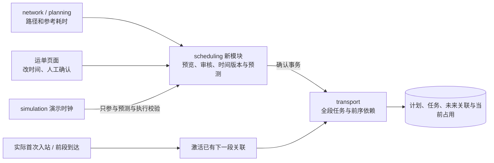
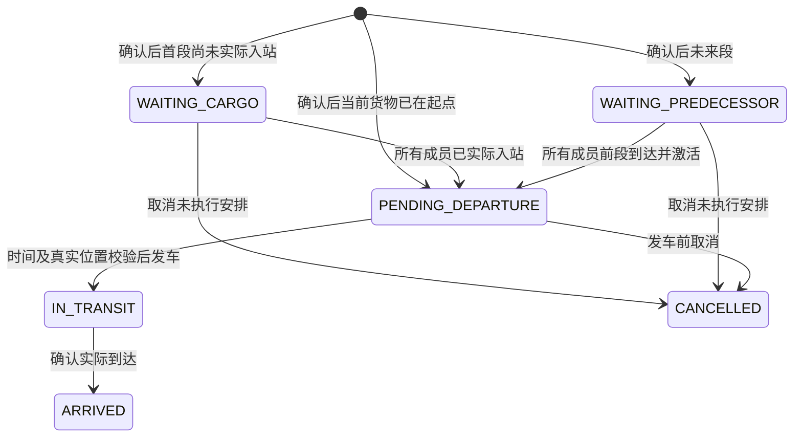

# JINGPO V7 · BE 开发规格

> 2026-10-01 · 按会话 `01a0f630-e7e5-70c2-a0b4-60b08ff2f56b` 的讨论与用户截图修订。后端代码与迁移已实现，客户端独立接入；验证记录见 plan。依据 [PRD](../../../prd/v7/JINGPO-logistics-system-v7.md)。

## 1. 怎么解决

复用 V6 的完整路径，新增运输计划预览和确认。预览给出全程参考时间，用户逐站修改后提交；确认在一个事务内保存时间版本并为全部未执行段生成任务及依赖关联。真实入站/到达只激活已生成任务，预测变化只更新展示，未来任务时间调整需要再次确认。

`scheduling` 负责预览、确认和未来调整；`transport` 负责一段运输的实际执行及成员依赖。提取可共用 Session 的内部函数，外层统一开启事务，不嵌套 begin、不提交后补建下一段。下文结构、接口与枚举已在 BE 实现。

## 2. 数据模型与约束

| 对象 | 新增内容 | 规则 |
| --- | --- | --- |
| Station | transfer_minutes | 可空表示无参考；非负整数 |
| TransportRoute | travel_minutes | 可空表示无参考；正整数 |
| PathPlanLeg | origin_transfer_override_minutes | 可空；仅方案中间站覆盖，首段禁止覆盖首站 |
| Shipment | scheduling_mode、schedule_version、schedule_status | 旧运单 LEGACY，新运单 REVIEWED；时间版本从 0 开始；初始 NOT_CONFIRMED |
| ShipmentScheduleVersion 新表 | 运单、路径版本、版本、起终点、各段已确认时间/耗时副本、原因、来源方案和操作 | 每次确认追加不可变布局，同运单版本唯一；包含全段任务/关联编号 |
| ShipmentPathLeg | travel_reference_minutes、origin_transfer_reference_minutes | 参考值副本可空；明确重新预览时才能采用更新配置 |
| TransportTask | scheduling_source、planned_departure_at、planned_travel_minutes、schedule_revision | 来源 LEGACY/PLAN；任务 expected_arrival_at 保存已确认到达时间；成员变化递增 revision |
| TaskShipment | association_state、schedule_version、predecessor_association_id、ready_at、approved_transfer_minutes | PLANNED/ACTIVE/RELEASED；首段前序为空，未来段指向该运单上一段关联 |
| OperationLog | parent_operation_id | 确认生成、成员加入/解除、到达激活及取消失效子动作可追溯 |

分钟数拟定上限 525600，参考运输大于 0，中转可为 0，拒绝 bool/字符串/小数。已确认运输耗时由到达减出发计算，必须为正；已确认中转间隔由下一段出发减前段到达计算，必须非负。配置参考和人工审核耗时分别保留。

任务关联约束须替换 V6 的“released_at 为空即当前占用”规则：

| 约束 | V7 条件 |
| --- | --- |
| 一张运单最多一个当前执行占用 | shipment_id 唯一，过滤 association_state=ACTIVE |
| 同一路径段最多一个未结束安排 | path_leg_id 唯一，过滤 association_state IN (PLANNED,ACTIVE) |
| 同任务与运单不重复关联 | 保留 task_id+shipment_id 唯一 |
| 状态与释放时间一致 | PLANNED/ACTIVE 的 released_at 为空；RELEASED 非空 |
| 前序依赖合法 | 前序属于同运单、前一个路径段且线路连续；首段为空；服务层校验且禁止循环 |

PLANNED 是未来安排，可有多行。ACTIVE 表示货物当前关联的一趟待发车或运输中任务。RELEASED 保留完成、取消或被替代的历史，附 release_reason。查询 active_transport_task 只取 ACTIVE；任务历史与完整计划包括 PLANNED。不能仅去掉 V6 唯一索引而保留旧查询。

## 3. 预览、每站时间编辑与确认

预览参数包括计划起点、运单目的站、plan_id/expected_plan_version 或完整 route_ids，以及可选首段出发时间和用户编辑的各段时间。当前在站时起点取实际站；运输中从当前任务终点接续；首次入站未知时用户显式指定计划起点。系统不通过收件地址猜站点。

- 默认首段建议出发取当前演示时间，允许用户修改；后段按参考运输时长与中转耗时顺推。
- 参考缺失时返回缺项和空建议，用户填写完整未来时间后可确认。
- 用户可编辑每个未来站点的到达/出发时间；中间站到达对应前段 planned_arrival_at，出发对应后段 planned_departure_at，保持单一值来源。
- 首站实际到达只读；未到首站时可选填计划入站时间，不得晚于首段计划出发。目的站没有后续出发字段。
- 每段到达必须晚于出发，下一段出发不得早于前段到达；确认的未来首段不得早于当前演示时间。
- 运输中的当前段及已完成段保留原 ID、任务、已确认时间和实际记录，禁止通过未来时间编辑覆盖。

所有输入为带时区的整分钟时间；不静默取整，非整分钟返回 422。计划中的标准运输/中转数值只是参考：短于参考值产生按段标识的警告，确认须提交已见警告集合；允许人工审核后采用。实际处理中转等待采用人工确认的中转间隔。

切换路线重新生成候选预览，旧候选时间和候选任务不复用。预览接口只读计算，不写路径、任务、确认版本或物流事件。服务端返回 10 分钟有效的签名 preview_token，绑定运单、完整候选路线和时间、来源方案/网络参考摘要、当前路径/时间版本、运单阶段、当前任务 revision、接续站、警告、拟共享任务及其 revision。编辑后重新预览生成对应 token，确认不能偷偷替换其时间。

确认时先检查幂等重放，再验证 token、版本、实际接续站、配置摘要、共享成员和执行状态。过期或变化返回 409，要求重新预览；不得自动换路线、改时间或悄悄选择另一共享任务。确认保存已批准的路径与时间版本，一次创建/归入全部未来段任务，建立每张运单的前序链；任何一段失败则全部回滚。确认只产生安排日志，不产生 DEPART/ARRIVE 轨迹。

确认允许待揽收、已揽收、在站和运输中运单；待揽收/已揽收需要显式计划起点，在站使用真实所在站，运输中冻结当前段。派送中和已签收拒绝新站间安排。首次入站前保存的路径须由新的确认函数支持，不能复用 V6 仅在站/运输中可写的阶段规则而漏掉这条流程。

## 4. 提前生成任务与到站激活

新增任务等待状态：WAITING_CARGO（待首站入站）、WAITING_PREDECESSOR（待前段到达），保留 PENDING_DEPARTURE/IN_TRANSIT/ARRIVED/CANCELLED。任务状态反映整趟所有成员的就绪情况；关联状态表达单张货物是否已进入当前段。

若共享成员包含不同等待原因，存在前序未到达成员时显示 WAITING_PREDECESSOR，否则有首站未到成员显示 WAITING_CARGO；详情逐成员返回等待原因。中转处理尚未完成时可以为 PENDING_DEPARTURE，但 DEPART 禁用并给出最早就绪时间。

首次实际入站激活该运单首段 PLANNED 关联；前段到达时，先释放其 ACTIVE，再激活已存在的下一段 PLANNED，并令 ready_at=实际到达+已批准的中转间隔。无需生成新任务、改变任务编号或增加计划版本。若其他共享成员未就绪，则整趟继续等待。

发车必须满足全部关联 ACTIVE、前序 ARRIVED、货物实际在起点、演示时间不早于 planned_departure_at 及全部 ready_at。等待状态禁止发车/到达。计划时间已过也不能绕过位置和前序校验；实际到达时间通过操作记录保存，不按预计时间自动推进。

首站实际与计划起点不符时保留入站事实，计划 BLOCKED、关联继续 PLANNED，提示重新规划。线路后续停用阻止新增安排，但已确认生成的任务沿用旧任务可继续规则；计划详情提示配置风险，用户可确认调整。目的站更正须检查未来预留，不能因为只有 PLANNED 就忽略其影响。

## 5. 时间基准、预测与共享任务

已确认任务 planned_departure_at 和 expected_arrival_at 作为本趟基准；planned_travel_minutes 为人工审核的到达减出发。配置变更不改已确认任务。运单时间历史保留历次全程基准。

| 情况 | 最新预计时间 |
| --- | --- |
| 已到达段 | 采用实际到达时间 |
| 当前待发车段 | max(已确认出发, now, 全体成员 ready_at)+已批准运输时长 |
| 正在运输段 | max(实际出发+已批准运输时长, now)；超出估算而未到达则 forecast_stale=true |
| 等待前段段 | 从各成员前序最新预测到达加已批准中转间隔，取全部成员最晚值，再与原计划出发取 max |
| 无前序且尚未首站入站 | 有计划入站时间则作参考；未知则预测为空并显示等待真实入站 |
| 旧任务缺耗时 | 预测可空，保留原 expected_arrival_at |

共享依赖是逐段向前的无环关系，预测需按依赖次序传播；共享成员最晚到达可能影响整趟及后续，不能只算单张运单忽略其他成员。缺输入时明确未知，预测过期时显示估算下界。预测不写回已确认任务时间、不创建任务、不增加时间版本；延误仍比较原 expected_arrival_at。

共享键为 `(route_id, planned_departure_at, expected_arrival_at, delay_monitoring_snapshot)`。只加入 PLAN 来源且未发车/未取消、时间未过期的兼容任务，最多 100 张运单，满额可生成同时间另一趟。预览明示已有任务和成员，确认校验其 revision；共享不移动其他运单时间、不提前发车，也不自动凑批改时间。

同一任务共享成员追加或解除均递增 schedule_revision；PLAN 任务发车和取消请求带 expected_schedule_revision，过期 409 后刷新名单。未来任务不能追加已经具有另一未结束同段安排的运单。

## 6. 延误、取消和重新确认

计划状态为 NOT_CONFIRMED、CONFIRMED、NEEDS_RECONFIRMATION、BLOCKED、COMPLETED。运输延误保留 CONFIRMED 并显示偏差；用户选择修改时进入候选预览，最终确认后才产生新版本。首次入站/到达不会绕过审核补建缺失任务。

- 改时间或路线：生成完整未来预览。完成/运输段冻结；确认事务内解除被替代的未执行关联，取消空任务，创建新任务链并保存替代原因，旧版本仍可查。
- 共享任务调整：本版不在单张运单操作里静默改共享任务或移除其成员。返回 SHARED_TASK_REVIEW_REQUIRED 和影响名单，先用任务级取消解除共享安排，受影响运单重新确认。专用“整批调整”接口留作后续。
- 任务取消：允许两种等待状态和待发车状态；取消该趟全部未释放成员关联，各运单尚未执行的下游关联也失效。下游共享任务只解除受影响运单的关联；其他成员仍保留，revision 递增，空任务取消。页面取消预览展示全部直接和下游影响。
- 取消后：相关运单 NEEDS_RECONFIRMATION；已有上游运输中任务可继续，其到达不自动重建被取消的未来段。旧 key 重放或新 key 同原因业务防重不再修改新安排。
- 目的站更正：沿用 V5 阶段和当前执行占用限制。先显式审核取消旧未来安排，再更正；新的目的站路线与时间重新预览确认。单纯更正不产生新任务。
- 实际到站时发现下游依赖不完整：保存真实事实，记录 NEEDS_RECONFIRMATION 及原因；有完整、合法依赖才能激活。未知数据库错误整体回滚，不能转换成业务提醒后部分提交。

取消预览签名包含各层关联和任务 revision；共享成员或下游链变化返回409要求重新核对。所有被替代安排保留 task、association、released_at、release_reason 和操作来源，不能删除历史来满足唯一索引。

## 7. API 契约

接口前缀 `/api/v1`；实际写操作要求 UUID Idempotency-Key，严格字段/正整数 ID/版本和 Request-ID 沿用 V6。预览 POST 为只读计算，无幂等写日志。客户端操作顺序与示例见 [接入说明](client-contract.md)。

| 接口 | 内容 |
| --- | --- |
| stations/routes 配置接口 | 增加 transfer_minutes/travel_minutes，旧创建可省略，缺失在预览明确提示 |
| path-plans 配置接口 | 增加 transfer_overrides=[{station_id,minutes}]，仅中间站且不重复，方案更新带原版本 |
| POST /shipments/{id}/schedule/preview | 提交目的站前提、计划起点、方案或连续 route_ids、可选各段编辑时间；返回各站时间、警告、缺项、拟共享任务与 preview_token |
| POST /shipments/{id}/schedule/confirm | preview_token、reason、acknowledged_warning_codes；确认并一次生成全部未来段，返回完整已确认计划和全部任务编号 |
| GET /shipments/{id}/schedule | 状态、路径/时间版本、完整各站计划/预测/实际及全部任务/关联、阻塞原因 |
| GET /shipments/{id}/schedule-history | 时间版本倒序分页；page>=1，page_size=1..100 |
| POST /transport-tasks/{id}/cancel-preview | reason；返回整批及下游影响和带 revision 的 cancel_token，只读 |
| POST /transport-tasks/{id}/cancel | PLAN 任务要求 cancel_token、expected_schedule_revision、reason；取消整批和受影响下游预留 |
| POST /transport-tasks/{id}/depart | PLAN 任务要求 expected_schedule_revision；校验所有成员与时间、实际位置后发车 |
| 任务列表/详情/写响应 | 新等待状态、planned_departure_at、forecast_arrival_at、forecast_stale、schedule_revision、成员等待原因 |
| 运单详情/path 响应 | schedule 摘要；当前执行任务只取 ACTIVE；路径段新增 PLANNED 展示未来任务编号 |

preview 的候选未来段使用 `legs=[{route_id,planned_departure_at,planned_arrival_at}]`，未首次入站时可选填 planned_origin_arrival_at。系统初次生成可省略 legs，编辑后提交完整未来布局，必须与候选路线一一对应。原路径 expected_path_version、expected_schedule_version、expected_destination_station_id、接续站及来源方案版本写入 token，确认重新校验。预览目的站必须与运单当前目的站一致；改目的站仍先走 V5 专用更正。

预览可以在冻结段外替换完整未来路线；确认时若存在单运单独占的未执行任务，原子解除并替换。存在未审核共享影响返回409，不自动取消整批。LEGACY 运单采用 V7 确认后切换 REVIEWED；已有旧运输中任务冻结复用，当前段不能重复生成。

新增 409 原因：PREVIEW_STALE、PREVIEW_EXPIRED、SCHEDULE_VERSION_CONFLICT、SCHEDULE_WARNING_NOT_ACKNOWLEDGED、TASK_MEMBERSHIP_CONFLICT、SHARED_TASK_REVIEW_REQUIRED、TASK_PREDECESSOR_NOT_ARRIVED、TASK_NOT_READY；参数422、资源404、演示时钟未初始化503。缺参考但人工补齐可确认；缺时间或时间逆序返回422。

旧人工创建和旧 key/hash/缓存保持兼容；REVIEWED 运单新手工 create 请求拒绝并引导确认计划，不能绕过审核。V6 PUT path 对 REVIEWED 运单只允许保存未确认路径或明确失效旧未来安排后操作，不能悄悄保留与新路径不符的未来任务；正式路径和时间替换通过 schedule confirm 一起完成。

## 8. 事务、迁移与客户端交接

所有写入先锁演示时钟，再查幂等日志。当前所有相关业务写操作共用时钟行锁，确认、取消、入站与发到因此按事务串行执行；预览不锁时钟，确认在锁内重新验证全部前提。确认时在锁内检查签名和前提，保存路径、时间版本、全段任务/关联、共享 revision 及子日志，整体提交。取消和到达激活同样原子；内层复用函数不重复开事务。

实际到达必须同时释放本段 ACTIVE 并激活下一段已有 PLANNED；旧无确认计划运单只更新物流事实。依赖故障/触发器错误回滚到达、轨迹、释放和激活；已完成业务防重与幂等重放不重复激活。子动作用来源操作、动作、运单和段派生稳定 key，并记录 parent_operation_id。

迁移 f72d8a94c105 接 V6 e61a7c93b204。旧关联 released_at 为空映射 ACTIVE，非空映射 RELEASED；旧任务来源 LEGACY，新增计划/耗时字段为空，旧运单 LEGACY、schedule_version=0。更换两类部分唯一索引、补关联状态/依赖及任务等待状态约束；升级不改变旧物流事实、expected_arrival_at 或历史 key/hash/缓存，也不生成任务。

迁移前在 V6 副本/空库演练；开发库发布需停服务、备份、升级并重启。旧任务可继续，旧接口响应新增字段提供缓存兼容默认值。FE/Agent 要适配等待状态、多未来关联、当前执行占用以及时间计划；BE 通过不等于客户端验收。

## 9. 验证与风险

覆盖 PRD V7-01～V7-10：无副作用预览、换路及逐站改时间、参考偏差审核、确认一次生成全链、首站/中转激活无新增任务、依赖和共享全体就绪、延误只影响预测、人工重确认替代未来安排、取消下游影响、版本冲突、并发及故障完整回滚，以及 V2～V6 回归与迁移对账。

主要风险是把 PLANNED 当 ACTIVE、共享取消影响扩大、预测覆盖人工基准、预览期间配置变更和部分生成任务链。相关验证证据需包含确认前后任务数量、所有任务编号、真实位置不变和每一步唯一当前占用。实施顺序见 [plan](plan.md)。

## 站点服务范围与订单目的站匹配（2026-10-02）

新增 network 服务范围配置、订单目的站只读预览及创建运单自动匹配。省/市/区县服务范围、错误码、客户端兼容规则和独立迁移发布记录见 [专项说明](station-service-areas.md)。创建运单现在可提交 `{}`，destination_station_id 可省略；旧客户端为结构化订单显式选站时必须与自动结果一致。后端默认 REVIEWED，完整运输计划仍需确认。

开发库备份并升级 d18a64b3902f，44 条演示范围已初始化。编译检查和只读 HTTP 检查已完成，未新增或运行功能测试；实际运单创建、优先级和冲突等写流程、客户端与页面仍待验收。本轮未执行 c84e2b19a607 模拟时钟表删除迁移；两条分支由 e26b07f94c31 合并。
