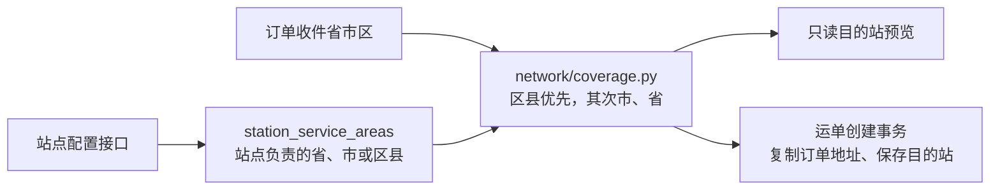

# 站点服务范围与订单目的站自动匹配

## 1. 怎么解决

用户填写订单收件省市区后，后端查询“哪个站负责这个区域”，创建运单时复制订单地址并确定目的站。前端可以先展示匹配结果，提交时后端再核对一次。地区字典表示地址在哪里；站点服务范围表示谁负责派送，两者通过区域 ID 关联。



匹配只决定目的站，不生成运输计划，也不改变真实物流阶段。已创建运单不随服务范围变化而改站。

## 2. 配置规则

新增 `station_service_areas`：id、station_id、province_id、city_id、district_id、enabled、created_at、updated_at。

| 字段组合 | 含义 |
| --- | --- |
| province_id，其余为空 | 全省级区域 |
| province_id + city_id，district_id 为空 | 全城市 |
| province_id + district_id，city_id 为空 | 直接归属省级的区县 |
| province_id + city_id + district_id | 城市下的区县 |

省级必填，区域必须存在、启用且归属正确；配置允许停在省或市，不套用订单“必须选到末级”的规则。启用服务范围要求站点启用且 allows_delivery=true。一个站可以负责多个范围。

同一个完整区域组合最多一条启用配置，由事务锁和数据库唯一索引共同保护；重复配置返回 `SERVICE_AREA_CONFLICT`。不同粒度允许重叠，例如省级兜底站与城市站并存，城市范围更优先。停用后保留记录，调整归属使用“停用原范围、创建新范围”，不删除历史。

配置写入沿用业务写锁与 Idempotency-Key，并写 OperationLog，resource_type=STATION、resource_id=站点 ID，after_data 含服务范围 ID。站点或区域停用后，其范围不会参与新匹配；范围本身的启用记录仍保留，转交给其他站前要停用原范围。

代码入口：`be/network/coverage.py`、`be/network/router.py`、`be/models.py`。

## 3. 接口契约

以下路径以 `/api/v1` 为前缀。

| 接口 | 请求与用途 |
| --- | --- |
| GET /stations/{station_id}/service-areas?enabled=true | 查看站点启用范围；不传 enabled 返回全部 |
| POST /stations/{station_id}/service-areas | 省、市、区县 ID（正整数），enabled 默认 true；需要 Idempotency-Key，成功 201 |
| PATCH /stations/{station_id}/service-areas/{area_id} | `{"enabled":false}` 或 true；需要 Idempotency-Key，成功 200 |
| GET /orders/{order_id}/destination-match | 只读预览负责该订单收件区域的目的站，不写订单/运单 |
| POST /orders/{order_id}/shipment | 目的站 ID 可省略或 null，由订单收件区域自动匹配 |

创建市级范围示例：

```json
{"province_id":19,"city_id":191,"district_id":null,"enabled":true}
```

以上 ID 来自当前开发库，其他环境需使用地区查询接口获得自己的 ID，不能拿行政区划 code 当数据库 ID。

服务范围响应包含 id、station_id、province_id、city_id、district_id、各级 name、level 和 enabled。响应 ID 为字符串；请求 ID 为整数。level 为 PROVINCE / CITY / DISTRICT。

预览响应：

```json
{
  "status":"MATCHED",
  "reason":null,
  "destination_station":{"id":"35","code":"SHENZHEN","name":"深圳站","enabled":true,"allows_first_arrival":true,"allows_delivery":true,"transfer_minutes":null},
  "matched_level":"CITY",
  "service_area_id":"25"
}
```

| 预览 status | 创建时结果 |
| --- | --- |
| MATCHED | 唯一匹配，创建并保存目的站 |
| ADDRESS_REQUIRED | 缺收件省级信息，自动创建返回 409 DESTINATION_ADDRESS_REQUIRED |
| INVALID_ADDRESS | 地址区域停用或归属不正确，409 DESTINATION_INVALID_ADDRESS |
| NOT_FOUND | 没有可用服务站，409 DESTINATION_NOT_FOUND |
| CONFLICT | 同一优先级有多个目的站，409 DESTINATION_CONFLICT，不随便选站 |
| EXISTING_SHIPMENT | 订单已有运单，预览返回运单已保存目的站；再次自动创建返回原运单 200 |

无匹配时 reason 说明原因，destination_station、matched_level、service_area_id 均为 null。预览不锁定结果，创建事务内重新匹配，防止使用过期页面结果。

前端自动创建只需提交 `{}` 或 `{"scheduling_mode":"REVIEWED"}`。默认仍为 REVIEWED。兼容旧客户端传 destination_station_id：结构化收件地址必须匹配同一站，否则 409 DESTINATION_MISMATCH；旧文本地址允许显式选择启用且允许派送的站点。没有匹配的结构化地址应先补服务范围，不能用任意站点绕过。

自动请求的幂等内容包含“自动匹配”标记，不包含当时计算出的站点 ID。相同 key 成功重试返回原结果，配置变化不会重建运单；已有订单运单也不会在新 key 请求时被改站。旧客户端显式站点请求的原哈希保留。

运单创建后仍复制订单寄收双方区域 ID、名称快照与详细地址。后续运单地址编辑与目的站更正继续使用原接口，不自动连带改写目的站或已确认计划；修改收件区域后应核对目的站。

## 4. 迁移与演示配置

新增迁移 `d18a64b3902f`，接 `30ec3dbeb8ac`，只建服务范围表。与已有的服务器时间迁移 `c84e2b19a607` 分支独立，`e26b07f94c31` 合并两条分支、无额外 DDL。开发库本轮只升级到服务范围分支，未执行删除模拟时钟表的迁移。

```bash
# 在 be 下执行，先设置目标 DATABASE_URL 并备份数据库
.venv/bin/alembic upgrade d18a64b3902f
.venv/bin/python -m network.seed_service_areas --dry-run
.venv/bin/python -m network.seed_service_areas
```

初始化脚本内显式列出站点 code 与区域 code，不从名称猜测服务范围；这是演示运营规则：40 个城市站负责对应全市，4 个直辖市站负责全市各区。SOC、A/B/C/D 站不分配范围，不新造站点，不替已有用户范围重分配。重复执行跳过已有配置，包括人工停用记录；遇到他站已占用的同级范围则整批回滚。初始化也记录操作日志。

其他地区没有对应服务站时仍返回 NOT_FOUND；这 44 条配置不意味着全国地址均已覆盖。新增站点后通过配置接口扩大范围。

## 5. 实际执行与限制

- 开发库备份：`be/backups/jingpo_logistics_before_service_areas_20261002_201138.dump`，163,460 字节，pg_restore 清单可读取。
- 已执行服务范围结构迁移，当前版本 d18a64b3902f；省市区、订单、运单及旧业务记录未回写。
- 已初始化 44 条范围：40 个城市、4 个省级直辖市；唯一索引和站点索引已建成。
- Python 编译检查通过，Alembic 源码只有一个合并 head。
- 实际只读 HTTP：/health/ready、广州站服务范围、订单 15 目的站预览均 200。检查时 ORD-000015 收件地址匹配深圳站（CITY，service_area_id=25）。未为此订单创建运单。
- OpenAPI 已将 ShipmentCreateRequest.destination_station_id 标记为可省略、可 null；配置与预览接口已发布。

本轮未新增或运行功能测试；未验收区县覆盖省市、冲突、停用、并发、幂等以及实际运单创建的写流程。FE/查询 Agent 代码未修改；前端需接入预览、自动创建及配置页面，查询 Agent 如需读取配置需独立接入。
