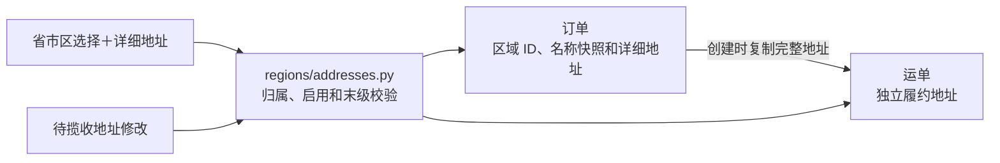

# 订单和运单：省市区＋详细地址

## 1. 用户会看到什么

订单和运单地址可以保存寄件、收件双方的省市区选择及详细门牌地址。旧记录继续保留原地址文本；不从文本猜行政区域。前端由其负责 Agent 接入，本轮只改后端。



订单创建运单后不可编辑；运单地址沿用原限制，仅待揽收时可修改。修改运单不会改写订单。地址区域本身不表示站点归属，也不自动改变已确认运输计划。

## 2. 字段

orders 与 shipments 各增加 12 个可空字段：

| 寄件方 | 收件方 | 含义 |
| --- | --- | --- |
| sender_province_id | recipient_province_id | 省级 ID |
| sender_city_id | recipient_city_id | 市级 ID，可空 |
| sender_district_id | recipient_district_id | 区县 ID，可空 |
| sender_province_name | recipient_province_name | 当时的省级名称 |
| sender_city_name | recipient_city_name | 当时的市级名称 |
| sender_district_name | recipient_district_name | 当时的区县名称 |

名称由 BE 读取字典并保存，客户端不能提交名称快照。创建运单直接复制订单的 ID、名称快照和详细地址，不因字典后续改名重算订单历史。

现有 sender_address、recipient_address 保留：对应一方 province_id 有值时表示详细地址；无值时表示旧的完整地址文本。原 region_code 固定 Z 保持原样。

请求 ID 为严格正整数，响应 ID 为字符串或 null。读取历史缓存时，新增字段默认 null；没有新增区域字段的旧请求保持原 hash，仍可重放旧 key。

## 3. 接口与提交规则

订单 POST /api/v1/orders/create、PATCH /api/v1/orders/{id} 支持上述区域 ID。订单列表/详情/写响应均返回区域 ID 与名称快照。

运单 PATCH /api/v1/shipments/{id}/address 支持相同区域 ID；详情、列表和写响应同样返回。创建运单仍沿用现有接口，从订单复制全部地址，不在创建运单请求中重新选择省市区。

修改某一方区域时必须一起提交该方三个 ID。改变省后不能只提交 province_id、静默保留原城市/区县。没有实际下级时，city_id 或 district_id 显式为 null；province_id 不能为 null，不能通过区域修改清除成旧文本地址。

仅修改详细地址可以省略区域字段，保留原区域和名称快照。寄收两方可分别更新；未提交的一方保持原样。

示例（ID 为示意，实际需使用地址库查询结果）：

```json
{
  "sender_province_id": 1,
  "sender_city_id": 2,
  "sender_district_id": 3,
  "sender_address": "某街道某号"
}
```

省级直管区县示例：

```json
{
  "recipient_province_id": 4,
  "recipient_city_id": null,
  "recipient_district_id": 5,
  "recipient_address": "某小区某栋某室"
}
```

创建订单仍兼容旧请求，可不提供区域字段；只要某一方提供区域选择，就必须有省级区域，BE 将补齐该方省/市/区县字段和名称快照。

| 校验 | 处理 |
| --- | --- |
| 区域不存在或停用 | 422 INVALID_ADDRESS_REGION |
| 城市不属于所选省级 | 422 REGION_PARENT_MISMATCH |
| 区县不属于所选城市，或省级直管关系不符 | 422 REGION_PARENT_MISMATCH |
| 所选省/市还有可选下级，用户未选到末级 | 422 ADDRESS_REGION_INCOMPLETE |
| 修改区域未整组提交，省级为空、ID 非正整数 | 422 参数校验 |

确实没有启用下级时允许停在省或市。不能根据“自治区”类型推断层级，按字典真实归属处理。停用历史区域不影响只改详细地址，也不妨碍复制已保存的订单快照。

## 4. 迁移与当前状态

新增迁移 30ec3dbeb8ac，接地址库 77292ad0db58。只增加可空字段与外键，旧记录字段全为 null，原地址、轨迹、任务和缓存不变。禁止直接 downgrade 丢弃地址快照，回退需恢复备份。

隔离库已迁移，alembic check 无模型差异。开发库备份为 `be/backups/jingpo_logistics_before_structured_addresses_20261001_232822.dump`（113 KB，pg_restore 清单可读取），已升级到 30ec3dbeb8ac 并恢复后端。发布后 `/health/ready`、订单列表、运单列表、`/openapi.json` 均返回 200；列表已返回区域 ID/名称快照，OpenAPI 的订单创建/修改与运单地址修改已包含新字段。本轮未新增或运行功能测试；结构检查与只读契约检查不代表完整新地址写流程已验收。

地址库已于 2026-10-02 初始化全国常用省市区数据，现有只读接口已能提供真实选项，数据版本、特殊层级和只读检查见 [地址库说明](address-library.md)。订单新地址写流程与页面联动仍需后续验收；站点服务范围与地址自动匹配不在本次改动内。
