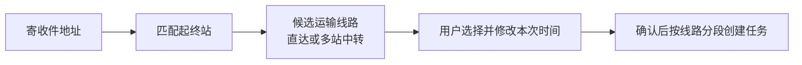

# 统一运输线路：讨论草案

> 2026-10-02：用户已确认本方案。后端统一接口、迁移和国内城市线路初始化已实现，实际契约与交付状态见 [统一运输线路](unified-transport-lines.md)。本页保留讨论时的设计依据。

## 用户看到一个概念

一条运输线路是一套从起点到终点、按顺序经过站点的可复用运输安排，可以直达，也可以中转。用户在一个管理入口维护线路及其站点顺序，创建运单后选择候选线路并调整本次时间。

当前术语把运输线路定义为单段，把路径方案定义为完整站点链。建议面向用户统一叫“运输线路”；内部保留“线路分段”，负责耗时配置和运输任务执行。现有术语暂不替换，待用户确认统一模型后修改。

| 线路示例 | 站点顺序 | 确认后对应任务 |
| --- | --- | --- |
| 广州—深圳直达 | 广州→深圳 | 广州→深圳一段 |
| 广州—深圳经东莞 | 广州→东莞→深圳 | 广州→东莞、东莞→深圳两段 |

## 建议规则

- 线路由有序站点、分段运输参考耗时、中转参考耗时组成；起终点由第一站和最后一站确定，禁止不连续或循环。
- 同一对起终站可以有多条线路，运单按两端匹配候选；没有直达时可以匹配中转线路。
- 管理页一次维护完整线路，内部单段运输记录可复用。现有单段线路可转成两站线路，已有路径方案可转成多站线路；迁移应保留旧任务与历史关联。
- 运单仍保存自己的线路版本与时间计划，修改公共线路不能改写既有执行历史。
- 自动推荐规则先用中转少、配置完整，再逐步考虑预计时效；用户可换线。线路参考耗时是持续时间，具体出发/到达日期属于本张运单的计划。
- 自动图搜索可作为无已配置线路时的辅助预览；正式候选以运营配置为准，避免把所有可走的绕行路径当常用线路。

## 国内快递形态与演示范围

中通官网介绍了直达干线，其消费品物流方案同时采用干线、支线与区域分拨；可参考 [中通官网](https://www.zto.com/Site/) 与 [官方消费品方案](https://www.zto.com/introduce/industry/consumer)。这些资料支持运营形态，不提供完整真实企业城市路由清单。

建议先完善已有广东城市网：广州、深圳、东莞、佛山、珠海的直达和合理中转示例，再配置珠三角、长三角、京津冀以及区域间主干线。所有城市组合与耗时标注为演示配置；实际运营接入企业认可的站点、线路和时效参数。

统一管理、迁移及演示配置已实施。运输任务仍执行一段运输；企业真实线路与时效须使用运营方认可的数据。
