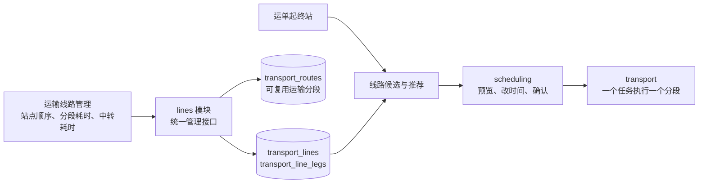

# 统一运输线路与国内演示初始化

## 1. 用户会看到什么

一个“运输线路”入口维护完整站点顺序：两站为直达，多站为中转。运单按计划始发站和目的站匹配线路，用户选择、修改本次时间，确认后生成每个分段的运输任务。



## 2. 关键规则

| 概念 | 后端处理 |
| --- | --- |
| 运输线路 | 唯一面向业务的可复用线路，包含有序站点和版本；不要求客户端先建分段、再组装线路 |
| 运输分段 | 相邻站点的运输关系，内部复用；旧任务继续引用原分段 ID |
| 分段参考时间 | `TransportLineLeg.travel_override_minutes` 每条线路可有自己的参考值，空时沿用原分段参考值 |
| 中转参考时间 | 优先线路中转覆盖值，其次站点值；公共线路编辑不会改写已确认运单的耗时快照 |
| 起终点 | 从站点顺序首尾推导，禁止循环和重复站点；启用时要求站点启用，首站允许接收、末站允许派送 |
| 推荐 | 在可用启用线路中，先完整参考时间，再段数少、参考时间短，最后 code 稳定排序；缺参考值的线路仍可选并人工填时间 |
| 保存历史 | 运单有独立路径、时间版本与任务关联，修改公共线路保留已发生的物流事实 |

更改线路只重建公共线路的分段关联，不修改已有运单的分段记录和任务。新建时自动复用已有同方向分段，缺少分段则自动创建。旧“路径方案”管理页面及 `/path-plans`、运单 `/path-options` 接口已下线；旧 `/routes` 分段管理接口暂时保留兼容，旧客户端新建单段时同时登记两站线路。

## 3. 新接口契约

所有路径以 `/api/v1` 为前缀。

| 接口 | 请求/响应 |
| --- | --- |
| GET /transport-lines | 可过滤 enabled、origin_station_id、destination_station_id；page 默认 1，page_size 默认 20、最大 100；返回 items/total/page/page_size |
| GET /transport-lines/{id} | 单条线路完整站点、分段参考耗时和中转配置 |
| POST /transport-lines | code、name、station_ids、legs、transfer_overrides、enabled；需要 Idempotency-Key，成功 201 |
| PATCH /transport-lines/{id} | expected_version 及更改项，需要 Idempotency-Key；成功 200；改站点必须同时提交完整 legs |
| GET /shipments/{id}/line-options | 起终站、lines 候选及 recommended_line_id；只返回当前起终站的可用启用线路 |
| GET /shipments/{id}/schedule/initial-preview | 默认采用推荐线路；无需先实际入站，不生成任务 |
| POST /shipments/{id}/schedule/preview | 支持 line_id、expected_line_version，选择后可编辑 first_departure_at、planned_origin_arrival_at 和逐段 legs |
| POST /shipments/{id}/schedule/confirm | 沿用 preview_token、reason、警告确认，原子生成所有分段任务 |

创建线路示例（以下是当前开发库 ID）：

```json
{
  "code":"GZ_SZ_VIA_DG",
  "name":"广州—深圳经东莞",
  "station_ids":[34,36,35],
  "legs":[{"travel_minutes":120},{"travel_minutes":90}],
  "transfer_overrides":[{"station_id":36,"minutes":60}],
  "enabled":true
}
```

legs 数量必须为站点数减一，中转覆盖只能指向中间站。省略 travel_minutes 或传 null 表示沿用共享分段值，仍缺值时预览明确提示补时间。每段与中转修改允许使用完整数组替换，旧时间不自动累加。

线路响应的 ID 为字符串，包括 stations、station_ids、legs 中的 segment_id、各级站点 ID，以及 transfer_overrides.station_id；请求使用正整数。返回 total_reference_minutes 为全程运输＋中转参考总分钟数；参考缺失时为 null。usable 表示拓扑与站点可用，不代表时间已填齐。

预览、已确认运输计划、运输计划历史、运单线路安排和线路历史均以 line_id/line_version 为正式字段。旧 source_plan_id/source_plan_version、plan_id/expected_plan_version 与手动 route_ids 仅为兼容字段，并在 OpenAPI 标记弃用。新客户端统一使用 `/transport-lines`、`/line-options` 和带 line_id 的计划接口。兼容字段会在客户端迁移完成后另行下线。

线路配置现存于 `transport_lines`、`transport_line_legs`；班次规则和快照存于 `line_services`、`line_service_stops`、`scheduled_trips`。运单路径/计划历史保留原业务记录，历史来源外键已迁到线路表和线路字段；旧管理接口下线不删除运单路径与任务历史。`route_ids` 指内部运输分段 ID，不能当作线路 ID 使用。

code 冲突 409 NETWORK_CODE_CONFLICT；版本变化 409 LINE_VERSION_CONFLICT；配置错误 422 INVALID_TRANSPORT_LINE；没有可用启用线路 409 SCHEDULE_LINE_REQUIRED。已有初始预览的时间/线路发生变化需重新预览再确认，不能把停用线路作为默认候选。起终站相同允许零段计划。

## 4. 迁移与初始化范围

新增 `c52d09a13f84`，接 `a39f04d72816`：增加线路分段参考耗时字段，并将没有对应单段完整线路的旧运输分段登记为 `L_SEG_{segment_id}` 两站线路。原分段、旧完整路径、运单及任务 ID 均保留。`d63a19e85b40` 合并本分支和此前的合并节点；开发库本次只升级 c52d09a13f84，模拟时钟删除分支仍未执行。

```bash
# 先配置目标 DATABASE_URL，备份后再部署
.venv/bin/alembic upgrade c52d09a13f84
.venv/bin/python -m lines.seed
.venv/bin/python -m lines.seed_national --report /tmp/national-line-report.json
```

`lines/seed.py` 提供珠三角、长三角、京津冀的明确线路例子；`lines/seed_national.py` 使用现有 44 个国内城市站，补齐已有城市干线的缺失反向，并增加明确的跨区域枢纽走廊。再沿这些实际配置的分段生成常用直达或中转线路，覆盖 44×43=1,892 个有向城市组合。并未把所有城市组合都造为直达运输分段，也不补造不存在的城市站点。

参考时间采用显式演示规则：同省 180 分钟、同区域跨省 360 分钟、跨区域 1,080 分钟，涉及乌鲁木齐/拉萨的一般示例 1,440 分钟；明确枢纽走廊使用脚本中独立给出的时间，例如西安—乌鲁木齐和成都—拉萨为 2,880 分钟；中转默认示例为 60 分钟。最初几个区域例子有自己明确的参考值。这些是演示参数，不是快递公司承诺时效或测量的公路时间。

区域形态参考 [中通公开直达干线介绍](https://www.zto.com/Site/) 和 [官方干支线与区域分拨方案](https://www.zto.com/introduce/industry/consumer)，城市连接以本项目演示配置为准。脚本按 code 和已有配置跳过重复，不覆盖人工时间；精确相同站点/时间的自动生成重复项会停用并保留操作历史。初始化按线路事务提交，失败可重复执行继续补齐，不会一次失败丢掉已导入线路。

## 5. 实际交付与检查

- 2026-10-08 已将 `path_plans` / `path_plan_legs` 的 2,392 条线路和 9,711 条分段迁入 `transport_lines` / `transport_line_legs`，保留 ID 和版本；班次 2,391 条、计划车次 19,072 条及历史引用不变。旧表已删除，相关外键及历史来源列已指向新线路表/字段。
- 迁移前备份：`be/backups/jingpo_logistics_before_transport_line_tables_20261008_165233.dump`；大小 2.6 MB，`pg_restore -l` 校验可读。迁移后 Alembic 版本为 `9a76c4e1b205`，结构检查无差异；线路班次和关联数据计数、外键孤儿检查通过。

- 完整备份：`be/backups/jingpo_logistics_before_unified_lines_20261002_223630.dump`；全国扩充前另备份 `be/backups/jingpo_logistics_before_national_lines_20261002_223934.dump`，两份 pg_restore 清单均可读取。
- 结构迁移已执行，开发库版本 c52d09a13f84；原业务运单、任务和事实未回写。
- 当前完整线路 2,347 条，启用 2,346 条，内部运输分段 151 条；保留 1 条停用的精确重复演示线路历史。
- SQL 只读覆盖检查：现有城市站 1,892 个有向组合，1,892 个均有启用线路，无缺失组合；完整省市区地址库仍需对应服务范围，不能据此宣称每个国内区县都有服务站。
- 实际 HTTP：线路列表分页/过滤、运单 15 line-options、initial-preview、health/ready 均 200。广州—深圳有直达和经东莞两条候选，参考总时长分别 180、270 分钟，默认直达；初始预览时间完整、missing 为空、can_confirm=true。
- Python 编译检查通过；没有新增或运行功能测试。初始化过程执行了配置写入，但运单确认建任务、版本冲突、幂等并发及客户端页面没有验收。

前端只保留一个管理入口并接入新线路接口；查询 Agent 若要读取完整线路也应接入 transport-lines，不能把旧 routes 中的运输分段解释为完整线路。本轮未改 FE/Agent 代码。
