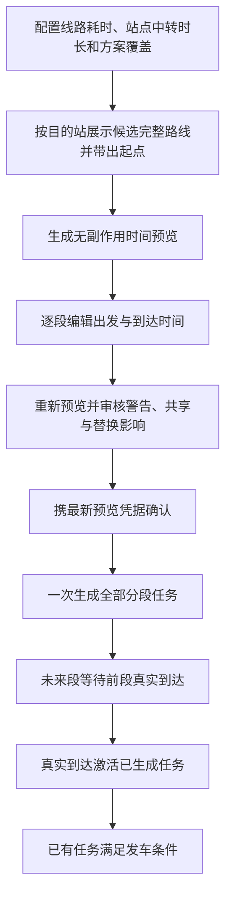
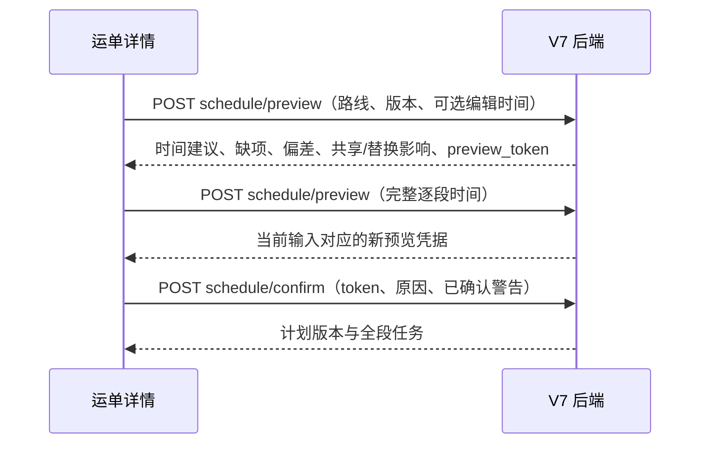

# JINGPO V7 · FE 适配与验证记录

> 2026-10-01 · 前端已接入参考耗时配置、逐站计划预览与确认、全段任务状态和计划任务取消审核。接口细节以 [V7 客户端接入说明](../be/client-contract.md) 为准。

## 用户会看到什么

新运单进入 V7 审核流程。用户先从候选完整路线中选择一条，系统带出计划起点和目的站，再查看建议时间并编辑每一段出发和到达时间；接受参考偏差并填写确认原因后，一次生成全程任务。已经实际入站的运单直接锁定真实接续站。后续段会立即显示任务编号和“待前段到达”，不会被误当作已运输。旧运单仍保留 V6 单段建任务流程。

## 实现范围

- **网络配置**：线路可设置参考运输分钟数；站点可设置默认中转分钟数；路径方案可按中间站配置覆盖值。未设置的参考允许保留，由运单计划人工补全。
- **订单地址**：卖家、买家地址使用后端省市区字典级联选择，详细地址独立输入；订单保存详细地址及选中的行政区 ID，详情页用后端保存的名称快照展示完整地址。编辑旧订单时保留原地址文本，可重新选择行政区。
- **运单详情**：新建运单显式采用 `REVIEWED`。计划编辑器提交路径、逐段时间和路径/计划/目的站版本前提；任何编辑都会使当前预览失效，必须重新预览。显示缺项、参考偏差、拟替换任务、共享名单和确认历史。
- **全程安排展示**：每段展示线路、计划时间、滚动预测、实际时间、关联任务编号、关联状态、就绪时间和等待成员；等待任务明确显示为未实际运输。
- **执行与取消**：计划任务发车提交 `expected_schedule_revision`。取消先读取带签名的影响预览，再提交确认；关联运单和下游任务影响在确认前展示。
- **旧版本兼容**：`LEGACY` 运单仍使用 V6 路径及单段建任务入口；V7 全程审核不改写其旧流程。

流程图说明运单上的操作次序；时序图说明只有最后确认会创建计划任务。

BE 工作区已增加省、市、区字典查询，以及订单/运单行政区 ID 和名称快照字段；前端已按该契约保存结构化选择。站点服务范围与地址到站点匹配接口尚未提供，因此级联地址目前不能驱动站点自动匹配。候选路线仍来自已配置方案；没有可用方案时，用户需明确选择计划起点并逐段配置路线。自动推荐站点需待 BE 提供站点覆盖范围和匹配结果后接入。

## 验证与边界

| 检查 | 结果 |
| --- | --- |
| `npm run lint` | 通过 |
| `npm run build` | 通过；仍有现存大 chunk 超过 500 kB 的 Vite 提示 |
| `git diff --check` | 通过 |
| 后端只读检查 | `/health/ready` 返回 200；当前开发库在途旧样本均为 `LEGACY`，未发现可用于 V7 交互验收的 REVIEWED 样本 |
| V7 预览/确认和取消写链路 | 未在开发库发起；预览、确认、取消完整操作需在隔离样本或用户提供的 V7 演示数据上验收 |
| 浏览器完整操作 | 未执行 |

构建证明类型和打包可通过，不等于 V7 页面写链路已验收。计划预览/确认及任务取消涉及业务写操作，未使用当前开发库创建样本。
