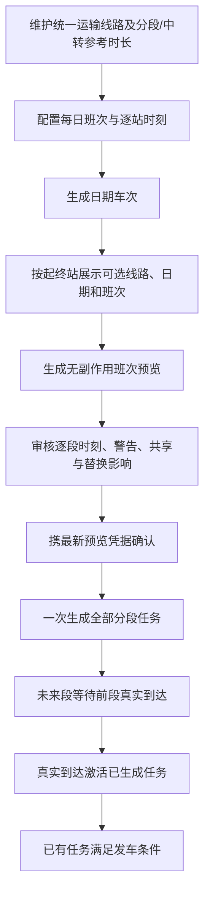
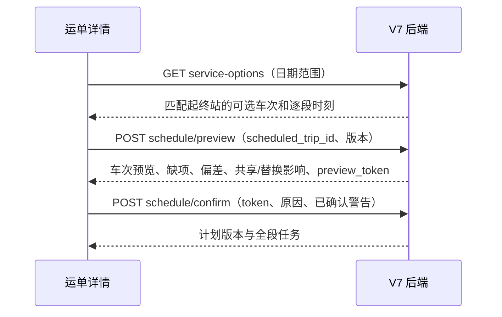

# JINGPO V7 · FE 适配与验证记录

> 2026-10-01 · 前端已接入参考耗时配置、逐站计划预览与确认、全段任务状态和计划任务取消审核。接口细节以 [V7 客户端接入说明](../be/client-contract.md) 为准。

订单表单现可设置最早在计划始发站交运时间和最晚到达目的站时间；创建运单后，计划弹窗展示时间窗并采用后端返回的兼容任务建议。共享任务时间不要求与订单时间完全相同。实现状态与迁移前提见 [BE 时间窗说明](../be/order-delivery-windows.md)。

## 用户会看到什么

新运单进入 V7 审核流程。用户从统一运输线路中选择线路、日期和具体班次，核对逐段时刻后填写原因并确认，一次生成全程任务。线路可维护每天重复的多个班次；新班次默认首站 08:00 发车，后续站点按分段运输和中转参考时长推算。已经实际入站的运单直接锁定真实接续站。后续段会立即显示任务编号和“待前段到达”，不会被误当作已运输。旧运单仍保留 V6 单段建任务流程。

## 实现范围

- **网络配置**：运输线路统一维护有序站点、分段运输分钟数和中转覆盖；未设置的参考允许保留，由运单计划人工补全。原“路径方案”菜单改为统一运输线路入口。
- **订单地址**：卖家、买家地址使用后端省市区字典级联选择，详细地址独立输入；省级有城市和直管区县时合并展示。选项按“层级 + ID”区分，并沿完整父级路径装载，兼容各表 ID 重复。订单保存详细地址及选中的行政区 ID，详情页用后端名称快照展示完整地址；编辑旧订单保留原地址文本。
- **运单详情**：新建运单显式采用 `REVIEWED`。计划编辑器提交所选车次及路径/计划/目的站版本前提；按日期展示匹配当前运单起终站的具体班次，逐段时刻只读审核，不再手工编辑。未提供起点入站估时的运单，在实际首次入站前可能没有到达预测。时间统一按北京时间（`Asia/Shanghai`）展示，前后端用带时区的时间戳交互。显示班次缺项、参考偏差、拟替换任务、共享名单和确认历史。
- **全程安排展示**：每段展示线路、计划时间、滚动预测、实际时间、关联任务编号、关联状态、就绪时间和等待成员；等待任务明确显示为未实际运输。
- **执行与取消**：计划任务发车提交 `expected_schedule_revision`。取消先读取带签名的影响预览，再提交确认；关联运单和下游任务影响在确认前展示。
- **旧版本兼容**：`LEGACY` 运单仍使用 V6 路径及单段建任务入口；V7 全程审核不改写其旧流程。

流程图说明运单上的操作次序；时序图说明只有最后确认会创建计划任务。

BE 已增加站点服务范围及按订单收件区域匹配目的站的只读接口。前端打开创建运单窗口时读取匹配预览：匹配成功就显示站点名称、编码和匹配层级，提交时省略目的站 ID，由后端在创建事务中再次匹配；未配置、冲突或无效地址时显示后端原因并阻止创建。缺少结构化地址的历史订单仍可手选派送站，兼容旧文本地址。计划起点及候选完整线路由后端 line-options 返回。

创建运单成功后，前端直接进入该运单详情并打开计划审核；若后端返回唯一可用运输线路，自动生成首份时间预览供用户调整。多条候选线路时由用户选择。计划预览支持实际入站前进行，不要求先扫描入站。

## 统一运输线路接入（2026-10-07）

运单计划审核和未来路径调整现在读取 `line-options`，选择统一运输线路并提交 `line_id` 与线路版本；冻结的已完成/运输中前缀仍从运单路径接口读取。网络配置新增完整运输线路管理页，支持有序站点、逐段运输参考时长、中转覆盖、启停和版本更新。导航移除“路径方案”，旧路径入口重定向到运输线路页；后端旧接口仍由兼容代码保留。

`npm run build` 通过。未执行浏览器写流程走查；线路创建/编辑、运单路径更新及全程确认仍需在隔离演示数据中验收。

## 每日班次与车次选择（2026-10-07）

运输线路列表的“每日班次”入口进入独立页面 `/network/transport-lines/:lineId/services`。页面支持班次新增、编辑、启停和近期车次生成；首站默认 08:00，按线路分段运输分钟数与站点中转分钟数推算逐站时刻。新建规则默认每天运行、有效起始日为当天。运单规划先只读查询符合运单起终站与时间窗的车次；没有车次时，操作人明确点击后才生成所选日期的车次并刷新。确认计划时逐段时刻只读采用车次快照，不再由人逐段填写。

前端对接 BE `line-services`、车次生成和 `service-options` 接口。页面展示每日启用班次数；载运率暂不显示，需先统一运力单位并接入实际任务占用统计。

`npm run build` 已通过，Vite 仍提示少数打包块超过 500 kB。浏览器写流程尚未验收；需在后端迁移升级后的隔离数据上验证班次保存、近期车次生成、运单候选筛选和计划确认。

## 按当前业务规则调整（2026-10-08）

订单新建和编辑只录商品与地址，不再录入或展示预计出发/送达时间；旧订单和后端时间窗字段保留兼容，但前端不再以其筛选班次。计划审核默认查询未来 31 天的候选车次，候选由后端按服务器当前时间及运单实际起终站过滤，前端按最近发车排序并突出显示最近一班。线路配置的站点选择器支持按站点名称搜索，名称优先展示、编码辅助区分；线路列表和计划候选也显示站点编码，避免同城不同站点混淆。

| 用户操作 | 当前前端行为 | 仍需后端支持 |
| --- | --- | --- |
| 订单录入 | 只填写商品、寄收件信息和地址 | 旧时间窗数据保留，不再用于新订单录入 |
| 运单排程 | 自动列出当前可赶上且起终站匹配的车次，最近发车优先 | 当前候选接口已按服务器时间和站点 ID 过滤 |
| 无合适班次 | 提示检查线路班次配置 | 需要单次车次创建接口，不能通过创建每日规则代替 |
| 同城多个站点 | 线路候选展示站点编码供核对 | 如现有站点主数据/服务范围将城市站与枢纽误设成可互换，需统一后端站点模型或匹配规则；前端不能自行合并站点 |

本次 `npm run build`、Impeccable 静态检测及 `git diff --check` 通过；浏览器写流程尚未验收。单次临时车次创建和站点主数据调整不在本次前端改动内。

## 订单自动建运单后的页面衔接（2026-10-09）

订单创建成功后，前端再读取订单详情：后端已自动创建运单时直接打开运单详情，让用户看到自动绑定班次或待排班状态；因派送范围未配置而没有创建运单时，仍打开订单详情，保留补配范围及手动创建运单的入口。创建接口响应没有附带运单 ID，因此以前端补查订单详情衔接。

运输计划区常驻显示当前计划状态和时间摘要；“修改班次”或“安排运输计划”打开弹窗，在弹窗内沿用班次下拉选择、逐站时刻预览和替换任务影响审核。修改后取消会在下次打开时恢复当前已确认班次，不保留未确认的临时选择。

## 验证与边界

| 检查 | 结果 |
| --- | --- |
| `npm run lint` | 通过 |
| `npm run build` | 通过；仍有现存大 chunk 超过 500 kB 的 Vite 提示 |
| `git diff --check` | 通过 |
| 地址库只读联动 | 34 个省级项；湖北联动返回 13 个市、4 个省直管区县；检查河北/北京重复 ID 数据层级 |
| 目的站匹配只读接口 | `GET /api/v1/orders/15/destination-match` 返回 200，匹配深圳站（CITY，服务范围 ID 25） |
| 创建运单目的站提交 | 匹配成功时请求体仅包含 `scheduling_mode: REVIEWED`，后端负责事务内复核；未匹配/冲突/无效地址时禁用创建 |
| 后端只读检查 | `/health/ready` 返回 200；当前开发库在途旧样本均为 `LEGACY`，未发现可用于 V7 交互验收的 REVIEWED 样本 |
| V7 预览/确认和取消写链路 | 未在开发库发起；预览、确认、取消完整操作需在隔离样本或用户提供的 V7 演示数据上验收 |
| 浏览器完整操作 | 未执行 |

构建证明类型和打包可通过，不等于 V7 页面写链路已验收。地址级联通过接口数据结构核验，但尚未浏览器逐项点击验收；计划预览/确认及任务取消涉及业务写操作，未使用当前开发库创建样本。
